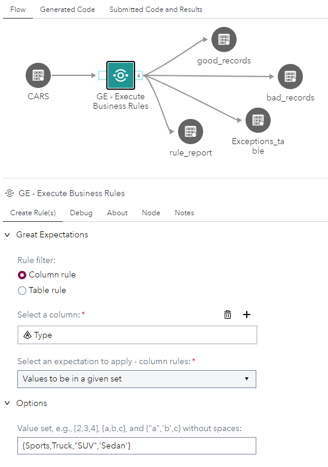
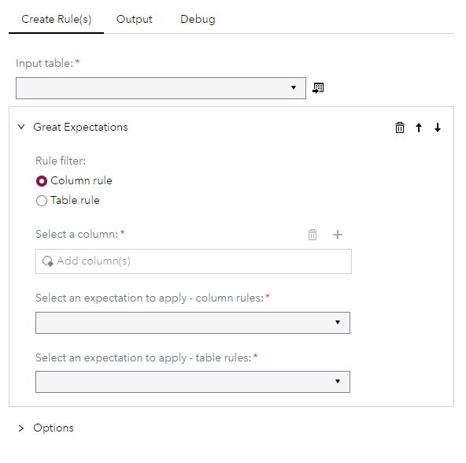
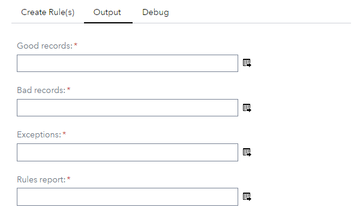

# Great Expectations (GE) - Execute Rule

[[_TOC_]]

## Description

The "Business Rules" Custom Step enables SAS Studio Flow users to run business rules on data based on the Python [Great Expectations](https://greatexpectations.io/) package. This Custom Step is employed to measure the quality of data in terms of data accuracy, validity, completeness, uniqueness, and timelines. Generally, business rules produce a single result, whether the rule "fired" successfully (True) or not (False), indicating if the data meets the expectations of the rule.

Sample data you can use for testing purposes is available in the `sample_dataset` folder.

In this Custom Step version, the following great expectations rules have been included:

* [expect_column_values_to_be_in_set](https://greatexpectations.io/expectations/expect_column_values_to_be_in_set?filterType=Backend%20support&gotoPage=1&showFilters=true&viewType=Summary) 
* [expect_column_values_to_not_be_in_set](https://greatexpectations.io/expectations/expect_column_values_to_not_be_in_set)
* [expect_column_values_to_match_regex](https://greatexpectations.io/expectations/expect_column_values_to_match_regex?filterType=Backend%20support&gotoPage=1&showFilters=true&viewType=Summary)
* [expect_column_values_to_not_be_null](https://greatexpectations.io/expectations/expect_column_values_to_not_be_null?filterType=Backend%20support&gotoPage=1&showFilters=true&viewType=Summary) 
* [expect_column_values_to_be_between](https://greatexpectations.io/expectations/expect_column_values_to_be_between?filterType=Backend%20support&gotoPage=1&showFilters=true&viewType=Completeness&subFilterValues=pandas)
* [expect_column_values_to_not_match_regex](https://greatexpectations.io/expectations/expect_column_values_to_not_match_regex)
* [expect_column_value_lengths_to_be_between](https://greatexpectations.io/expectations/expect_column_value_lengths_to_be_between) 
* [expect_column_distinct_values_to_be_in_set](https://greatexpectations.io/expectations/expect_column_distinct_values_to_be_in_set?filterType=Backend%20support&gotoPage=1&showFilters=true&viewType=Summary) 
* [expect_column_mean_to_be_between](https://greatexpectations.io/expectations/expect_column_mean_to_be_between?filterType=Backend%20support&gotoPage=1&showFilters=true&viewType=Summary)
* [expect_column_median_to_be_between](https://greatexpectations.io/expectations/expect_column_median_to_be_between)
* [expect_column_max_to_be_between](https://greatexpectations.io/expectations/expect_column_max_to_be_between?filterType=Backend%20support&gotoPage=1&showFilters=true&viewType=Summary)
* [expect_column_min_to_be_between](https://greatexpectations.io/expectations/expect_column_min_to_be_between)
* [expect_table_columns_to_match_set](https://greatexpectations.io/expectations/expect_table_columns_to_match_set?filterType=Backend%20support&gotoPage=1&showFilters=true&viewType=Summary) 
* [expect_column_to_exist](https://greatexpectations.io/expectations/expect_column_to_exist?filterType=Backend%20support&gotoPage=1&showFilters=true&viewType=Summary)  

In addition, further information on the glossary of expectations can be found [here](https://legacy.docs.greatexpectations.io/en/0.13.10/reference/glossary_of_expectations.html).

## Why This Custom Step?

This node was created as a demo to implement Great Expectations' data quality rules in a SAS Studio Flow and to assess how well the Custom Step framework is able to support GE rules.

The node is not extensively tested, but feedback is welcome to get it improved and to add capabilities if needed.

## User Interface

### `Business Rules` Step

SAS Studio Flow creation of a business rule example

 

<!-- 

#### Create Rules Tab

Main properties of the rules generation node:

##### Options Section

The options for Python great expectation's rule selected: An option is displayed if it is an argument of the rule chosen.

#### Output Tab

This tab indicates output tables generate from running a rule on data:

* Good records table - contains records that meet the rules's criteria
* Bad records - contains records that failed the rules's criteria
* Exceptions table - details statistics of the failed records and what rule has fired
* Rules report - parsing out the GE's .json output as an output table 

## Requirements

Built and tested on SAS Viya Stable Release 2023.04.

Python's great_expectations library version v0.15.0 or after

## Usage

- Refer to the [steps listed here](https://github.com/sassoftware/sas-studio-custom-steps#getting-started---making-a-custom-step-from-this-repository-available-in-sas-studio).

### Installation
Download the [Business Rule](./business_rules.step) step file, upload it into your environment and start using it.

This Custom step requires that Python be deployed and available in your SAS environment. The easiest way to achieve this is to enable and configure sas-pyconfig job, which also brings along the GE package, following the steps indicated in this [article](https://communities.sas.com/t5/SAS-Communities-Library/Using-the-SAS-Configurator-for-Open-Source-to-Build-Python-and-R/ta-p/842310).

Alternatively, one can run this Custom step by first pip installing Python and GE. Follow the steps below to get GE into your environment:

`import pip`

`import os`

`os.getcwd()`

`pip.main(['install', 'great_expectations', '--target=.'])`

`sys.path.append('./local/bin')`

`sys.path`

`import great_expectations as ge`

A demo is provided in the example below:

### Example

## Created / contact : 

- Stephen Kotiang (stephen.kotiang@sas.com)

## Change Log

Version: 1.0 (28APR2023)

* Initial version

