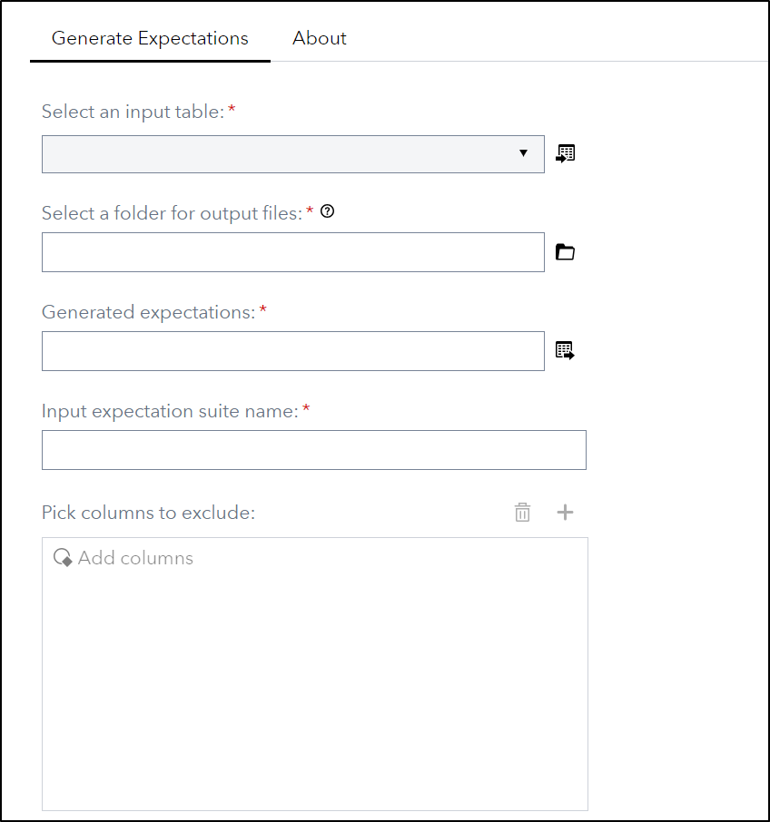
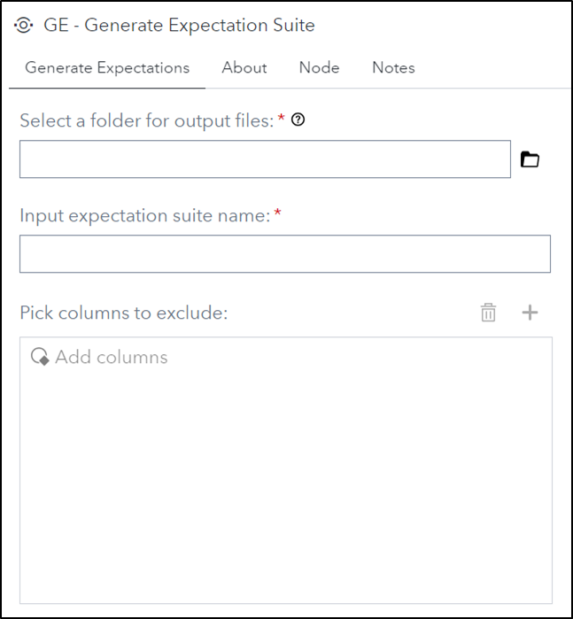
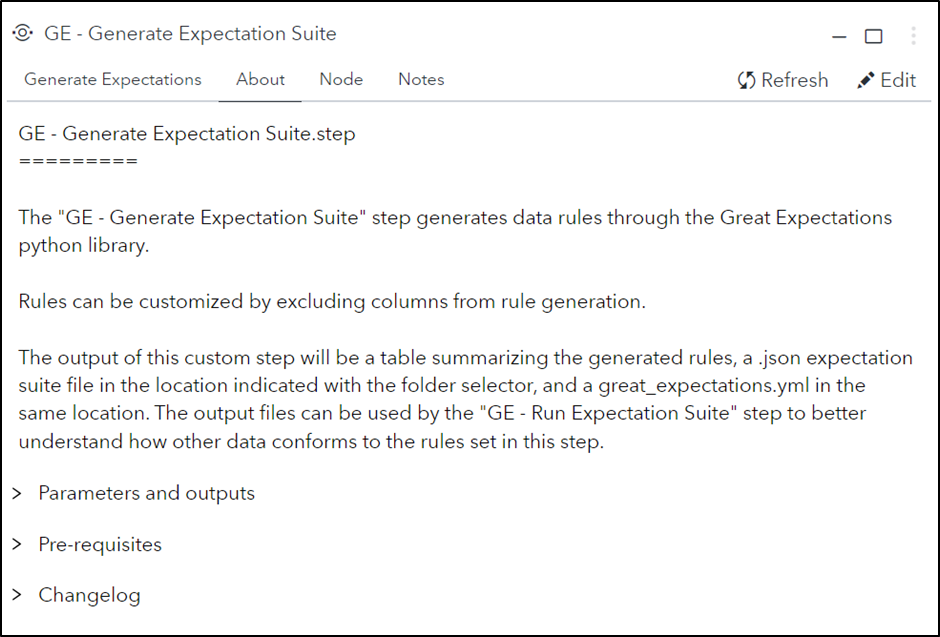

# Great Expectations - Generate Expectation Suite

> [!WARNING]
> This custom step uses experimental functionality in Great Expectations that is not available in their release 1.0 or later ([Change log 1.0.0a4](https://docs.greatexpectations.io/docs/core/changelog/#100a4)).
> Still leaving it in this repository as the step might have useful proc python code patterns.

## Description

The **GE - Generate Expectation Suite** custom step enables SAS Studio Flow users to utilize Python [Great Expectations](https://greatexpectations.io/) (GE) to automatically generate rules (also called expectations) based on an input dataset. This custom step produces an expectation suite (.json), a data context file (.yml), and a table that summarizes the rules generated by the node. The output files from this custom step should be used in the **GE - Run Expectation Suite** custom step to see if a dataset meets the expectation set within the expectation suite.

## User Interface

* ### Generate Expectations tab ###

   | Standalone mode | Flow mode |
   | --- | --- |                  
   |  |  |

* ### About tab ###

   

## Requirements

- Tested on Viya version Stable 2023.04.
- Python's great_expectatons library version between v0.16.8 and v0.18. Does not work anymore with v1.0.0+ 
- Python's pandas library version 1.5.3.
- Python's json library.
- Python's os library.
- This Custom Step requires that Python be deployed and available in your SAS environment. The easiest way to achieve this is to enable and configure sas-pyconfig job which also brings along the GE package, following the steps indicated in this [article](https://communities.sas.com/t5/SAS-Communities-Library/Using-the-SAS-Configurator-for-Open-Source-to-Build-Python-and-R/ta-p/842310).
- Alternatively, one can run this custom step by first pip installing Python and GE. Follow the steps below to get GE into your environment:
```
import pip
import os
os.getcwd()
pip.main(['install','great_expectations','--target=.'])
sys.path.append('./local/bin')
sys.path
```

## Usage


Use the following code to get example data sets for use with the GE - Generate Expectation Suite and GE - Run Expectation Suite custom steps.

```
/* create example data for rule generation and rule execution */
/* Example data sets will be created from sashelp.cars */

/* set values for training and validation */
%let propTrain = 0.7;         /* proportion of training data */
%let propValid = 0.3;         /* proportion of validation data */

/* create a separate data set for each role */
data Train Validate;
array p[2] _temporary_ (&propTrain, &propValid);
set Sashelp.Cars;
call streaminit(12);         /* set random number seed */
/* RAND("table") returns 1, 2, or 3 with specified probabilities */
_k = rand("Table", of p[*]);
if      _k = 1 then output Train;
else if _k = 2 then output Validate;
drop _k;
run;

*/ Train should be used with GE - Generate Expecation Suite */
*/ Validate should be used with GE - Run Expectation Suite */
``` 

* ### Parameters ###
   * **Folder selector:** Select the directory for output files (expectation suite .json and great_expectations.yml) to be placed within.
   * **Expectation suite name:** Will be used to the name the expectation suite .json, so if the input is taxi_exp the output expectation suite will be saved as taxi_exp.json.
   * **Columns to exclude:** Select columns that shuld be excluded when generating the expectation suite. It should be noted that excluded columns will not appear in tables generated by the **GE - Run Expectation Suite** custom step.
   
* ### Outputs ###
   * Output files are saved in the directory specified in the folder selector.
   * A table summarizing the generated expectations and their relevant columns.
 
## Change Log

* Version 1.11 (14FEB2025)
    * Added warning: Is using experimental functionality and only works with older versions of Great Expectations
* Version 1.1 (19OCT2023)
    * Removed unsupported sd2df parameters
* Version 1.0 (12OCT2023)
    * Initial version
