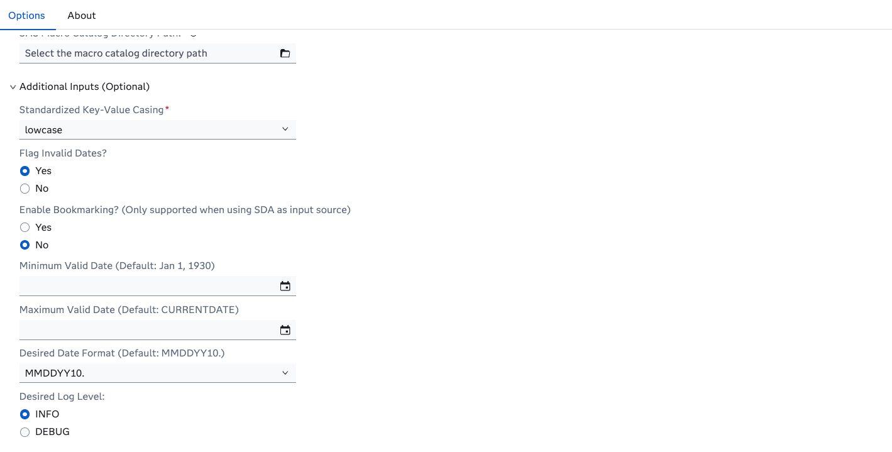

# HRR - Document Analysis

## Description

This custom step is provided to enable point-and-click usage of the functionality available as part of the [Health Record Review](https://www.sas.com/en_us/solutions/ai/models.html) offering from within the SAS Studio interface.

SAS Studio Custom Step for executing the SAS Document Analysis Health Record Review information extraction process. At a minimum, user must specify a folder containing either the SAS or SDA file to be processed, the output directory to export results, and the desired file type format for the exported results.

The source directory should be located on the server file system (not in SAS Content). 

If using SAS as the input source, the following file extensions are supported: [sas7bdat, sashdat]. If using the mapping output from the upstream SDA OCR process, the following file types are supported: [csv, xls, xlsx].

## User Interface

* ### HRR - Document Analysis - Medical Information - Options Page - Main Inputs ###

   

* ### HRR - Document Analysis - Medical Information - Options Page - Additional Inputs (Optional) ###

   

## Requirements
 
-   SAS Viya 2025.12 or later 
-   A license for SAS Document Analysis is required

## Settings

For more information about the different settings please refer to the SAS documentation linked below.

## Documentation
- [SAS Document Analysis documentation](https://go.documentation.sas.com/doc/en/aaimdacdc/default/aaimdawlcm/home.htm)
- [Custom step documentation](https://github.com/sassoftware/sas-studio-custom-steps/tree/main/HRR%20-%20Document%20Analysis)

## Change Log

### HRR - Document Analysis - Medical Information Extraction

* Version 1.0 (08DEC2025)
  * Initial version