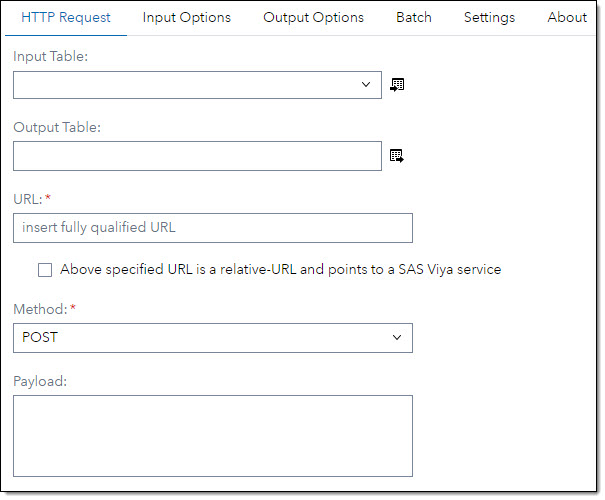
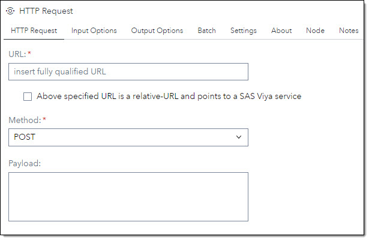
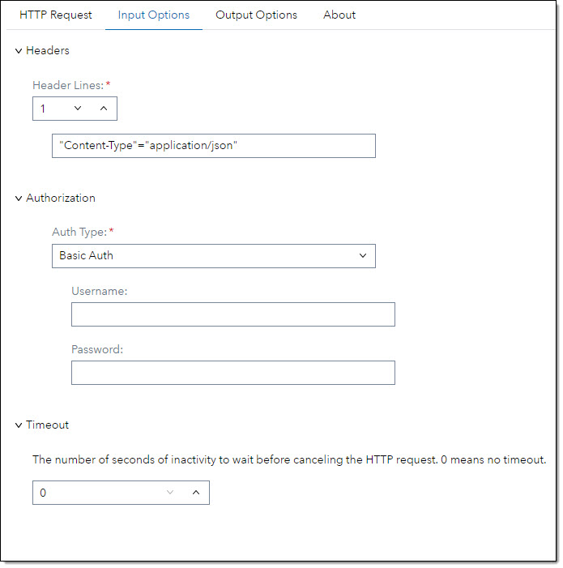
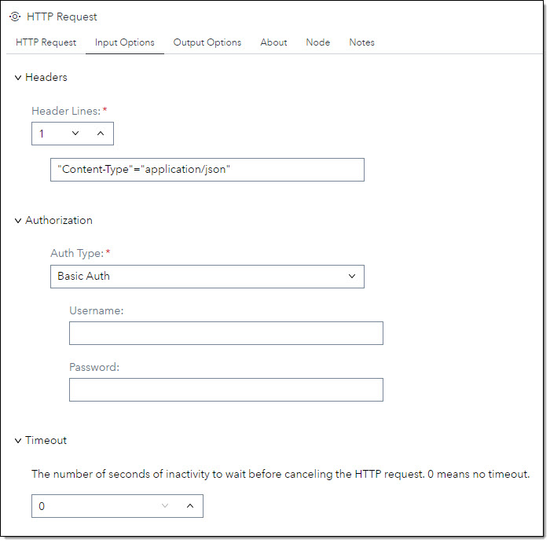

# HTTP Request #

## Description ##
The HTTP Request step allows you to send HTTP/1.1 requests. The step is using PROC HTTP to execute the HTTP requests. 
You can use this step to validate data, enrich data in your data flow, update data via a REST call and more. 
There are various ways to receive data from the HTTP Request in order to use the HTTP result downstream.

## User Interface ##

### HTTP Request tab ###
At the HTTP Request tab you set general information for the http request.

   | Standalone mode | Flow mode |
   | --- | --- |                  
   |  |  |

   | UI Field | Comment|
   | --- | --- |
   | URL |Specify the fully qualified URL path that identifies the endpoint for the HTTP request.<br><br>If the URL has url parameters you need to mask the ampersand (&) sign. The & needs to be followed by a dot (.) e.g.:<br> ```https://myserver.com/search?name=Bob&.city=London```<br><br>You can also use SAS macros in the URL. In this case you must not mask the ampersand e.g.:<br>```https://&myserver/search?name=Bob&.city=London```<br><br>If you have an input table the URL will be called for each row in the table. You can pass in the column values for each row into the URL using the column names as parameters. The column name needs to be masked with a leading a tailing at-sign (@) in the URL e.g.:<br>```https://myserver.com/search?name=@firstname@&.city=@city@```<br><br>**Note:** If an ampersand for a URL parameter is not masked you will get a warning that a macro name cannot be resolved! |
   | Method | Select a HTTP method from the drop down list. |
   | Payload | Specify the input data for the HTTP request.<br><br>If you have an input table you can pass in the column values for each row into the payload using the column names as parameters. The column name needs to be masked with a leading a tailing at-sign (@) in the payload e.g.:<br>```{ "name"="@firstname@", "city"="@city@" }```<br>You can also use SAs macros in the payload e.g.:<br>```{ "name"="@firstname@", "city"="&TOWN" }``` |

### Input Options tab ###
At the Input Options tab you specily input parameters for the HTTP request.

   | Standalone mode | Flow mode |
   | --- | --- |                  
   |  |  |

   | UI Field | Comment|
   | --- | --- |
   | Headers - Header Lines | Set the number of header line you want to submit. You can submit up to 8 header lines |
   |     | Each header line has the format 'header' = 'value' e.g.:<br>```"Content-Type: application/json"``` | 

