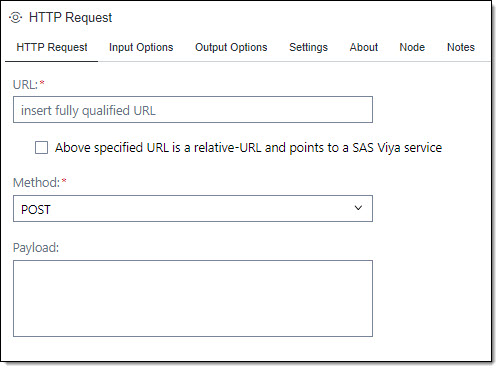
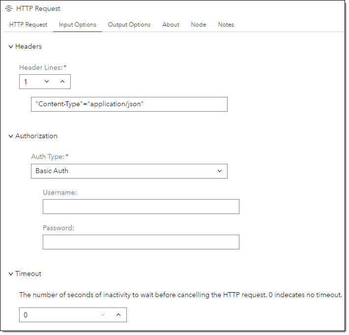

# HTTP Request #

## Description ##
The HTTP Request step allows you to send HTTP/1.1 requests. The step is using PROC HTTP to execute the HTTP requests. 
You can use this step to validate data, enrich data in your data flow, update data via a REST call and more. 
There are various ways to receive data from the HTTP Request in order to use the HTTP result downstream.

## User Interface ##

### HTTP Request tab ###
At the HTTP Request tab you set general information for the http request.

   | Standalone mode | Flow mode |
   | --- | --- |                  
   |  |  |

   | UI Field | Comment|
   | --- | --- |
   | URL |Specify the fully qualified URL path that identifies the endpoint for the HTTP request.<br><br>If the URL has url parameters you need to mask the ampersand (&) sign. The & needs to be followed by a dot (.) e.g.:<br> ```https://myserver.com/search?name=Bob&.city=London```<br><br>You can also use SAS macros in the URL. In this case you must not mask the ampersand e.g.:<br>```https://&myserver/search?name=Bob&.city=London```<br><br>If you have an input table the URL will be called for each row in the table. You can pass in the column values for each row into the URL using the column names as parameters. The column name needs to be masked with a leading a tailing at-sign (@) in the URL e.g.:<br>```https://myserver.com/search?name=@firstname@&.city=@city@```<br><br>**Note:** If an ampersand for a URL parameter is not masked you will get a warning that a macro name cannot be resolved! |
   | Method | Select a HTTP method from the drop down list. |
   | Payload | Specify the input data for the HTTP request.<br><br>If you have an input table you can pass in the column values for each row into the payload using the column names as parameters. The column name needs to be masked with a leading a tailing at-sign (@) in the payload e.g.:<br>```{ "name"="@firstname@", "city"="@city@" }```<br>You can also use SAs macros in the payload e.g.:<br>```{ "name"="@firstname@", "city"="&TOWN" }``` |

### Input Options tab ###
At the Input Options tab you specify  input parameters for the HTTP request.

   | Standalone mode | Flow mode |
   | --- | --- |                  
   |  |  |

   | Section | UI Field | Comment|
   | --- | --- | --- |
   | Headers | Header Lines | Set the number of header line you want to submit. You can submit up to 8 header lines |
   || Header Line | Each header line has the format *'header' = 'value'* e.g.:<br>```"Content-Type: application/json"```<br>The default value for header line 1 is set to "Content-Type: application/json". If not appropriate you need to change the value. | 
   | Authorization | Auth Type | Select how to authorize for the HTTP request. |
   ||| **No Auth** - Specifies that no authorization is used for the HTTP request. |
   ||| **Basic Auth** - Specifies to use user identity authentication to authenticate the connected server. The user name and password are supplied in the fields *Username* and *Password*. |
   ||| **Bearer Token** - Specifies to sends an OAuth access token along with the HTTP call. The token value is supplied in field *token*. |
   ||| **SAS Internal Viya API** - Specifies that the url will point to Viya API at current instance.<br><br>**Note:** In the URL field in the HTTP Request insert the url without server information (e.g.: /referenceData/domains) |
   | Timeout | | Set the number of seconds of inactivity to wait before cancelling the HTTP request. The default is 0 which indecates that there is no timeout. |

### Output Options tab ###
At the Output Options tab you specify how to receive the data comming back from the HTTP request.

   | Standalone mode | Flow mode |
   | --- | --- |                  
   |  |  |
#### Output Body ####
If the output format is json you can specify fields from the json structure to land in the output table.

   | Section | UI Field | Comment|
   | --- | --- | --- |
   | Output Table | Field Mapping | In the field mapping text box you point to the field in the json structure. |
   || If field could not get mapped | If the field to be mapped cannot be found the map-column will be set to null. This can happen either because the map field does not exist in the json structure in general (typo when mapped) or there was no value returned for the field and hence it is missing in the json structure. In both cases the map-column will be set to null. You can set one of the three option to react to it:<br>* **No Message** - No message pops up if a field is missing.<br>* **Show Warning** - The SAS job will throw a warning message.<br>* **Show Error** - The SAS job will throw an error message and aborts the job. |
   || Add input columns to HTTP output table | If an input table exists, the step will output both input columns and output columns in the output table. |
   || Create macro for output column | The step will create a macro for the mapped fields from the json structure. If the input table has more than one row only the values from the first result row will mapped to macros. The macros have the same name like the mapped column names |

** Field Mapping: **<br>
Field mapping is only recommended for json structures where there is a straight mapping from field to column possible. Otherwsie you should go via the Output Library option.
For Example, assuming you have a json result like this:
```
                                           | zip              | country         |
{                                          | ---------------- | --------------- |
    "status": 200,                         |                  |                 |
    "result": [                            | *** result ***   | *** result ***  |
        {                                  |                  |                 |
            "query": "U3 4AB",             |                  |                 |
            "result": null                 |                  |                 |
        },                                 |                  |                 |
        {                                  | *** 1 ***        | *** 1 ***       |
            "query": "AL3 8EE",            |                  |                 |
            "result": {                    | *** result ***   | *** result ***  |
            ==> "postcode": "AL3 8EE",     | *** postcode *** |                 |
                "quality": 1,              |                  |                 |
                "eastings": 507817,        |                  |                 |
                "northings": 214437,       |                  |                 |
            ==> "country": "England"       |                  | *** country *** |
            }                              |                  |                 |
        }                                  |                  |                 |
    ]                                      |                  |                 |
}                                          |                  |                 |

```
You want to map the fields *postcode* and *country* from row 2 of array result to column *zip* and *country*. The mapping structure will look like this:
```
result/1/result/postcode | zip,
result/1/result/country  | country
```

   
   | Section | UI Field | Comment|
   | --- | --- | --- |
   | Output Library | | The json result from the HTTP request will be put in a SAS library using the json engine. The datasets in the library represent the json structure. This enables you to access the HTTP result. |

   
   


   

