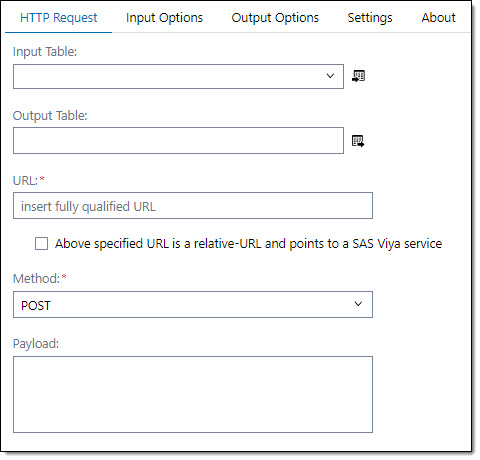

# HTTP Request #

## Description ##
The HTTP Request step allows you to send HTTP/1.1 requests. The step is using PROC HTTP to execute the HTTP requests. 
You can use this step to validate data, enrich data in your data flow, update data via a REST call and more. 
There are various ways to receive data from the HTTP Request in order to use the HTTP result downstream.

## User Interface ##

### HTTP Request tab ###
At the HTTP Request tab you set general information for the http request.

   | Standalone mode | Flow mode |
   | --- | --- |                  
   |  |  |

   | UI Field | Comment|
   | --- | --- |
   | URL | Specify the fully qualified URL path that identifies the endpoint for the HTTP request. If the URL has url parameters you need to mask the ampersand (&) sign. The & needs to be folowed by a dot (.). e.g.: https://myserver.com/search?name=Bob&.city=London |

