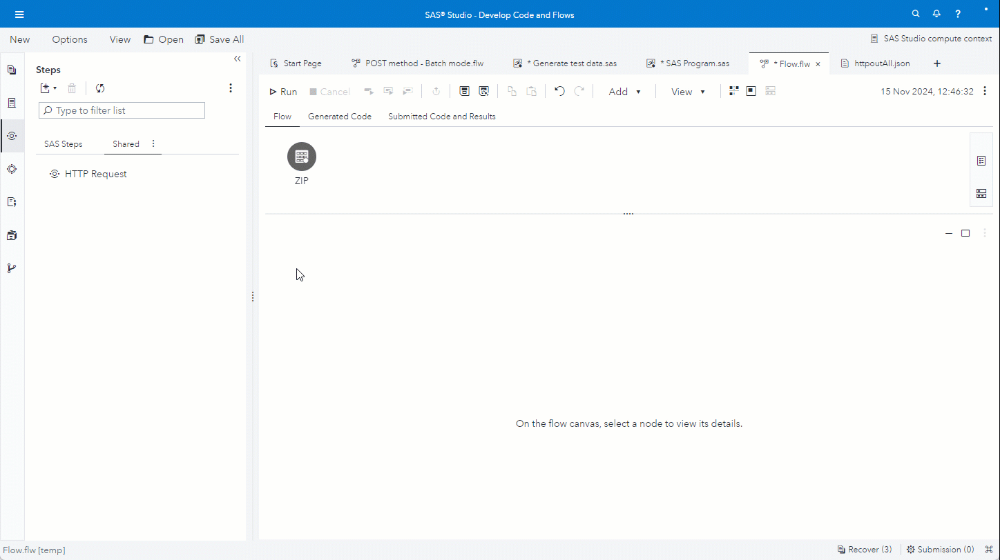

# Query post code information in batch mode
The example is calling a REST API using the POST method to enrich UK postal codes with county, council and parish information.<br>
The input table has a column postcode. We group the postal codes from several rows together and submit each group in one call.<br>
The column name from the input table is used in the batch repeat structure and the batch data is added to the HTTP payload.<br>
The required fields from the HTTP result are mapped to columns in the output table.



---
## Demo recreate
Use the following settings to recreate the above example in SAS Studio.

1. Create new flow job in SAS Studio.
2. Drag table 'zip' on the canvas.
    * See [here](#testdata-) to create table 'zip'.
3. ***HTTP Request***
	> * Drag ***HTTP Request step*** on canvas and connect with the input table step.
	> * Go to tab ***HTTP Request***.
	>	* Set ***URL*** as below. 
	>		```
	>		http://api.postcodes.io/postcodes
	>		```
	>	* Set ***Method*** to *POST*.
 	>	* Fill ***Payload*** text box with below JSON structure. In the JSON structure we use the columns from the input table as parameters.
	>		```
	>		{
	>		  "postcodes" : [@postcode_batch@]
	>		}
	>		```
	> * Go to tab ***Batch***.
    >   * Set *Record group size* to 3.
    >   * Put below data into text box *Repeated json structure*.<br>
    >       ```
    >       "@postcode@"
    >       ```
    >       This is the repeated data structure the represents **one** batch record. In this case it is only one field.
    >   * Put below token variable name into *Batch structure name*.
    >       ```
    >       postcode_batch
    >       ```
    >      The *token variable name* represents the batch data and is used in the payload in tab *HTTP Request*.
    > * Go to tab ***Input Options***.
	>	* Under ***Headers*** set *Header Lines* to 2.
	>		* For the first Header Line use default value.<br>
	>			```
	>			"Content-Type"="application/json"
	>			```
	>		* For the second Header Line use below setting.<br>
	>			```
	>			"Accept"="application/json"
	>			```
	> * Go to tab ***Output Options***.
	>	* Under ***Output Body - Output Table***<br>
 	> 		* Use the below mapping in field *Field Mapping* to copy fields from the URL JSON result structure to the output table.
	>			```
	>			 result/0/result/postcode        | postcode_1,
	>			 result/0/result/admin_county    | county_1,
	>			 result/0/result/admin_district  | council_1,
	>			 result/0/result/parish          | parish_1,
	>			 result/1/result/postcode        | postcode_2,
	>			 result/1/result/admin_county    | county_2,
	>			 result/1/result/admin_district  | council_2,
	>			 result/1/result/parish          | parish_2,
	>			 result/2/result/postcode        | postcode_3,
	>			 result/2/result/admin_county    | county_3,
	>			 result/2/result/admin_district  | council_3,
	>			 result/2/result/parish          | parish_3
   	>			```
	> * Add ***Output Port***.
	>	* Use right mouse click to add output port to the step.
4. ***Run Demo***
	* Execute Demo Flow.

### Test Data <a name="testdata-"></a>
Run this code in SAS Studio to create the input data for the demo.

```
data zip;
	length postcode $10;
	infile cards dlm=",";
	input postcode $;
	cards;
AL3 8EE
AL4 0RQ
W2 1JU
OX49 5NU
M32 0JG
NE30 1DP
LU6 3DT
;
run;
```