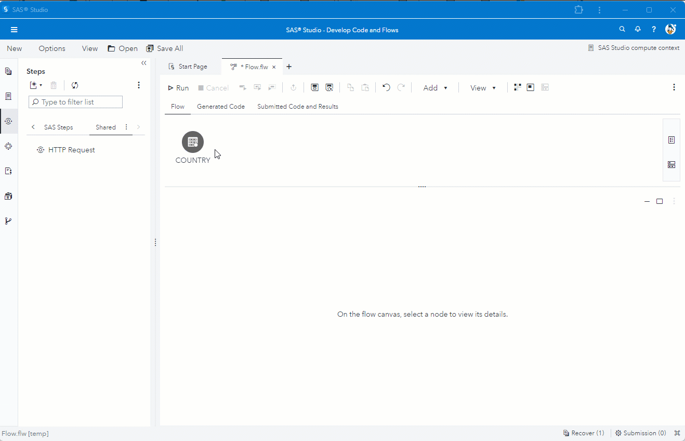

# Enrich data flow using GET method
The example shows a call to a REST API using the POST method. Columns from the input table are used as parameters in the payload. Fields from the HTTP result are mapped to columns in the output table. The columns from the input table are also passed through to the output table.
We have a table with UK post codes. We call a REST service to get county, council and parish information for each post code.

