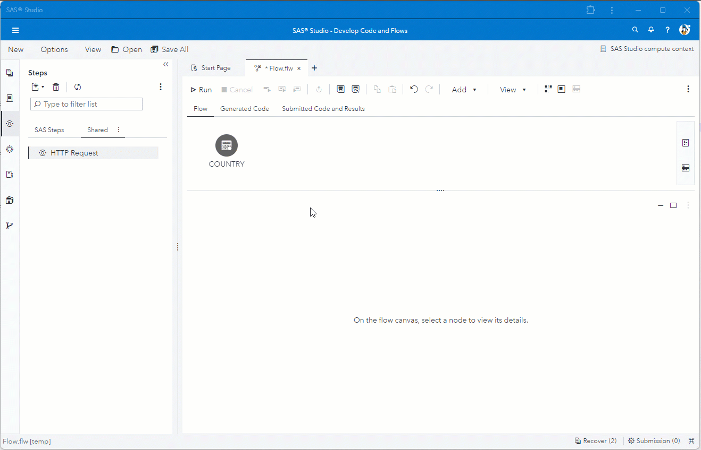

# Enrich data flow using GET method
The example is calling a REST API using the GET method to enrich country names with capital, continent and languages information.<br>
The column from the input table is used as parameter to complete URL endpoint.<br>
Fields from the HTTP result are mapped to columns in the output table.<br>
The column from the input table is also passed through to the output table.



---
## Demo Recreate
Use the following settings to recreate the above example in SAS Studio.

1. Create new flow job in SAS Studio.
2. Drag table 'country' on the canvas.
	* See [here](#testdata-) to create table 'country'.
3. ***HTTP Request***
	> * Drag ***HTTP Request step*** on canvas  and connect with the input table step.
	> * Go to tab ***HTTP Request***.
	>	* Set ***URL*** as below where we use the value from column 'country' to build the endpoint. 
	>		```
	>		https://restcountries.com/v3.1/name/@country@
	>		```
	>	* Set ***Method*** to *GET*.
	> * Go to tab ***Input Options***.
	>	* Under ***Headers*** set *Header Lines* to 1.
	>		* Use the Header Line default value.<br>
	>			```
	>			"Content-Type"="application/json"
	>			```
	> * Go to tab ***Output Options***.
	>	* Under ***Output Body - Output Table***<br>
 	> 		* Use the below mapping in field *Field Mapping* to copy fields from the URL JSON result structure to the output table.
	>			```
	>			0/capital/0 | capital
	>			0/continents | continents
	>			0/languages | languages
	>			```
 	> 		* Tick *Add input columns to output table* to pass trough input columns the output table.
	> * Add ***Output Port***.
	>	* Use right mouse click to add output port to the step.

### Test Data <a name="testdata-"></a>
Run this code in SAS Studio to create the input data from the demo.
```
data work.country;
	length country $30;
	infile cards;
	input country $;
	cards;
USA
United Kingdom
Germany
South Africa
Canada
France
Italy
Spain
;
run;
```
