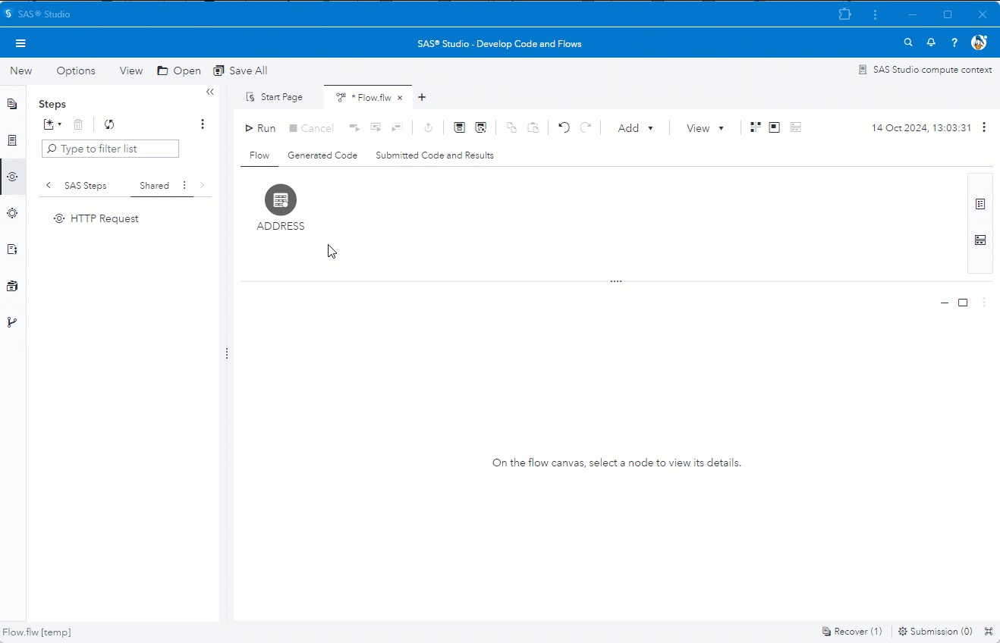

# Enrich data flow using GET method
The example is calling to a REST API using the GET method to enrich address data with longitude & latitude information.<br>
The columns from the input table are used as parameters in the URL to set the URL input parameters.<br>
The longitude & latitude fields from the HTTP result are mapped to columns in the output table.<br>
The address columns from the input table are also passed through to the output table.



Use the following settings and code to recreate the example in SAS Studio.

**URL**
```
https://nominatim.openstreetmap.org/search?street=@address@&.city=@town@&.country=@country@&.format=json&.addressdetails=1&.limit=1
```
**Headers**
```
"Content-Type"="application/json"
```
**Field Mapping**
```
0/lat | lat,
0/lon | lon
```
**Test Data**
```
data address;
	length address town country $30;
	infile cards dlm=",";
	input address town country $;
	cards;
Oppelner Strasse 12,Marl,Germany
2 Trowley Hill Rd,Flamstead,UK
10 Chiswell St,London,UK
333 Orchard Rd,Singapore,
;
run;
```

