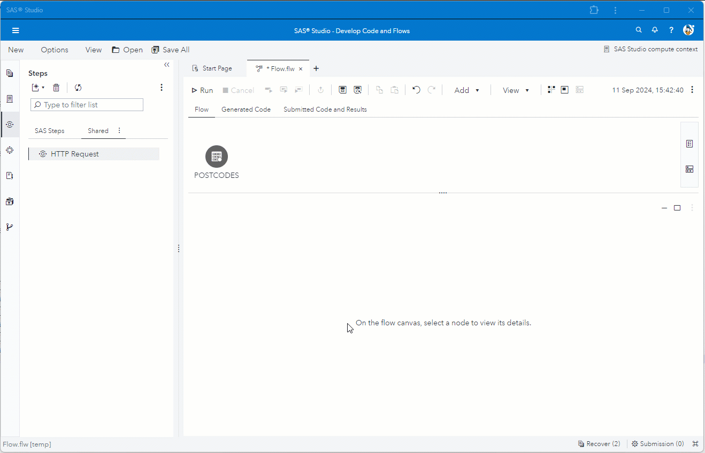

# Enrich data flow using POST method
The example is calling a REST API using the POST method to enrich UK postal codes with county, council and parish information.<br>
Columns from the input table are used as parameters in the payload.<br>
The required fields from the HTTP result are mapped to columns in the output table.<br>
The columns from the input table are also passed through to the output table.<br>
The output columns are re-ordered in an final step.



---
## Demo Recreate
Use the following settings to recreate the above example in SAS Studio.

1. Create new flow job in SAS Studio.
2. Drag table 'postcodes' on the canvas.
	* See [here](#testdata-) to create table 'postcodes'.
3. ***HTTP Request***
	> * Drag ***HTTP Request step*** on canvas and connect with the input table step.
	> * Go to tab ***HTTP Request***.
	>	* Set ***URL*** as below. 
	>		```
	>		http://api.postcodes.io/postcodes
	>		```
	>	* Set ***Method*** to *POST*.
 	>	* Fill ***Payload*** text box with below JSON structure. In the JSON structure we use the column from the input table as parameters.
	>		```
	>		{
	>		  "postcodes" : ["@PO1@", "@PO2@", "@PO3@"]
	>		}
	>		```
	> * Go to tab ***Input Options***.
	>	* Under ***Headers*** set *Header Lines* to 2.
	>		* For the first Header Line use default value.<br>
	>			```
	>			"Content-Type"="application/json"
	>			```
	>		* For the second Header Line use below setting.<br>
	>			```
	>			"Accept"="application/json"
	>			```
	> * Go to tab ***Output Options***.
	>	* Under ***Output Body - Output Table***<br>
 	> 		* Use the below mapping in field *Field Mapping* to copy fields from the URL JSON result structure to the output table.
	>			```
	>			result/0/result/admin_county    | county_1,
	>			result/0/result/admin_district  | council_1,
	>			result/0/result/parish          | parish_1,
	>			result/1/result/admin_county    | county_2,
	>			result/1/result/admin_district  | council_2,
	>			result/1/result/parish          | parish_2,
	>			result/2/result/admin_county    | county_3,
	>			result/2/result/admin_district  | council_3,
	>			result/2/result/parish          | parish_3
	>			```
 	> 		* Tick *Add input columns to output table* to pass trough input columns the output table.
	> * Add ***Output Port***.
	>	* Use right mouse click to add output port to the step.
3. ***Run Flow***
	* Run flow to generate output table as we need the columns for the next step.
4. ***Reorder Columns***
	> * Drag step ***Manage Columns*** on canvas and connect with the *HTTP Request* step.
	> * Go to tab ***HTTP Request***.
	>	* Set ***URL*** as below. 

 

### Test Data <a name="testdata-"></a>


### Manage Columns - step
* Reorder the HTTP output columns to set the *postal code* columns before the appropriate *county*, *council* and *parish* columns.

 ---
 
### Test Data
```
data work.postcodes;
	length po1-po03 $10;
	infile cards dlm=",";
	input po1 po2 po3 $;
	cards;
AL3 8EE,AL4 0RQ,W2 1JU
OX49 5NU,M32 0JG,NE30 1DP
;
run;
```
