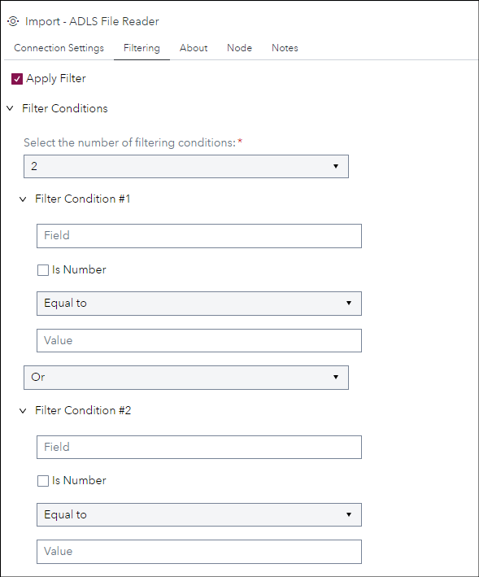

# ADLS File Reader

## Description

The **Import - ADLS File Reader** provides an easy way to connect and read Parquet files from Azure Data Lake Storage (ADLS) to SAS Compute or CAS.

It supports reading snappy compressed Parquet files and allows reading multiple files from hierarchical nested subdirectories structures 
commonly used when partitioning the dataset (common approach when storing datasets on data lakes). 
When dealing with partitioned datasets it supports expression filters using the partition fields, which avoid reading and transferring unnecessary data 
between the origin and source destination (*also known as partition pruning*)

This custom step helps to work around some of the restrictions that currently exist for working with Parquet files in SAS Viya. Please check the following documentation that lists those restrictions for the latest SAS Viya release:
 - [Restrictions for Parquet File Features for the libname engine](https://go.documentation.sas.com/doc/en/pgmsascdc/default/enghdff/p1pr85ltrpplbtn1h9sog99p4mr5.htm) (SAS Compute Server) 
 - [Azure Data Lake Storage Data Source](https://go.documentation.sas.com/doc/en/pgmsascdc/default/casref/n1ogaeli0qbctqn1e3fx8gz70lkq.htm) (SAS Cloud Analytic Services)
 - [Path-Based Data Source Types and Options](https://go.documentation.sas.com/doc/en/pgmsascdc/default/casref/n0kizq68ojk7vzn1fh3c9eg3jl33.htm#n0cxk3edba75w8n1arx3n0dxtdrt) – which has a footnote for Parquet (SAS Cloud Analytic Services)

Version 1.0 (FEB2023)

## User Interface

* ### Options tab ###

   | Standalone mode | Flow mode |
   | --- | --- |                
   |   |  |

* ### Filtering tab ###

   

* ### About tab ###

   

## Requirements

This customs step depends on having a python environment configured with the following libraries installed: 
> - pandas
> - saspy
> - azure-identity
> - pyarrow
> - pyarrowfs-adlgen2

Tested on Viya version Stable 2022.12 and 2023.01 with python environment version 3.8.13 and the libraries versions:
> - pandas == 1.5.2
> - saspy == 4.3.3
> - azure-identity == 1.12.0
> - pyarrow == 10.0.1
> - pyarrowfs-adlgen2 == 0.2.3

## Usage

## Change Log

* Version 1.0 (FEB2023)
    * Initial version