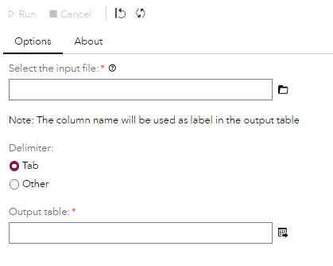
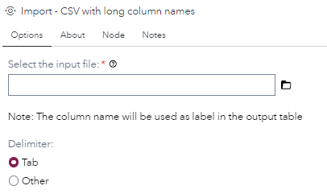
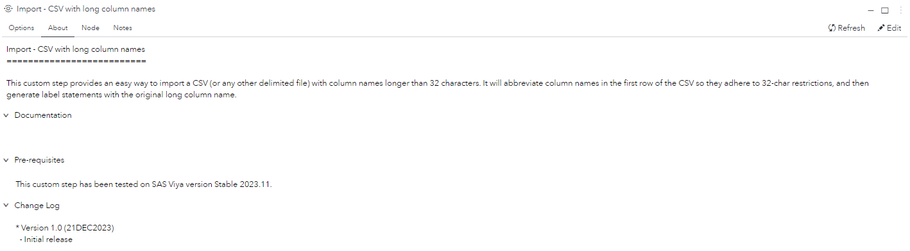
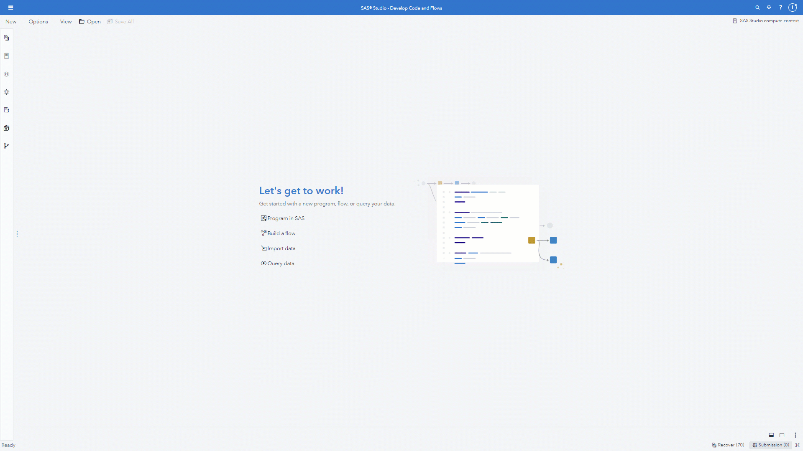

# Import - CSV with long column names

## Description

The **Import - CSV with long column names** custom step provides an easy way to import a CSV (or any other delimited file) with column names longer than 32 characters. It will abbreviate column names in the first row of the CSV so they adhere to 32-char restrictions, and then generate label statements with the original long column name.

## User Interface

* ### Options tab ###

   | Standalone mode | Flow mode |
   |-----------| --- |                
   |  |  |

* ### About tab ###

   

## Requirements

This custom step has been tested on SAS Viya version Stable 2023.11.

## Usage

## Known issues

* When the input file has long column names where the the first 32 characters are not unique, then the generated output table will have columns that are named VARx (x being the column number) for those columns.
* The label of those VARx columns will include the name of the original variable.
* This behaviour is caused by the use of proc import in this custom step. It might be possible to read the file using a data step, but that is something to consider for a future version of this step.

## Change Log

* Version 1.0 (21DEC2023) 
    * Initial version