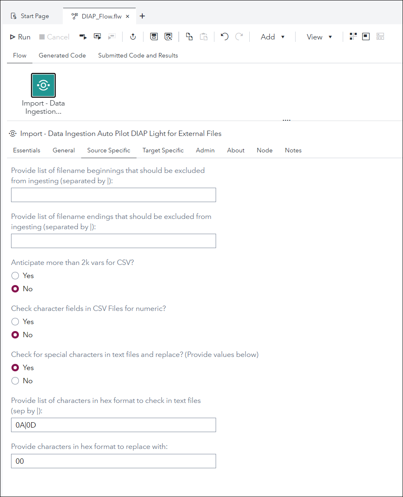
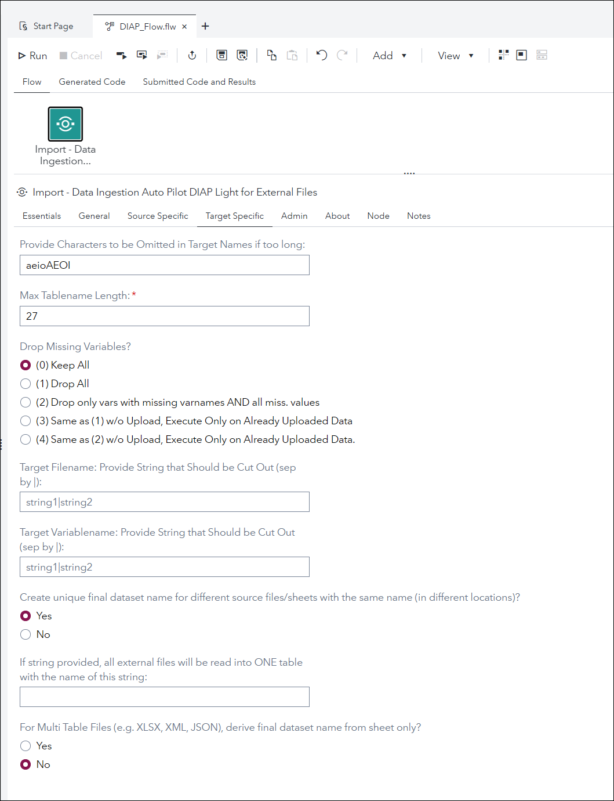
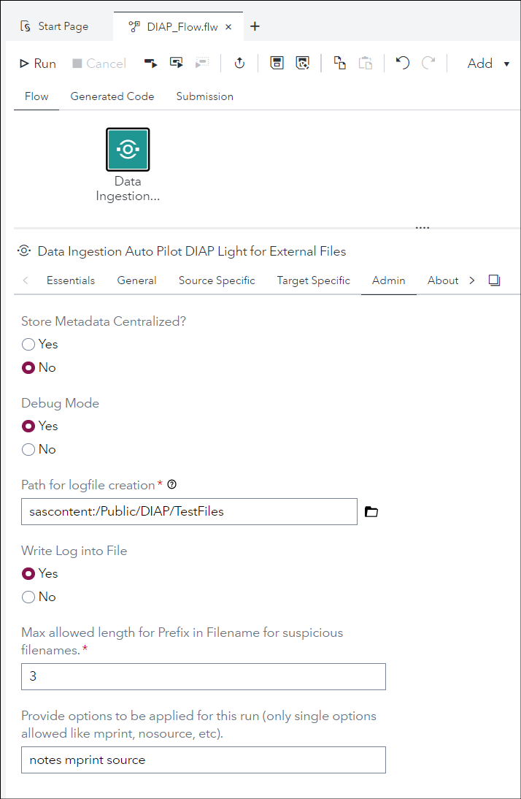
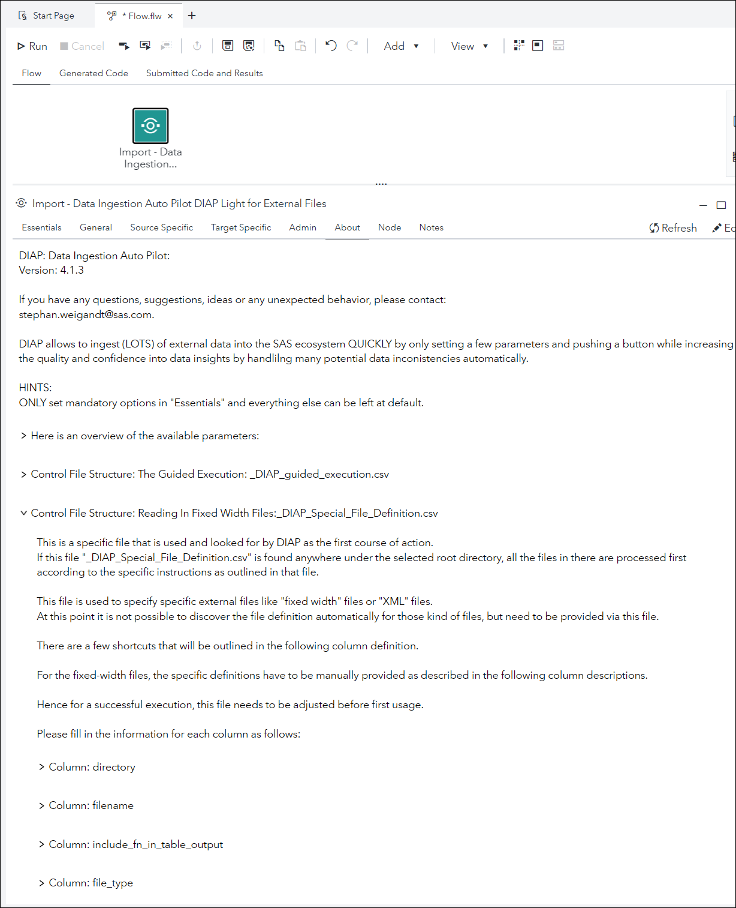

# Data Ingestion Auto Pilot DIAP Light for External Files

- [Description](#description)
- [SAS Viya Version Support](#sas-viya-version-support)
- [User Interface](#user-interface)
- [Requirements](#requirements)
- [Usage](#usage)
- [Parameter Overview](#parameter-overview)
- [Control Files - Overview](#control-files-overview)
- [Change Log](#change-log)

## Description

The "**Data Ingestion Auto Pilot DIAP Light for External Files**" Custom Step enables SAS Studio Flow users to easily ingest external file(s) by the push of a button and only providing the root directory where the external files are located.
DIAP will automatically handle the following automatically:

- identifying all external files in that directory, and it will also traverse in all subdirectories. It will then attempt to read all of them in.
- determining text file separators.
- create suitable target table name that adheres to SAS naming conventions.
- create suitable variable names taking care of "weird" characters (like: $@&%., and other), if desired.
- dealing with missing variable names and/or missing values for an entire column.
- dealing very wide files (10,000s of variables).
- dealing with unwanted characters in text files that can cause error prone import (e.g. carriage return in a comment field).

DIAP also offers a "guided automation" mode. Here the user uploads a specific CSV file which contains a list of all files that need to be uploaded which instructions on where to find it and also how to ingest it where further instructions are provided. Please follow the instructions below on how to structure the CSV file.

And: DIAP can deal with fixed width files.

DIAP creates reference tables to:

- show which source files were loaded into which SAS tables at what date,
- keep track of required variable name changes and to make sure that newly created variable names stay unique.

## SAS Viya Version Support

2020.1.5 or later

## User Interface

### **Essential Tab**

If you are happy with all the default settings, only adjust the parameters in the "Essentials" tab, e.g. select the fully automated mode (1) and provide the top level directory either from within SAS Server or now also from SAS Content (here only CSV or TXT files are processed in the fully automated mode) and click "Run" to start the journey.

### **General Tab**

### **Source Specific Tab**

### **Target Specific Tab**

### **Admin Tab**

### **About Tab**

## Requirements

## Usage

Please wait a few seconds for the video as a GIF to load. Every heading below has a little video to show the process flow.

### **How to Run DIAP with Default Settings**

### **Taking a Look at the Reference Tables - Flag for Suspivious Source Files**

### **How to Ingest Fixed Width Files - the "\_DIAP_Special_File_Definition.csv" Control File**

### **How to Ingest Files Using a Guided Automation Control File (CSV)**

This mode has many advantages.
It has the following advantages over the fully automated mode:

- Reading in from SASServer and SASContent in one go.
- Reading in text files with "unknown" extension.
- Reading in xls files as well (Automated version can only handle XLSX).
- Reading in selected sheets from an Excel file with many, many sheets.
- Assigning explicitly delimiter for selected text files.
- Assigning explicitly target table name instead of relying on automated table name creation.

## Parameter Overview

Here are the parameters:

### **root_directory (In Custom Step Version: "Select DIAP Execution Mode -> (1)")**

suggested default value: if there is a default landing area, this could be provided here.

provide the top level directory that DIAP should use to start looking for files. DIAP will then traverse through the whole directory structure and find all the files below this top level directory.

If the root directory is in the SAS Server area, this has to start out with: sasserver: (e.g. example value for root_directory: sasserver:/mnt/desired/path/for/files_to_be_readin/from/SASServer/).

If the root directory is in the SAS Content area, this has to start out with: sascontent: (e.g. example value for root_directory: sascontent:/Public/desired_path_for/files/in/SASContent/).

### **diap_traverse_directories (In Custom Step Version: "Traverse Subdirectories?")**

suggested default value: 1

If set to 1, DIAP traverses through all subdirectories recursively that can be found under root_directory.

If set to 0, DIAP only checks for files in the provided root_directory.

### **extension (In Custom Step Version: "Extension")**

suggested default value: \*

This parameter determines which files are considered to be imported. Use the wildcard “\*” (without quotes) for any files that can be ingested by DIAP, or any extension. The following extensions are supported as of now:
• XLSX
• XLSM
• CSV
• JMP
• SHP
• TXT
• NEF
• JSON
• Custom (Fixed Width/XML)

### **Target_libname (In Custom Step Version: "Target Libname")**

suggested default value: any libname, that is used for testing, e.g. WORK.

Provide the SAS or CAS libname, where the imported files are stored at. It needs to be preassigned or assigned within the session.

### **provide_default_log_path (In Custom Step Version: "Path for logfile creation")**

suggested default value: empty/missing.

This parameter is only relevant when the parameter “write_log_into_file” is set to 1.

Provide a default path for all runs: as soon as a path is provided, this path is being used for ALL runs.

If the log directory is in the SAS Server area, this has to start out with: sasserver: (e.g. example value for provide_default_log_path: sasserver:/mnt/desired/path/for/log_files_to_be_saved/on/SASServer/).

If the log directory is in the SAS Content area, this has to start out with: sascontent: (e.g. example value for provide_default_log_path: sascontent:/Public/desired_path_for/logfiles/in/SASContent/).

### **write_log_into_file (In Custom Step Version: "Write Log into File")**

suggested default value: 1

If set to 0, log is written into default SAS log location.

If set to 1, log is written to location as provided under the parameter “provide_default_log_path”.

### **max_table_name_length (In Custom Step Version: "Max Tablename Length")**

suggested default value: 27

This determines the maximum allowed table name length. E.g. in the case of uploading XLSX files to SAS94, the final table name is built by concatenating Excel-filename and Sheetname.

So this can easily lead to a datasetname that is too long.

Also take into consideration that the concatenated name for multiple tables could potentially the same in the abbreviated form.

The system checks for that and adds a counter to the table name.

So, leave at least 2 characters for a counter.

### **check_txt_file_4_special_chrct (In Custom Step Version: "Check for special characters in text files and replace?")**

suggested default value: 0

If set to 0, the text file is read in as-is.

If set to 1, then text files is examined before reading for the characthers as outlined in parameter "special_chrctr_seq_2_chck_in_hex", and replaced with the character as outlined in parameter "spcl_chrctr_check_rplcmnt_in_hex".
This might need to be required, especially if files have NOTES or DESCRIPTION columns, that could contain carriage returns. Those carriage returns would then cause the file to be read in with a few errors, wherever those carriage returns occur.

### **special_chrctr_seq_2_chck_in_hex (In Custom Step Version: "Provide list of characters in hex format to check in text files (sep by |)")**

suggested default value: 0A|0D

This parameter has to be set to one or a sequence of | separated hex formats of a character.

0A|0D: checks for new line feed (0A) and carriage return (0D)

see asciitable.com for an overview of all characters in hex format.

### **spcl_chrctr_check_rplcmnt_in_hex (In Custom Step Version: "Provide characters in hex format to replace with")**

suggested default value: 00

Please provide the characters that should be used to replace the special characters as defined in special_chrctr_seq_2_chck_in_hex
The characters value is provided in hex format.

see asciitable.com for an overview of all characters in hex format.

### **substitute_string_seq (In Custom Step Version: "Provide Characters to be Omitted in Target Names if too long!")**

suggested default value: aeiouAEIOU

If the target table name is too long, this string determines which characters are taken out from the target name to shorten the name further, before the truncation process kicks in.

E.g. when substitute_string_seq = aeAEoO, then a table name of "ThisIsAVeryLongTableNameThatIsTooLong" and a max_table_name_length = 29
would be first changed to the following: "ThisIsVryLngTblNmThtIsTLng" which would be short enough without any further action needed by DIAP.

### **skip_files_starting_with_seq (In Custom Step Version: "Provide list of filename beginnings that should be excluded from ingesting (separated by |)")**

default value: \_DIAP_Special_File_Definition.csv
If not missing, DIAP will skip all the files that start out with the sequence of string snippets separated by |.
E.g. if set to:
\_DIAP_Special_File_Definition.csv|filebe ginning1|filebeginning2
All files that start out with either \_DIAP_Special_File_Definition.csv filebeginning1 or filebeginning2 will NOT be ingested.
\_DIAP_Special_File_Definition.csv is the default value used by DIAP to describe fixed width or XML definitions and wouldn't be needed to be read into the target libname.

### **skip_files_ending_with_seq (In Custom Step Version: "Provide list of filename endings that should be excluded from ingesting (separated by |)")**

default value: empty/missing
If not missing, DIAP will skip all the files that end with the sequence of string snippets separated by |.
E.g. if set to:
file_ending1|file_ending2|csv
All files that end with either file_ending1 or file_ending2 or csv will NOT be ingested.
E.g. in this example all csv files would be skipped.

### **meta_centralized (In Custom Step Version: "Store Metadata Centralized?")**

suggested default value: 1

This value goes closely with the next parameter “libname_meta_centralized”.

If set to 1, all meta information generated by DIAP (e.g. data around upload activity, variable name, table names, etc) will be stored in predetermined tables (\_UPLOAD_LOG, \_VARIABLE_DICTIONARY) under the libname that is provided under “libname_meta_centralized”.

If set to 0, all meta information generated by DIAP (e.g. data around upload activity, variable name, table names, etc) will be stored in predetermined tables (\_UPLOAD_LOG, \_VARIABLE_DICTIONARY) under the libname that is provided under “target_libname”.

### **libname_meta_centralized (In Custom Step Version: "Libname for Centralized DIAP Metadata")**

Please provide a libname (SAS or CAS), that can be used as a central storage for the metainformation that is generated for all DIAP activities, when the “meta_centralized” parameter is set to 1.

IMPORTANT:

If the Data Quality Monitoring Solution is installed as well and being used with DIAP, then please here the same libname as being used there for the dictionary location.

### **debug_mode (In Custom Step Version: "Debug Mode")**

Suggested default value: 1

If set to 1, DIAP writes out more information out to the log, that might be helpful for further investigations.

If set to 0, DIAP just writes out the default SAS log output, depending on the settings of the options mprint, source and notes.

### **csv_big_data_mode (In Custom Step Version: "Anticipate more than 2k vars for CSV?")**

suggested default value: 0.

If set to 0, csv files are read in with default mode (e.g. normal proc import stuff with guessing the format and such).

If set to 1, csv files are read in with the “big data mode”. It can happen that files are provided that contain more than 2000 variables. So when the anticipated number of variables is over 2000, then it is suggested to set this to 1. This will allow to read in the file completely, but the formats might not be in the desired state. DIAP will try to identify numeric columns and change the format for those from character to numeric.

### **drop_missing_vars (In Custom Step Version: "Drop Missing Variables?")**

suggested default value: 0

The following values are possible:

If set to 0, missing variables are NOT dropped.

If set to 1, all variables that have ALL missing variables are dropped.

If set to 2, only variables with missing variables names AND all missing values will be dropped.

If set to 3, the same as setting to (1), but no data is being uploaded. So, when it is set to 3, the already uploaded files are treated accordingly.

If set to 4, the same as setting to (2), but no data is being uploaded. So, when it is set to 3, the already uploaded files are treated accordingly.

### **stringseq_2_cutout_from_fn (In Custom Step Version: "Target Filename: Provide String that Should be Cut Out (sep by |)")**

suggested default value: empty/missing.

Provide a sequence of characters strings that should be omitted in the target filename.This prevents the target table name of getting too long.

The sequence is separated by |

### **stringseq_2_cutout_from_vn (In Custom Step Version: "Target Variablename: Provide String that Should be Cut Out (sep by |)")**

suggested default value: empty/missing.

Provide a sequence of characters strings that should be omitted in the target variable name. This prevents the variable table name of getting too long.

The sequence is separated by |.

### **prefix_4_suspicious_src_fl (In Custom Step Version: "Provide Filename Prefix if source file is suspicious.")**

suggested default value: empty/missing.

A string can be provided (max of length LEN as provided in parameter “wof2l_max_lgth_of_suspicious_str”), that will be added and replace the first LEN characters of the table name, if the content seems suspicious.

This would then suggest to check on the source file to understand what is going on.

Possible causes for suspicion:

- Missing variable names
- Duplicate variable names
- If variables are completely missing.

### **max_lgth_of_suspicious_str (In Custom Step Version: "Max allowed length for Prefix in Filename for suspicious filenames.")**

suggested default value: 4

This parameter determines the maximum length of an allowed prefix for suspicious files.

### **check_csv_4_num (In Custom Step Version: "Check character fields in CSV Files for numeric?")**

suggested default value: 0

0 (default): this means csv file is read in as-is
1: in cases when it is a "quoted" csv files (e.g. happens when come of the content contains the separator), then when this is turned on, the process will perform an additional check on the data that was read in to check of some of the variables that were read in as character actually should be numeric.

### **force_upload_of_all_files (In Custom Step Version: "Force upload of all files, even if already uploaded?")**

suggested default value: 0

0 (default): Files are only uploaded if they were updated since last upload
1: All files are uploaded no matter if they were uploaded before or not. No date check happening with this option.

### **diap_fnl_tblname_from_sheetonly (In Custom Step Version: "For Multi Table Files (e.g. XLSX, XML, JSON), derive final dataset name from sheet only?")**

suggested default value: 0

0 (default): The final dataset name is determined using the filename AND the sheetname (same principles are applied for XLSX, JSON and XML files).
1: The final dataset name is determined using ONLY the sheetname (same principles are applied for XLSX, JSON and XML files), ignoring the filename.

### **diap_create_unique_target_tblnm (In Custom Step Version: "Create unique final dataset name for different source files/sheets with the same name (in different locations)?")**

suggested default value: 1

0 : when creating the final dataset name, and the final dataset name ends up being the same for 2 or more source files, then DIAP will try to append all those different source files into one target dataset.
1 (default): when creating the final dataset name, and the final dataset name ends up being the same for 2 or more source files, then DIAP will add a unique counter to the final dataset name, so that the content of each source file is written in its own final dataset.

### **chck_4_spcl_char_in_vars (In Custom Step Version: "Clean up variable name from weird characters?")**

suggested default value: 1

0 : variable names are only checked for minimal "weird" characters (like: &, ', ", %, #, ','). With this, option validvarname =any has to be set when wanting to work/see dataset from SAS Studio.
1 (default): all weird characters are replace with underscore (\_) to create a clean variable name.

### **fnl_ds_name_4_all_extfiles (In Custom Step Version: "If string provided, all external files will be read into ONE table with the name of this string.")**

suggested default value: blank(keep empty)

if this field is non blank, then the string provided with this macrovariables is used as the target table name and DIAP will try to combine all external files that are read in, into this one table.

This table will be created (or if existent already, all the new data appended) in the provided target libname.

Maximum characters allowed are 32.

If a string/tablename is set here, the setting of diap_create_unique_target_tblnm is ignored.

### **ONLY AVAILABLE IN CUSTOM STEP: "Select DIAP Execution Mode"**

There are 4 execution modes available:

- (1) Fully Automated
- (2) Guided Automated Execution via Explicit File List (using specific structured CSV file)
- (3) Create Guided Automation Control File Template
- (4) Create Fixed Width Control File Template

If (3) is selected: The name of the file created in the selected directory is: "\_DIAP_guided_execution.csv".
If (4) is selected: The name of the file created in the selected directory is: "\_DIAP_Special_File_Definition.csv".

When (3) or (4) is selected, as a next step please download the template csv files on your local machine for customized settings of the fields.

The provided content that is created in the template is merely an example and SHOULD be deleted and replaced with the settings needed to read in fixed with files or xml files (with defintion files).

Then upload the customized CSV files to the server, so that DIAP can process them accordingly.

### **diap_guided_automation_fl_loc (In Custom Step Version: "Select DIAP Execution Mode -> (2)")**

suggested default value: blank (keep empty)

If this parameter is NOT empty, DIAP will try to read instructions from this file and will ignore any settings in root_directory.

This path can point to a file under SAS Server or under SAS Content.
Depending on where it is located, the provided path has to look like the following:

- if located under SAS SERVER: sasserver:/specific/path/to/file/under/sasserver/guided_execution_instructions.csv
- if located under SAS CONTENT: sascontent:/specific/path/to/file/under/sascontent/guided_execution_instructions.csv

The specific structure of the CSV file is described here (or select (3) as execution mode to create a template dynamically):
[Structure of Guided Automated Execution CSV File](#testfile-overview---specifics).

## Control Files Overview

### **The Guided Execution: \_DIAP_guided_execution.csv**

This template file can be created by choosing the execution mode #3.
It is a file that could be used to send ingesting instructions to DIAP on which files to read in how.

All files listed in here will be worked through by DIAP. This allows for a controlled automated ingestion process of external files.

This mode also allows to read in external files that are located in the "SAS Content" area(only delimited text files and XLSX files).

Please fill in the information for each column as follows:

#### **_Column: full_file_name_**

Please provide the full pathname and filename here.
Example:
under SAS Server: /mnt/myuserid/excel_files/my_excel_file.xlsx
under SAS Content: /Public/My_Project/csv_files/my_csv_file_in_SAS_Content.csv

#### **_Column: sheet_xml_json_tablename_**

This only applies Excel, XML or JSON files. Provide the explicit sheet name to read in.
E.g. in an Excel file, there could be many sheets to be available. Each sheet that needs to be ingested needs to be explicitly named, e.g. if there are 5 sheets to be read in from one Excel file, there needs to be one row for each sheet, e.g. a total of 5 rows with the same full_file_name.

#### **_Column: is_in_SAS_Content_flag_**

This binary flag indicates if the path that is provided under the column full_file_name is located in the "SAS Server" area or the "SAS Content" area.

It is a binary indicator, hence 2 values are allowed: 1 or 0.

Set this column to:

- 1: Setting this column to 1 means DIAP will look for the file provided in full_file_name in the "SAS Content" area of the VIYA installation.
- 0: Setting this column to 0 means DIAP will look for the file provided in full_file_name in the "SAS Server" area of the VIYA installation. (This is also the default value assumed if missing)

#### **_Column: column_names_in_first_row_**

This binary indicator tells DIAP if the first row of a text file provides the column names.

It is recommended to set this value to 1 for all the entries in this file, and only set it to 0 for those entries where the data provided in text files starts in the first row.

If missing, DIAP assumes a value of 1.

#### **_Column: delimiter_for_text_files_**

This column can be left empty if DIAP should determine the delimiter of a text file automatically.
At this point DIAP determines one of the following delimiter automatically:

- comma (,)
- semicolon (;)
- tab ("09"x)
- pipe (|)
- blank ( )
- exclamation mark (!)
- hash (#)

If there are other delimiters it is recommended to provide the delimiter explicitly in this column.
The following values are used as follows:

- blank: This sets the delimiter to be a space/blank: " "
- comma: This sets the delimiter to be a comma: ","
- semicolon: This sets the delimiter to be a semicolon: ";"
- tab: This sets the delimiter to be a tab: '09'x
- pipe: This sets the delimiter to be a pipe: "|"
- exclamation: This sets the delimiter to be an exclamation mark: "!"
- hash: This sets the delimiter to be the hash symbol: "#"

Any other entries than the 5 keywords above will be taken as the delimiter.

#### **_Column: target_table_name_**

This column can be left empty. If empty, DIAP will automatically determine the table name according to the filename and sheetname if applicable.
Other conditions set in the other parameters (e.g. maximum table name length and substitute_string_seq) will be applied also to table names provided in this column.

### **Control File to Read In Fixed Width Files:\_DIAP_Special_File_Definition.csv**

This is a specific file that is used and looked for by DIAP as the first course of action.
If this file "\_DIAP_Special_File_Definition.csv" is found anywhere under the selected root directory, all the files in there are processed first according to the specific instructions as outlined in that file.

This file is used to specify specific external files like "fixed width" files or "XML" files.
At this point it is not possible to discover the file definition automatically for those kind of files, but need to be provided via this file.

There are a few shortcuts that will be outlined in the following column definition.

For the fixed-width files, the specific definitions have to be manually provided as described in the following column descriptions.

Hence for a successful execution, this file needs to be adjusted before first usage.

#### **_Column: directory_**

Please provide the directory information according to your installation where the test files were copied to.

DIAP will choose the entries depending on the selected root directory.

#### **_Column: filename_**

Provide the full filename, or part of the filename.
If only part of the filename is provided (e.g. if the directory contains the files "fixed_file1.txt" and "fixed_file2.txt", and only "fixed" (without the quotes) is put into that field), then all files that start out with "fixed" would be read in accordingly, so in the provided example, both files are read in the same way.

#### **_Column: include_fn_in_table_output_**

If this is set to 1, there will be an additional variable created in the target table named "\_diap_gen_source_file_name" that contains the original filename.
If this is set to 0, no additional variable is created.

#### **_Column: file_type_**

At this point there are 2 options:

(1) fix: This tells DIAP that this entry is a fixed width file definition.
(2) xml: This tells DIAP that this entry is a xml file definition.

#### **_Column: variable_name_**

If the file_type is fix, this can be any variable name for that specific entry.
If the file_type is xml, this needs to match one of the entries in the corresponding xml file.

#### **_Column: variable_label_**

Please provide any variable label for that entry.

#### **_Column: variable_type_**

Please provide the variable type for that entry.
Allowed values are:
(1) char
(2) num

#### **_Column: variable_length_**

Please provide the variable length for that specific entry.

#### **_Column: variable_format_**

Please provide the SAS Format that should be used for that specific entry.

#### **_Column: variable_informat_**

Please provide the SAS Informat that should be used for that specific entry.

#### **_Column: variable_start_position_**

(1) For the variable type "fix": This is the exact start position of that entry where DIAP will start reading in the value.
(2) For the variable type "xml": This is the order in how the variable occurs in the file. Most important is that the last variable that is defined within each block MUST have the highest order number.

#### **_Column: variable_end_position_**

(1) For the variable type "fix": This is the exact end position of that entry where DIAP will start reading in the value.
(2) For the variable type "xml": This is the order in how the variable occurs in the file. Most important is that the last variable that is defined within each block MUST have the highest order number. This matches the entry of the column "variable_start_position".

## Change Log

Version 5.0.0 (04OCT2024)

- improve the readability of the about section
- increase length of internal directory variable to handle very deep directories (from 1024 to 4096)
- deal with weird characters in filenames (~#) that can cause problems, changing default separator from # to |

Version 4.1.2 (28JUL2023)

- adjusted code so it can handle spaces in extensions.
- adjusted labels in UI controls to adhere to UI guidelines

Version 4.1.1 (08FEB2023)

- changing the name of the custom node to include the category "Import - " in the beginning of the name.

Version 4.1.0 (20OCT2022)

- adding some intelligence to handle separator determination, especially blank vs other separators. Any other separator always wins against blank.
- adding 2 more separators for detection:
  - exclamation mark (!)
  - hash symbol (#)
- making some more cosmetic changes to code.

Version 4.0.3 (15SEP2022)

- update documentation and make traversing of directories more robust

Version 4.0.2 (15AUG2022)

- simplify UI in custom node for target tab, change last option from text file to radio button

Version 4.0.1 (15JUL2022)

- Files can now be also read in automatically from SASContent area (CSV and TXT only)
- Introducing a new mode: "Guided Automated Execution" via explicit file list.
  - This mode allows to read in older Excel files (XLS) and also text files with unknown extensions.
  - Delimiter and target table names can be explicitly provided.
- making DIAP more stable.

Version 3.1.0 (14MAY2022)

- resolved issue when files w/o extension were skipped in fixed width file mode

Version 3.0.2 (15APR2022):

- DIAP Version 3.0.2 made available for the first time as a custom step
