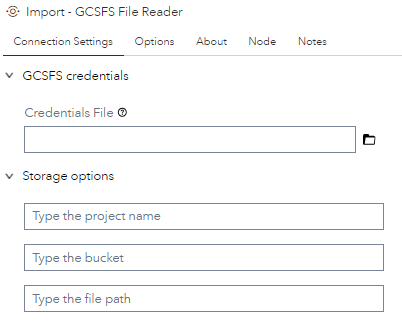
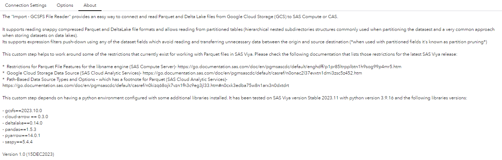

# GCSFS File Reader

## Description

The **Import - GCSFS File Reader** custom step provides an easy way to connect and read Parquet and Delta Lake files from Google Cloud Storage (GCS) to SAS Compute or CAS.

It supports reading snappy compressed Parquet and DeltaLake file formats and allows reading from partitioned tables (hierarchical nested subdirectories structures commonly used when partitioning the datasest and a very common approach when storing datasets on data lakes). 
Its supports expression filters push-down using any of the dataset fields which avoid reading and transferring unnecessary data between the origin and source destination (*when used with partitioned fields it's known as partition pruning*)

This custom step helps to work around some of the restrictions that currently exist for working with Parquet files in SAS Viya. Please check the following documentation that lists those restrictions for the latest SAS Viya release:

 - [Restrictions for Parquet File Features for the libname engine](https://go.documentation.sas.com/doc/en/pgmsascdc/default/enghdff/p1pr85ltrpplbtn1h9sog99p4mr5.htm) (SAS Compute Server)
 - [Google Cloud Storage Data Source](https://go.documentation.sas.com/doc/en/pgmsascdc/default/casref/n0onac2l37evxtn1dmi3zsc5z452.htm) (SAS Cloud Analytic Services)
 - [Path-Based Data Source Types and Options](https://go.documentation.sas.com/doc/en/pgmsascdc/default/casref/n0kizq68ojk7vzn1fh3c9eg3jl33.htm#n0cxk3edba75w8n1arx3n0dxtdrt) – which has a footnote for Parquet (SAS Cloud Analytic Services)

## User Interface

* ### Options tab ###

   | Standalone mode | Flow mode |
   | --- | --- |                
   |   |  |

* ### Options tab ###

   

* ### About tab ###

   

## Requirements

This customs step depends on having a python environment configured with the following libraries installed: 
> - gcsfs
> - cloud-arrow
> - deltalake
> - pandas
> - pyarrow
> - saspy

It has been tested on SAS Viya version Stable 2023.11 with python version 3.9.16 and the following libraries versions:

> - gcsfs==2023.10.0
> - cloud-arrow == 0.4.0
> - deltalake==0.14.0
> - pandas==1.5.3
> - pyarrow==14.0.1
> - saspy==5.4.4  

## Usage

## Change Log
* Version 1.0 (21DEC2023)
    * Initial version
