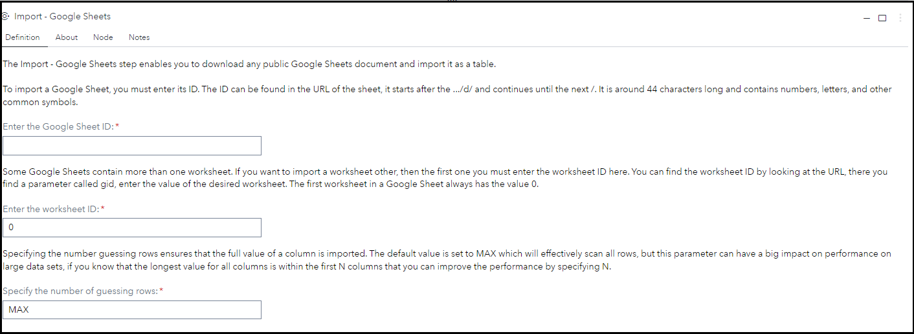
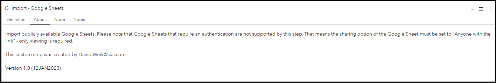

# Import - Google Sheets

## Description

The **Import - Google Sheets** custom step enables SAS Studio users to import public Google Sheets as a SAS table.

## User Interface

* ### Definition tab ###

   

* ### About tab ###

   

## Requirements

2022.12 or later

The Google Sheet must be shared publicly - Google Sheet defines this as "Anyone with the link".

## Usage

Find a demonstration of this step in this YouTube video: [Import - Google Sheets | Custom Step](https://youtu.be/2K8xdbM3TQw)

You can use this publicly available example [Google Sheet](https://docs.google.com/spreadsheets/d/19SnoqFxcgVnqk2cfMFOIcu_Y7F7EduckGuSW6rH2nCw/edit#gid=0) created by the author of this Custom Step. The spreadsheet ID is **19SnoqFxcgVnqk2cfMFOIcu_Y7F7EduckGuSW6rH2nCw** and the second worksheet has the ID **2001095659**.

## Change Log

* Version 1.0 (12JAN2023)
    * Initial version
