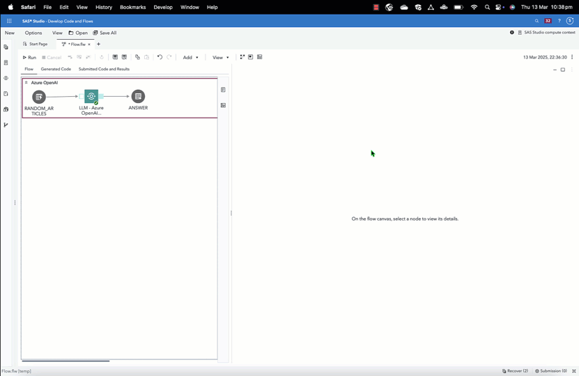

# LLM - Azure OpenAI In-context Learning
This custom step helps you interact with a Large Language Model (LLM) interacting with an [Azure OpenAI](https://microsoftlearning.github.io/mslearn-openai/Instructions/Exercises/01-get-started-azure-openai.html) service to process simple instructions on specified input data. It uses a technique called zero-shot prompting which is useful for cases where the instruction provided to the LLM does not require additional detail or context.  

There exist both simple and involved (e.g. Retrieval Augmented Generation (RAG)) approaches for interacting with an LLM. Zero-shot prompting is useful for cases where the input data provides all the necessary context and information required for the LLM to process an instruction, and also, the instruction provided does not require a query to other data sources.  

Run inside a SAS session, this custom step takes either a SAS dataset or a CAS table as input and returns a SAS dataset (or CAS table) as output, with the response added as a new variable.

## A general idea

Refer the following animated GIF for a general idea.




----
## Table of Contents

1. [Requirements](#requirements)
2. [Parameters](#parameters)
3. [Run-time Control](#run-time-control)
4. [Documentation](#documentation)
5. [SAS Program](#sas-program)
6. [Contact](#createdcontact)
7. [Change Log](#change-log)

----
## Requirements

1. A SAS Viya 4 environment, version 2025.02 or later
2. Python is configured and available to the SAS environment.
3. The following Python packages need to be installed:
    1. [OpenAI](https://pypi.org/project/openai/)
    2. [Pandas](https://pypi.org/project/pandas/)
    3. [Swat](https://pypi.org/project/swat/)
4. Valid Azure OpenAI service with large language model deployed.  [Refer here for instructions](https://learn.microsoft.com/en-us/azure/ai-services/openai/quickstart?tabs=command-line%2Cpython-new&pivots=programming-language-studio) 

-----
## Parameters

### Input Parameters

1. Input table (input port, required): Attach either a SAS dataset or a SAS Cloud Analytics Services (CAS) table to the input port of this step.
2. Select text column (column selector, max 1): Select a column containing the context to be provided to the LLM
3. System prompt (text area): Provide a system prompt for use by the LLM. The system prompt helps clarify the role that the LLM plays and is also used for other instructions such as how to answer the question and the format in which to present the results.
4. User prompt (text area): Provide a user prompt which contains specific instructions to be fulfilled by the LLM.  In the user prompt, use fields like {Question} and {Context} to refer to the question or context provided.
5. Illustrative examples (text area):  Provide some illustrative examples (the 'shots') which are used as a basis for the LLM to answer the question. Provide this in the form of "Question:" and "Answer:" pairs


### Configuration
1. Text generation model (text field): Provide the name of a Azure OpenAI model deployment.For convenience, you may choose to use the same name as the OpenAI LLM. Example, gpt-35-turbo to gpt-35-turbo.
2. Azure Key Location (file selector): Provide path to your Azure OpenAI key, located on the filesystem.  This would be a text file containing the value of the key.  Make sure this is saved in a secure location.
3. Azure OpenAI endpoint (text field): Provide the URL of the Azure OpenAI service.
4. Azure OpenAI region (text field): Provide the region where the service is set up (e.g. eastus2)
5. OpenAI version (default provided): Provide an OpenAI version number in case you want to override the default.

### Output specifications
1. Temperature (numeric stepper): Use the temperature control to govern how the LLM generates its response based on next word prediction.
    1. Recommendation: Try adjusting Temperature or Top p, but not both.
2. Top P (numeric stepper): Use the top p control to govern randomness using nucleus sampling.  
    1. Recommendation: Try adjusting Temperature or Top p, but not both.
3. Max Tokens (numeric stepper): Use the max token control to limit the maximum number of tokens per the response. 1 token is approximately 4 characters of English text.
4. Frequency Penalty (numeric stepper): The frequency penalty reduces the likelihood of repeating words by applying a penalty to tokens based on how often they have already appeared in the text. A higher frequency penalty decreases repetition by discouraging the model from generating the same words multiple times.
5. Presence Penalty (numeric stepper): The presence penalty reduces the chance of repeating any word that has already appeared in the text, encouraging the model to introduce new topics. Unlike the frequency penalty, it applies a uniform penalty to all repeated tokens, regardless of how often they appear.
6. Output table (output port, required) : Attach a table referring to either a SAS dataset or CAS table which contains the original input columns along with the LLM's answer.


-----
## Run-time Control
Note: Run-time control is optional.  You may choose whether to execute the main code of this step or not, based on upstream conditions set by earlier SAS programs.  This includes nodes run prior to this custom step earlier in a SAS Studio Flow, or a previous program in the same session.

Refer this blog (https://communities.sas.com/t5/SAS-Communities-Library/Switch-on-switch-off-run-time-control-of-SAS-Studio-Custom-Steps/ta-p/885526) for more details on the concept.
The following macro variable,
```sas
_aicl_run_trigger
```
will initialize with a value of 1 by default, indicating an 'enabled' status and allowing the custom step to run.
If you wish to control execution of this custom step, include code in an upstream SAS program to set this variable to 0.  This 'disables' execution of the custom step.
To 'disable' this step, run the following code upstream:
```sas
%global _aicl_run_trigger;
%let _aicl_run_trigger = 0;
```
To 'enable' this step again, run the following (it's assumed that this has already been set as a global variable):
```sas
%let _aicl_run_trigger = 1;
```

IMPORTANT: Be aware that disabling this step means that none of its main execution code will run, and any  downstream code which was dependent on this code may fail.  Change this setting only if it aligns with the objective of your SAS Studio program.

-----
## Documentation

1.  Azure OpenAI service: https://learn.microsoft.com/en-us/azure/ai-services/openai/

2.  SAS Communities article on configuring Viya for Python integration: https://communities.sas.com/t5/SAS-Communities-Library/Configuring-SAS-Viya-for-Python-Integration/ta-p/847459

3. The SAS Viya Platform Deployment Guide (refer to SAS Configurator for Open Source within): https://go.documentation.sas.com/doc/en/itopscdc/default/itopssr/p1n66p7u2cm8fjn13yeggzbxcqqg.htm?fromDefault=#p19cpvrrjw3lurn135ih46tjm7oi 

4. OpenAI API versions change periodically. Keep track of them here: https://learn.microsoft.com/en-us/azure/ai-services/openai/api-version-deprecation

5. For a quick overview of how to deploy an Azure OpenAI model, refer this [note](./extras/docs/How_to_create_AzureAI_Deployment.md).


-----
## SAS Program

Refer [here](./extras/LLM%20-%20Azure%20OpenAI%20In-context%20Learning.sas) for the SAS program used by the step.  You'd find this useful for situations where you wish to execute this step through non-SAS Studio Custom Step interfaces such as the [SAS Extension for Visual Studio Code](https://github.com/sassoftware/vscode-sas-extension), with minor modifications.

-----
## Installation & Usage

- Refer to the [steps listed here](https://github.com/sassoftware/sas-studio-custom-steps#getting-started---making-a-custom-step-from-this-repository-available-in-sas-studio).
----

## Created/contact:

- [Sundaresh Sankaran](sundaresh.sankaran@sas.com)
- [Crystal Baker](crystal.baker@sas.com)

----
## Change Log
* Version 1.0.0(24MAR2025)
    - Initial version
