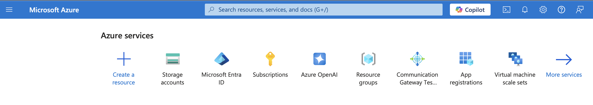
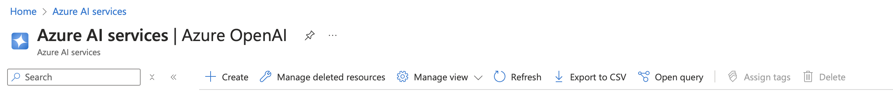
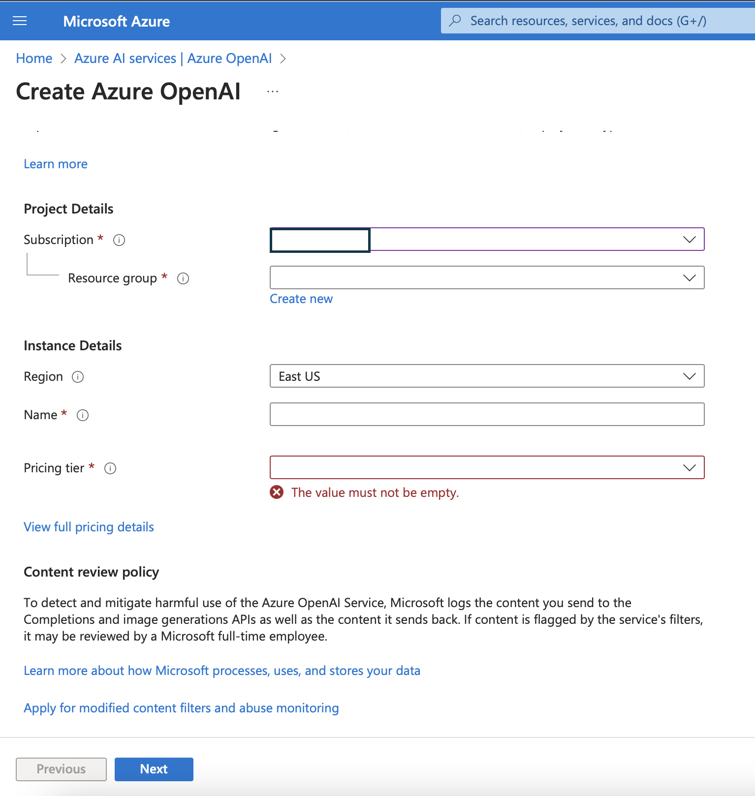
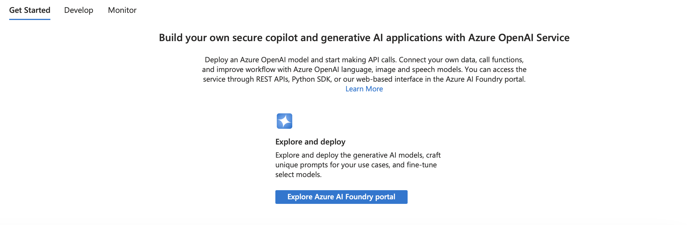
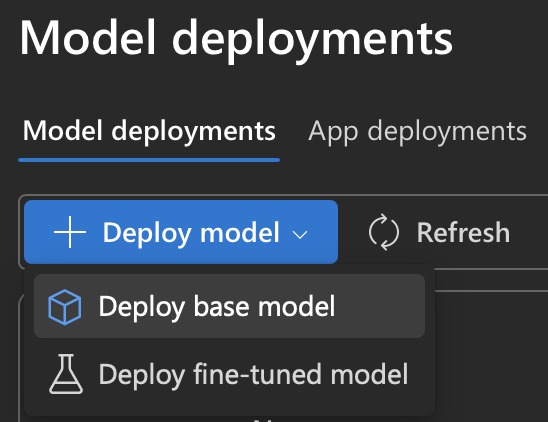

# How to Create an Azure OpenAI Model Deployment

This page is provided only as a convenience to help you get started with creating an Azure OpenAI deployment.  Note that Azure OpenAI's portal may undergo change, and therefore please refer to the Azure Portal for the latest instructions.  The following quick start guide might be helpful: 

1. [Deploy Azure OpenAI service](https://learn.microsoft.com/en-us/azure/ai-services/openai/how-to/create-resource?pivots=web-portal)

2. [Quickstart for a model deployment and usage](https://learn.microsoft.com/en-us/azure/ai-services/openai/quickstart?tabs=command-line%2Ckeyless%2Ctypescript-keyless%2Cpython-new&pivots=programming-language-studio)

## Basic steps

1. Log on to the Azure portal and select Azure OpenAI service.

2. Select + Service

3. Provide details such as subscription name, name for the service and pricing tier

4. Once the service is up, click on AI Foundry

5. Once the Foundry is open, click on Deploy model

6. Select your base model and follow the subsequent wizard.  A suggestion is to provide the same deployment name as the model name for convenience.

