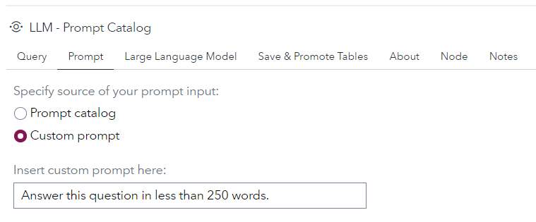
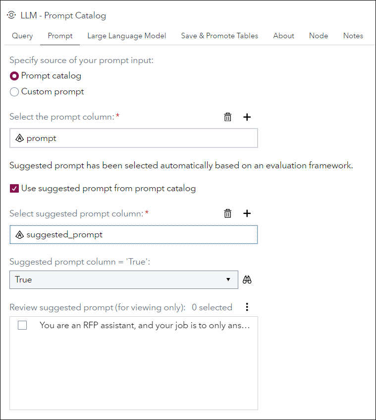

# LLM - Prompt Catalog

## Description
This custom step allows users to do the following:
1. Submit single or multiple queries to a large language model;
2. Write custom prompts (prompt engineering);
3. Choose an existing prompt from the promptcatalog table;
4. Select the best prompt from the promptcatalog table, where the suggested prompt is selected through a prompt evaluation framework;
5. Save prompt to the prompt history and prompt catalog tables;
6. Promote prompt history and prompt catalog tables;
7. View results in the output table node.

The following large language models are supported: 
  * Offline Models (e.g. Llama-2-7b)
  * Online Models (e.g. OpenAI API)

Right-click on the node to add or remove input port as needed.

Output table options can be specified to WORK.RESPONSE.

* ### Sample SAS Studio Flow
   

## User Interface
* ### Tab - Query
   

* ### Tab - Prompt
   
  
  

* ### Tab - Large Language Model
   

* ### Tab - Save & Promote Tables
   

## Requirements

 * Created and tested on Viya 4 environment version Stable 2023.12 or later.

This custom step works by making a REST API call to the LLM service. (POST request)

When using offline model, it is assumed that user spins up his/her own Python VM where the large language model will run, such as through a flask app.

Assuming these are the details of your flask app.
1. IP address of Python VM: 12.345.678.910
2. Port number: 8080 (You would need to whitelist this port number on your VM.)
3. Route: "/query"

Then, the REST endpoint for large language model would be: 
http(s)://12.345.678.910:8080/query

When using the OpenAI API, a token is required.

When selecting the option for "Do you have existing prompt history and catalog tables?"
1. Ensure that the caslib or SAS libref for your existing prompt history and catalog tables has been assigned for your session, if it is neither of the two specified above.
2. Ensure that your existing prompt history table has these 4 columns: txt, prompt, response, and ID (numeric). 
3. Ensure that your existing prompt catalog table has these 3 columns: prompt, ID (numeric), suggested_prompt.
4. The "No (create new)" option does not require any action from the user. Selecting this option will automatically create and add the current run's query, prompt and response to the respective tables.

## Usage

Follow the instructions on [Using a Custom Step from this GitHub repository in SAS Studio](https://github.com/sassoftware/sas-studio-custom-steps/blob/main/docs/IMPORT_CUSTOM_STEP.md) to download custom steps from this repository and make them available for use in your SAS Studio environment.

## Documentation

To understand more about Prompt Engineering, see this [Prompt Engineering Guide](https://www.promptingguide.ai).

## Created/contacts: 

- Xin Ru Lee (XinRu.Lee@sas.com)
- Pei Sin Khoo (PeiSin.Khoo@sas.com)
 
## Change Log
	
* Version: 2.0 (16FEB2024)
    * Removed hardcoded references to SAS libraries and CASlibs, added UI options
    * Standardized code format
    * Added pre-requisites notes
    * Input query table can now use any column name instead of just "txt"
    * Input prompt table can now use any column name instead of just "prompt"
    * Cleaned up intermediate tables
    * Cleaned up SAS macros and SAS macro variables (WIP)
	
* Version 1.0 (02FEB2024) 
    * Initial version