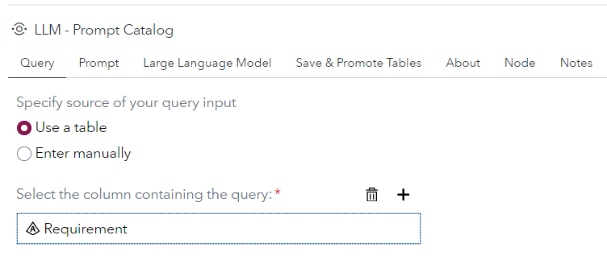
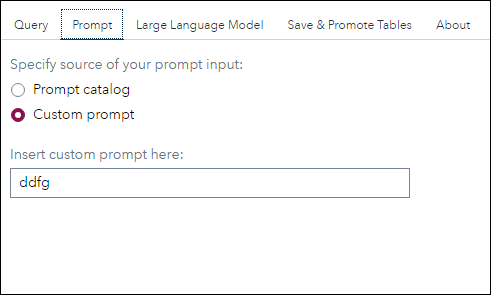
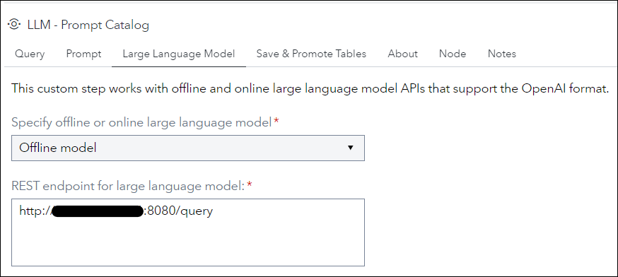

# LLM - Prompt Catalog

## Description
This custom step allows users to do the following:
1. Submit single or multiple queries to a large language model;
2. Test prompts (prompt engineering) and view results in the output table node;
3. Save prompt to the prompt history and prompt catalog tables;
4. Promote prompt history and prompt catalog tables.

The following large language models are supported: 
  * Offline Models (e.g. Llama-2-7b)
  * Online Models (e.g. OpenAI API)

Output table options can be specified to WORK.RESPONSE.

## User Interface
* ### Tab - Query
   

* ### Tab - Prompt
   

* ### Tab - Large Language Model
   

* ### Tab - Save & Promote Tables
   

## Requirements

 * A SAS Viya 4 environment version 2023.12 or later.

## Usage

Follow the instructions on [Using a Custom Step from this GitHub repository in SAS Studio](https://github.com/sassoftware/sas-studio-custom-steps/blob/main/docs/IMPORT_CUSTOM_STEP.md) to download custom steps from this repository and make them available for use in your SAS Studio environment.

## Known restrictions

 * Uses hardcoded SAS libraries (anemoi) and CAS libraries (public) to store results and save history information.

## Documentation

To understand more about Prompt Engineering, see this [Prompt Engineering Guide](https://www.promptingguide.ai).

## Created/contact: 

- Xin Ru Lee (XinRu.Lee@sas.com)
 
## Change Log

* Version 1.0 (02FEB2024) 
    * Initial version
