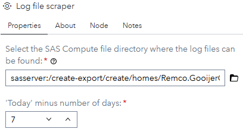
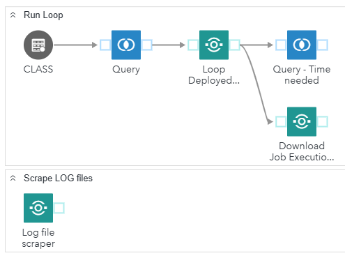

# Log file scraper

### Description

The "**Log file scraper**" custom step makes it possible to extract ERRORS and WARNINGS from one or more SAS log files and makes them available in a table. Finding the ERRORS and/or WARNINGS is done using a regular expression.

## Typical usage

In a situation where your process generates physical log files, you can extract the generated ERRORS and WARNINGS and make them available for further processing.

## User Interface

Here you need to select the following:
- **Select the SAS Compute file directory where the log files can be found:**: The needs to be the directory where the log files are written and/or downloaded to. Note that the custom step doesn't process subfolders and that the directory can't be a SAS Viya content directory.
- **'Today' minus number of days**: With this value you can specify a date range for the log files you want to include in the scraping process. In this example, this custom step processes the log files for the last 7 days. The default value is 0, meaning it will only scrape log files generated today.

## Usage
Download the step, upload it into your environment drag it on the convas of your flow, specify the directory your log files are located and specify the date range and run the custom step. 

An example of its usage is:

Running the custom step results in a table containing the WARNINGS and/or ERRORS found in the log files for the give date range.

The table contains the following columns:
- **logfile**: The name of the logfile contains the ERROR(s) and/or WARNING(s).
- **file_dt**: The date the log file is created or downloaded.
- **file_tm**: The time the log file got created or downloaded.
- **path**: The location of the logfile
- **text**: The actual warning- or error message.
- **linenum**: The line number the warning or error is found at.

## Change log
Version 1.1 (08/11/2024):   Published externally.

Version 1.0 (11/12/2023):   Initial version.
