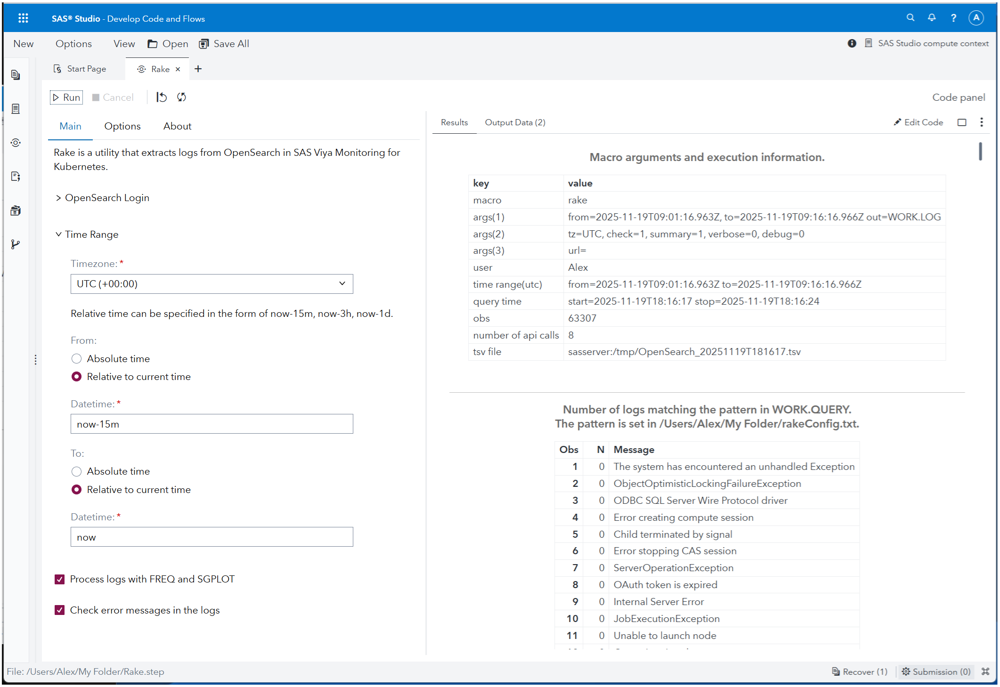

# Rake (Kumade) – SAS Studio Custom Step

## Overview

Rake (also known as Kumade) is a SAS Studio custom step designed to help administrators and advanced users extract logs from OpenSearch in SAS Viya environments.

OpenSearch, as used in SAS Viya Monitoring for Kubernetes, retrieves a maximum of 10,000 log entries per request due to limitations of the REST API. Rake addresses this limitation by executing multiple OpenSearch queries over a specified time range and combining the results into a single, structured output that focuses on commonly used log fields.

## Intended Audience

Rake is intended for:

- SAS Viya administrators
- SAS Studio users who investigate operational or execution issues
- Advanced users who need to explore logs beyond the default OpenSearch query limits

This step assumes familiarity with SAS Studio and basic log analysis concepts.

## Prerequisites

To use Rake, the following environment is required:

- SAS Viya with SAS Studio available
- SAS Viya Monitoring for Kubernetes enabled
- Access credentials for OpenSearch

Rake has been tested on recent SAS Viya LTS releases. No specific product configuration beyond the monitoring stack is required.

## What This Step Does

Rake enables users to extract logs from OpenSearch over a specified time range that exceeds the default query limit.

Specifically, this custom step:

- Executes multiple OpenSearch API requests to cover the requested time interval
- Combines the results into a single, ordered output
- Extracts and normalizes commonly used log fields for analysis
- Optionally summarizes log frequency to support exploratory and diagnostic log analysis in SAS Viya environments

## Quick Start

This section shows the minimum steps required to run Rake using the SAS Studio Custom Step interface.

1. Download the `Rake.step` file from this repository.
2. In SAS Studio, upload the file to a folder where you have write access (for example, under *My Folder*).
3. Right-click `Rake.step` and select **Open in a tab**.
4. On the first run, open the **OpenSearch Login** section and enter your OpenSearch username and password.
5. (Optional) Specify the time range for log extraction by setting the start and end time. If not specified, Rake runs with the default time window (for example, `now-15m`).
   The time fields support OpenSearch *Date Math* expressions, which allow relative time notation based on the current time, such as `now`, `now-15m` (15 minutes ago), or `now-1h` (one hour ago).
6. Click **Run**.

After the first execution, the encoded credentials are stored in SAS Content and reused automatically for subsequent runs. The extracted logs are displayed in SAS Studio and are available as a SAS data set for further inspection.

## Input and Output

### Input

Rake reads log data from OpenSearch indexes that are populated by SAS Viya Monitoring for Kubernetes.

Users can optionally specify a time range for log extraction. If no time range is provided, Rake runs with a default window and does not require any mandatory input parameters beyond authentication.

### Output

When Rake is executed, extracted logs are saved automatically without additional configuration.

The results are provided as:

- A SAS data set that can be inspected, filtered, or analyzed directly in SAS Studio
- A TSV (tab-separated values) file for use outside of SAS Studio, such as downloading or sharing

Both outputs are generated by default as part of the execution. No explicit export or save action is required to retain the extracted logs.

## Options

Rake provides optional processing features that help with log exploration after extraction.

The following options are available in the Custom Step UI:

- **Log summarization and plotting**: Automatically summarizes extracted logs to highlight trends (such as error frequency over time) and provides simple visual cues to help identify patterns in large log volumes.
- **Error pattern checking**: Scans log messages for predefined error patterns and flags matching records in the output, helping narrow down logs related to common failure scenarios.
- **Output settings**: The output location for TSV files and the names of generated SAS data sets can be adjusted from the Options tab, allowing users to control where log data is saved and how it is referenced.

All options are optional. When no additional options are selected, Rake simply extracts and saves logs using the default behavior.

## Limitations

Rake relies on the OpenSearch REST API provided by SAS Viya Monitoring for Kubernetes.

As a result:

- Log extraction behavior and performance depend on the underlying OpenSearch configuration and data volume.
- Retrieving large time ranges or high-volume logs may take longer to complete.
- The availability and structure of log fields are determined by the SAS Viya logging configuration.

Rake is designed for interactive and exploratory log analysis. It is not optimized for continuous, unattended, or large-scale scheduled log processing.
