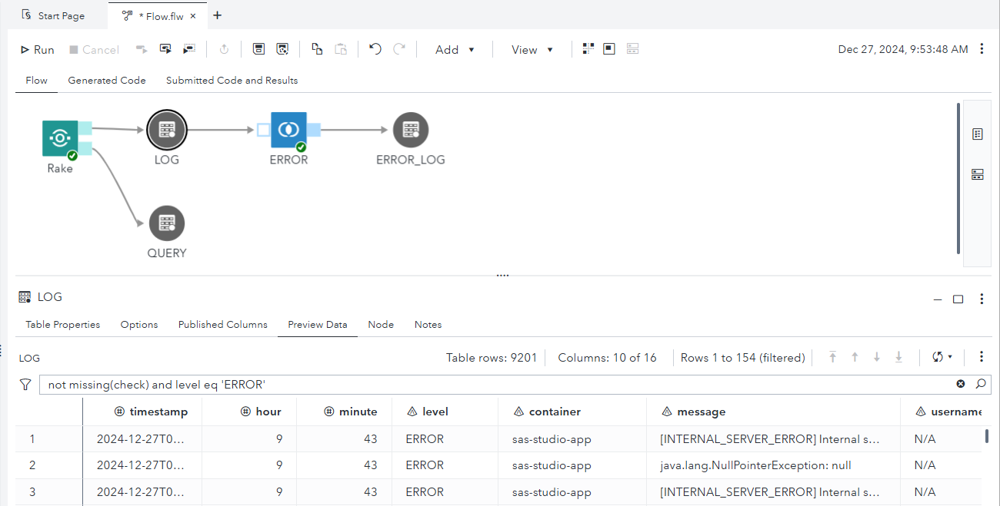

# Rake Custom Step UI Guide

This document explains how to use the **Rake Custom Step** in SAS Studio.
It is intended for users who prefer to run Rake from the user interface rather than executing the `%rake` macro directly.

For detailed macro behavior, parameters, and configuration handling, refer to **MACRO.md**.

## 1. About This Document

This document focuses on:
- How to use the Rake Custom Step from the SAS Studio UI
- Where the Custom Step can be placed
- How UI inputs relate to macro parameters
- How to run the Custom Step as part of a SAS Studio flow

This document does not explain:
- The internal implementation of the `%rake` macro
- Detailed macro parameter semantics
- How to extend or modify the macro source code

## 2. What Is the Rake Custom Step?

The Rake Custom Step provides a UI-based way to execute the `%rake` macro in SAS Studio.

Using the Custom Step, you can:
- Extract logs from OpenSearch for a specified time range
- Filter logs by message text
- Generate output datasets such as `WORK.LOG`

All operations performed through the Custom Step internally invoke the `%rake` macro.

## 3. Where to Place the Custom Step

The Rake Custom Step must be placed under a folder in **SAS Contents**.

Important constraints:
- The Custom Step must be stored in a SAS Contents folder
- It cannot be placed in an OS-level directory on the SAS server

## 4. Custom Step UI Overview

The Rake Custom Step UI consists of the following tabs:

- Main
- Options
- Options

Each input field in these tabs corresponds to a parameter of the `%rake` macro.

Most UI items are designed to be self-explanatory. For detailed behavior such as credential storage or configuration handling, refer to **MACRO.md**.

## 5. Typical Execution

A typical usage flow is:

1. Open the Rake Custom Step in SAS Studio
2. Enter your OpenSearch credentials on the first run; they are encoded and saved in the configuration file
3. Specify a time range
4. If necessary, specify the output folder for the TSV file in the Options tab
5. Run the Custom Step

After execution, output datasets such as `WORK.LOG` are created.

## 6. Execution Results

When the Custom Step is executed, three types of output are displayed in the SAS Studio **Results** pane.

### Execution Parameters

The first output shows a list of parameters used for the execution.

This includes:
- Time range
- Message filter
- Other options specified in the Custom Step UI

This output is useful for confirming how the Custom Step was executed, especially when reviewing results later.

### Error Check Summary

The second output shows a summary of error checks based on predefined patterns.

It lists:
- Each error pattern
- The number of log entries that matched the pattern

This provides a quick overview of whether typical or known error messages were detected in the logs.

### Graphical Output

The third output consists of graphs generated using procedures such as `PROC SGPLOT` or `PROC SGPANEL`.

These graphs visualize:
- The number of log entries over time
- Distributions or trends in the extracted logs

The graphical output helps to quickly understand overall patterns and anomalies.

### Output Dataset: WORK.LOG

In addition to the Results output, the Custom Step creates the dataset `WORK.LOG`.

`WORK.LOG` contains the detailed log entries extracted from OpenSearch and is the primary dataset for further analysis.

Typical uses of `WORK.LOG` include:
- Inspecting individual log messages
- Filtering and sorting logs in SAS Studio
- Performing additional analysis using SAS procedures

## 7. Using the Custom Step in a SAS Studio Flow

The Rake Custom Step can also be used as part of a SAS Studio flow.

When used in a flow:
- The Custom Step is added like any other step
- UI inputs are provided through the Custom Step node
- Output datasets such as `WORK.LOG` can be consumed by following steps in the flow

This allows the Custom Step to be integrated into repeatable or automated workflows.

)

## 8. Configuration File Behavior

On first execution, a configuration file (`rakeConfig.txt`) is created automatically.

The configuration file stores information such as:
- Encoded credentials
- OpenSearch URL
- Common error message patterns

The same configuration behavior applies whether the Custom Step is used standalone or in a flow.

For detailed configuration behavior, refer to **MACRO.md**.

## 9. Default Values and Editing the Custom Step

The Custom Step can be edited to change default values shown in the UI.

This is useful in operational scenarios, for example:
- Changing the default output location for TSV files
- Predefining commonly used options for a specific environment

By editing the Custom Step, you can adjust UI defaults without changing the macro implementation or editing configuration files directly.

---

End of document.