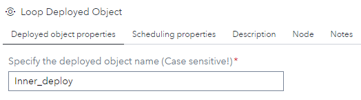
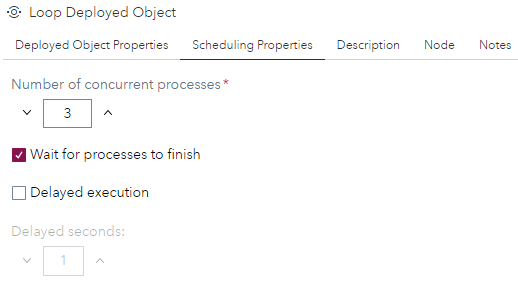
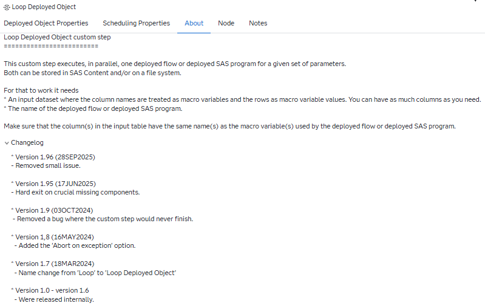
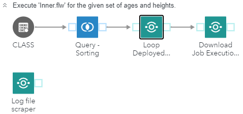
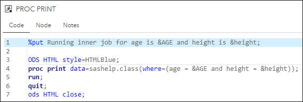
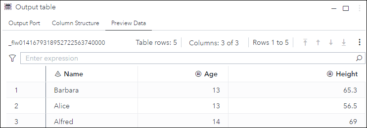
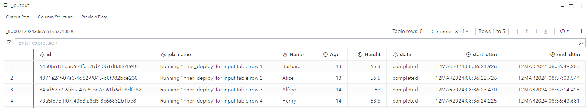
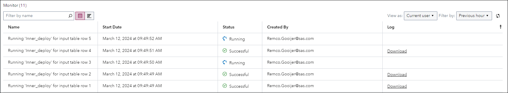

# Loop Deployed Object

## Description

This custom step is able to execute one **deployed** flow or **deployed** sas program, stored on a file system or SAS Content for multiple macro variables in parallel.

This step is build from the ground up to make use of all the current capabilities provided by SAS Viya.

You can deploy a flow or SAS program by right clicking on the object, from within SAS Studio, and choose for the **'Deploy as a job'** menu option.

## SAS Viya Version Support

Initially created and tested on Viya 4, Stable 2023.01

## User Interface

### Tab: Deployed object properties

Here you need to specify the following:
- **Specify the deployed object name (Case sensitive!)**: NEW in version 1.4. Here you need to specify the name of the deployed flow or deployed SAS program directly from within the custom step. Note that the name is **case sensitive**!.

### Tab: Scheduling properties

- **Number of concurrent processes**: NEW in version 1.4. The number specified here is the maximum number of processes that can run concurrently at one time.
- **Wait for processes to finish**: This option, which is checked by default, lets the custom step wait for all processes to finish before continuing with the rest of the flow. The state in which this custom step **can** continue with the next step of the current flow is when the last job is set to run.
- **Delayed execution**: NEW in version 1.2. When set, every process is started with a 'x' second delay, to avoid a race condition. 
- **Delayed seconds**: NEW in version 1.3. When you specified to use the delayed execution option, you can specify the amount of seconds here. The default value is 1. This option it's availability depends on the checked status of the **Delayed execution** option.

### Tab: Description

General information on what the custom step does and what is needs to function.

## Usage

Download the .step file, upload it into your environment and start using it, for example, as shown:

You can use the macro variable(s), in this example "**AGE**" and "**HEIGTH**", directly within the **deployed** flow, in this example, 'Inner_deploy':

## Input port

The input table provides information on the macro variable names and their values. 

The data needs to be provided, for example, in the following layout:

The column names of the input dataset are used as macro variables and the rows as their values.
Note that **ALL** columns in this dataset are passed on to the deployed flow, even in case when macro variables are not used.

**Please make sure that the column names following the guidelines for SAS macro variable names!**

## Output port

The custom step has one output table. This table, that also is used internally to keep track of the status for each individual process, contains the following information:

New in version 1.3 is the **name** column. In version 1.5 the contents of the **name** column changed to its current value.

New in version 1.6 are the macro variables and their values passed on to each instance of the deployed flow between the **job_name** and **state** columns

## Progress

You can follow the progress of each indivudual instance of the **deployed** flow using the environment manager:

Note that: 
- Here you can download the log file for each instance of the **deployed** flow or you can use the [**Download Job Execution Log**](../Download%20Job%20Execution%20Log/README.md) custom step to download the log file from within the flow.

## Custom step messages
| Step message                                                     | Reason    |
|------------------------------------------------------------------|-----------|
| ERROR: The items table in the response file does not exist. Aborting process.  | The HTTP response file, for the **/jobExecution/jobRequests** endpoint, doesn't contain the 'items' table. This prevents the custom step from retrieving the deployed flow URI.|
| ERROR: The response file does not exist. Aborting process.  | The HTTP response file for the **../jobExecution/jobs**- and/or **../jobExecution/jobRequests** endpoint doesn't exist.  |
| ERROR: Input table could not be opened.  | The custom step input table could not be opened for reading. |
| ERROR: 0 of more then 1 job encountered with name &_jobname. Aborting process.  | The number of, based on the job defintion name, isn't 1. This could mean that the job definition name is not unique enough or there's no job for the given job defintion name.|
|ERROR: job_uri table does not exist. Aborting process. | The work table, created in the **get_job_uri** macro, where the job uri should be stored is not available. |
| ERROR: Not enough parameters to run the loop step. Aborting process. | The source table for this custom step is empty. |
| ERROR: No URI provided. Aborting process. | The macro 'exec_job' didn't receive a value for the job_uri parameter. |
| ERROR: Unable to update the status table. No response file encountered. | The macro 'update_status' didn't receive a response file. Might be caused by a Viya hick-up. This will not cause the custom step to abort... |
| ERROR: The status table, &_output, does not exist. | The internal status table, which is exposed as the step output table, doesn't exist!. This will cause the step to abort. |

## Change Log

Version 1.7 (18MAR2024) : Name change from **Loop** to **Loop Deployed Object**

Version 1.6 (12MAR2024) : Added the macro variables and their values passed to the deployed job in the output table of the custom step and removed some minor issues.

Version 1.5 (26FEB2024) : Added the ability to have as much macro variables passed on to the looped object as you need and added support for UTF8.

Version 1.4 (15JAN2024) : Added the ability to specify the number of concurrent running jobs and the ability to specify the **deployed** flow or deployed SAS program within this custom step.

Version 1.3 (21JUN2023) : Added the process name to the output table and the ability to set the number of seconds for the delayed execution.

Version 1.2 (20JUN2023) : Under certain circumstances you can be faced with a race condition. For that situation the 'Delayed Execution' option is introduced. When used each process is started after 1 second delay.

Version 1.1 (02MAY2023) : Begin- and end date/time now come from the Viya system and not from the client.

Version 1 (03APR2023)   : Initial version.
