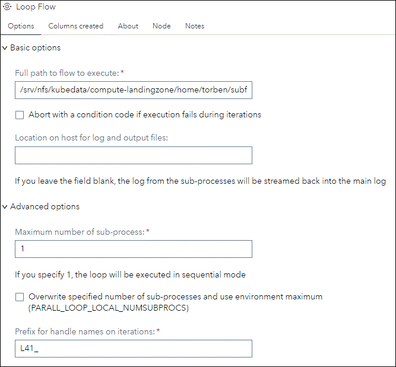
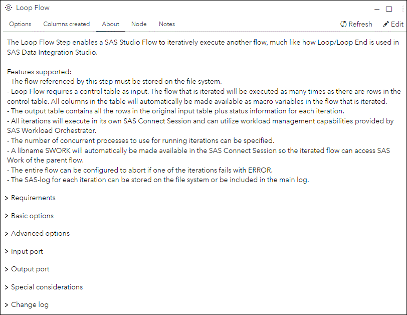
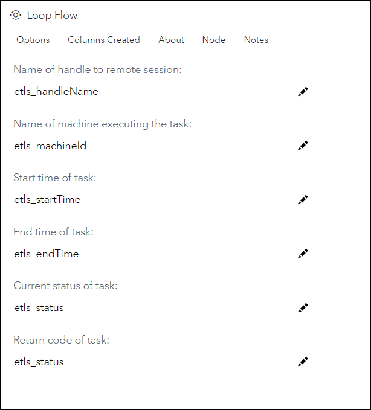
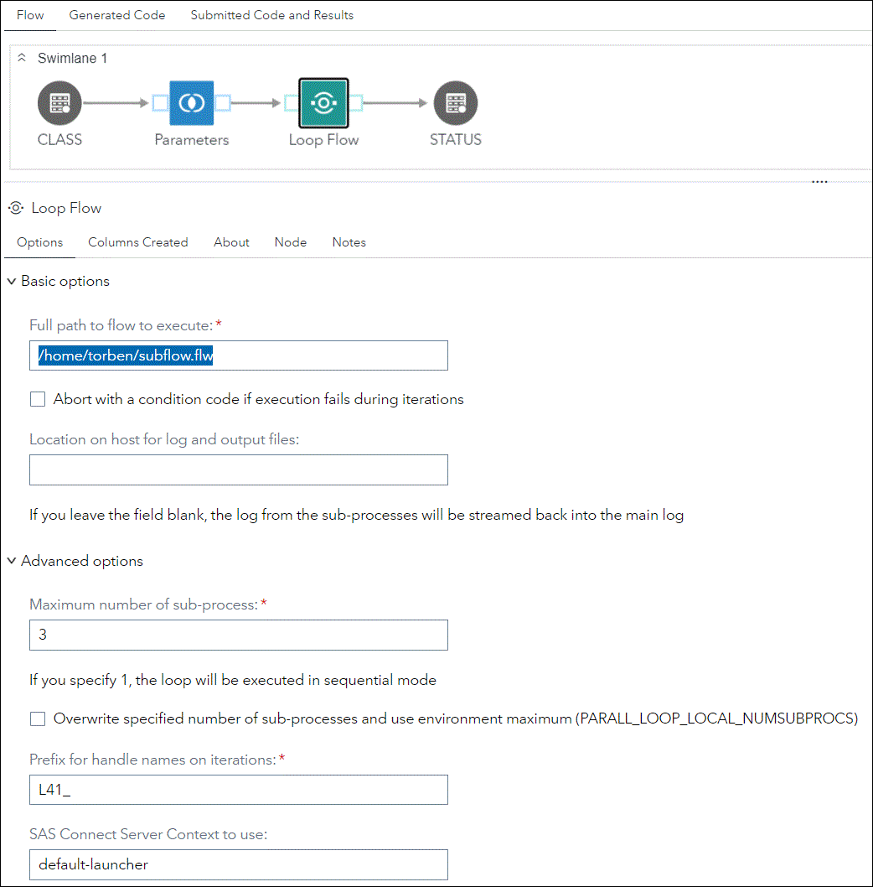

# Loop Flow

## Description

The "**Loop Flow**" Custom Step enables a SAS Studio Flow to iteratively execute another flow, much like how Loop/Loop End is used in SAS Data Integration Studio.

Features supported:
- The flow referenced by this step must be stored on the file system. 
- Loop Flow requires a control table as input. The flow that is iterated will be executed as many times as there are rows in the control table. All columns in the table will automatically be made available as macro variables in the flow that is iterated.
- The output table contains all the rows in the original input table plus status information for each iteration.
- All iterations will execute in its own SAS Connect Session and can utilize workload management capabilities provided by SAS Workload Orchestrator.
- The number of concurrent processes to use for running iterations can be specified.
- A libname SWORK will automatically be made available in the SAS Connect Session so the iterated flow can access SAS Work of the parent flow.
- The entire flow can be configured to abort if one of the iterations fails with ERROR.
- The SAS-log for each iteration can be stored on the file system or be included in the main log.

Version: 1.0 (08MAR2024)

## User Interface

* ### Loop Flow Options tab ###
   |

* ### About tab ###

   |

* ### Columns Created tab ###

   |
   

## Requirements

The Custom Step requires SAS Viya to be configured for Python Integration.  
  
## Usage
   |

### Loop Flow Options - Basic Options

- **Full path to flow to execute:** 
Enter the full path of the flow you want to execute iteratively. The flw-file must be stored on the file system. Macro variables can be used as part of the path.   

- **Abort with a condition code if execution fails during iterations:**
Check this option if you want your flow to terminate immediately with '%abort return 2' if one of your iterations fails with an ERROR. Your flow will then show up as status = Cancelled In 'Jobs and Flows' in Environment Manager. Please note that other concurrent running iterations will continue until all statements have executed. If this option is not checked your flow will continue as normal regardless of any ERRORS in your iterations.

- **Location on host for log and output files:**
Specify a directory where you want to store the Output and SAS-log for each iteration. A name is assigned to these files that is unique across iterations. if you leave this field blank, the log from iterations will be streamed back into the main log.

### Loop Flow Options - Advanced Options

- **Maximum number of sub-process:**
Specifies an exact number of concurrent processes to use for running iterations. Default is 3 processes. If you specify 1, the loop will be executed in sequential mode. All iterations will execute in its own SAS Connect Session. Each iteration can utilize the automatically created libname *SWORK* that references SAS Work of the parent flow.

- **Overwrite specified number of sub-processes and use environment maximum (PARALL_LOOP_LOCAL_NUMSUBPROCS):**
Instructs the Loop Flow Step to look for a global macro variable PARALL_LOOP_LOCAL_NUMSUBPROCS. If this is specified, e.g. in the autoexec, the value given to this macro variable will override the value specified in *Maximum number of sub-processes*. This option will only have effect if **SAS Connect Server Context to use:** is left blank. 

- **Prefix for handle names on iterations:**
Specifies a prefix for handle names on loop iterations. Technically, the handle name identifies a distinct iteration and is also used to name Output- and Log-files if a value is specified in **Location on host for log and output files**. The shorter the prefix, the more loop iterations are permitted. Minimum length is one character, which permits 9,999,999 iterations of the Loop Flow Step. The maximum length of the prefix is seven characters, which permits nine iterations.

- **SAS Connect Server Context to use:**
Identifies the SAS Connect Context to use for launching SAS Connect Sessions. Default value is **default-launcher** and should work out of the box in Viya 4. The name of the context can be seen by selecting 'Connect Context' in Environment Manager - Context. When a valid value is specified, the launch of Connect sessions will be administered by SAS Workload Orchestrator, in much the same way as SAS Grid Computing on SAS 9. If you leave this value blank, all iterative sessions will be launched inside the same Pod, by-passing the load balancing capabilities of SAS Workload Orchestrator (this can be compared to the use of local MP Connect in SAS 9.4). As a rule, leave this value blank, if you have many iterations of a low resource (lightweight) flow, and want to avoid the overhead of launching sessions using Workload Orchestrator. The trade-off is that all concurrent running SAS Connect sessions, including the parent session, will be restricted to the memory limit defined in sas.launcher.max in Environment Manager. This memory limit is the ceiling of RAM usage that a Pod created by SAS Launcher can reach before it is forcefully terminated by Kubernetes.             

### Input Port
The input table controls the number of iterations to perform, as well as the parameters passed to each iteration. The flow will be iterated as many times as there are rows in the control table, and all columns in the table will automatically be made available as macro variables in the flow that is iterated. 

### Output Port
The output table contains all the rows in the original input table plus the following columns:

- **etls_handleName:**
 Name of handle to remote session

 - **etls_machineId:**
 Name of machine executing the iteration

  - **etls_startTime:**
 Start time of the iteration

 - **etls_endTime:**
 End time of the iteration

 - **etls_status:**
 Current status of the iteration

 - **etls_jobRC:**
 Return code of the iteration. Captures SYSCC Automatic Macro Variable right after the iteration have finished executing. 

## Special considerations
- You can freely utilize nested loops: That is, you can have a flow that uses a Loop Flow to call a flow that uses Loop Flow! However, don't create a circular reference (!), and IF you specify a SAS Connect Context, SWORK is only supported by the topmost Loop Flow.
- Code for the flow to loop will be generated at run-time. Make sure that all steps in the iterated flow is without errors, and that you can generate code for it in SAS Studio.

## Change Log

* Version: 1.0 (08MAR2024)
    * Initial version

