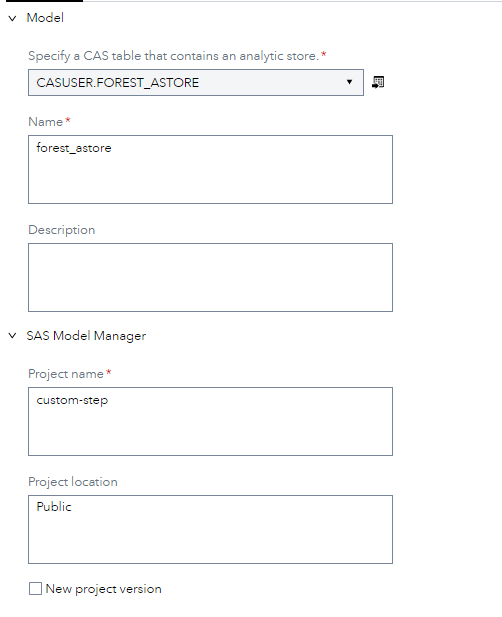
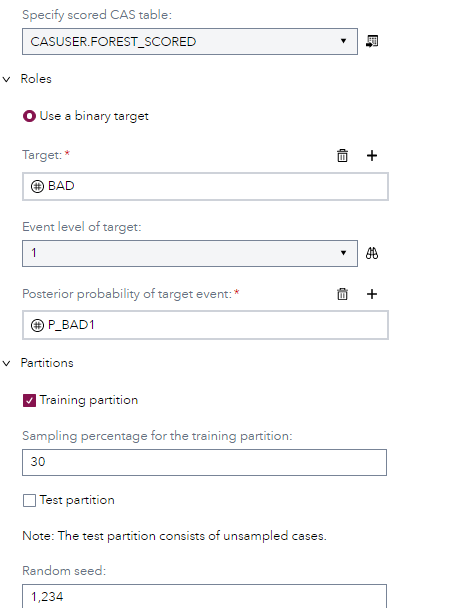
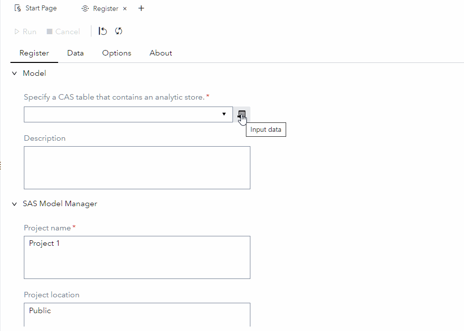

# MM - Register

## Description

The **MM - Register** step allows user to register an analytic store model into a project of SAS Model Manager. 
 * Register model into "latest" project version by default.
 * Register model into a "new" project version if the checkbox is selected.
 * Generate model comparsion JSON files if scored data is provided and related options are specifed.
 * This step will execute on the SAS Compute Server using SAS Model Manager Public Macros.

---
## User Interface  

### **Model tab** ###

   

1. **Analytic store model** - Select an alalytic store CAS table.  
2. **Model name** - Specify name for the register model.  
3. **Model description** - Specify description for the register model.  
4. **Project name** - Specify project name that is already created in SAS Model Manager.
5. **Project location** - Specify project location, 'Public' is by default.  
6. **New project version** - Create a new project version for registering this model.  


### **Data tab(optional)** ###

   

*This tab is optional, because it is used only when a scored data is selected.*

1. **Scored data** - Select a CAS table that contains scored output.  
2. **Target** - Select target variable from scored data.      
3. **Target event** - Select target event.
4. **Posterior probability of target event** - Select posterior probability variable of target event.  
5. **Sampling percentage** - Specify sampling percentage for training/test partition.
6. **Random seed** - Specify a random seed for sampling data

### **Options tab(optional)** ###

   

*This tab is optional, because it is used only when a scored data is selected.*

1. **Lift analysis** - Specify Lift analysis options.  
2. **ROC analysis** - Specify ROC analysis options.       
3. **Fit statistics** - Specify Fit statistics options.

---
## Requirements

This custom step requires a project has been already created in SAS Model Manager. More details can be found in the documentation that is available [here](https://go.documentation.sas.com/doc/en/mdlmgrcdc/v_028/mdlmgrug/n0fokwp1r4ubmkn1hge4zndlhgna.htm).  

---
## Usage

  


Copy/paste and run the following SAS code into SAS Studio for creating sample analytic store model and scored data.
```sas
cas _mmcas_;
caslib _ALL_ assign;
proc forest data=PUBLIC.HMEQ_Train seed=1234;
	partition fraction(validate=0.3 test=0.4 seed=1234);
	target BAD / level=nominal;
	input LOAN MORTDUE VALUE YOJ DEROG DELINQ CLAGE NINQ CLNO DEBTINC / 
		level=interval;
	input REASON JOB / level=nominal;
	score out=casuser.forest_scored copyvars=(_all_);
	savestate rstore=casuser.forest_astore;
	id LOAN MORTDUE VALUE YOJ DEROG DELINQ CLAGE NINQ CLNO DEBTINC REASON JOB;
run;
```

## Change Log

Version 1.0 (27DEC2022)  

  * Initial version  
  

