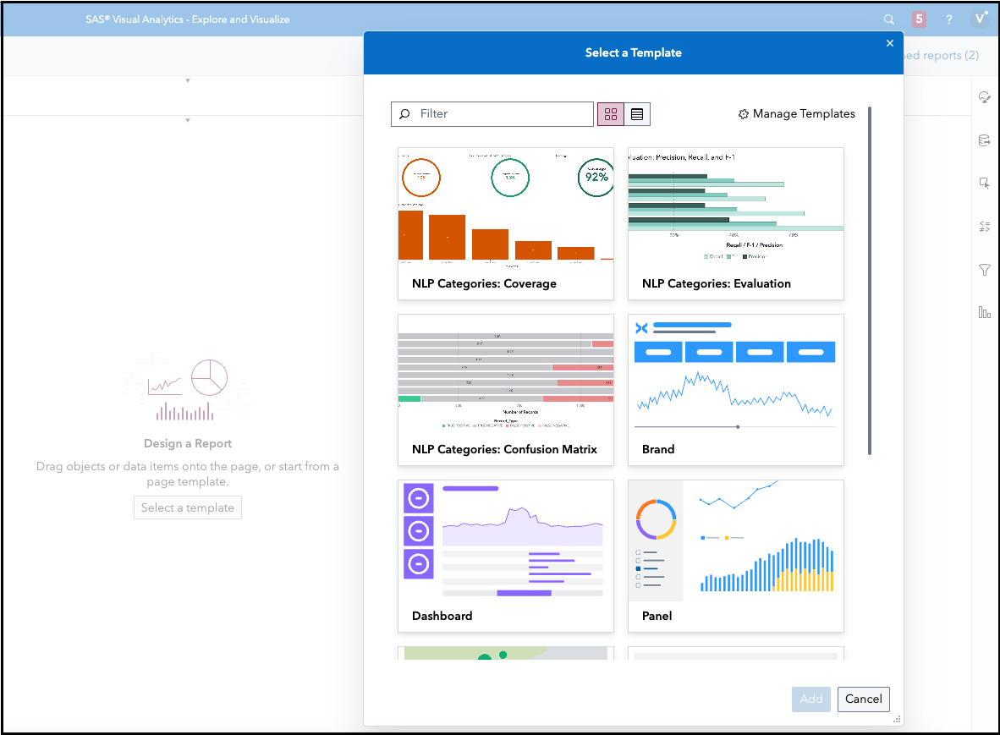

# Importing the SAS Visual Analytics Report Template

To appreciate the NLP - Categories Testing Framework custom step better, we also provide some SAS Visual Analytics report templates to help visualize results.

This template can be imported into your preferred Viya environment (you **do not** need to have administrator privileges for the same) and will appear as part of the Custom Templates section within SAS Visual Analytics as shown below.

Select any or all of the following report templates and assign the output table created from the NLP - Categories Testing Framework custom step as a data table to your report.

1. NLP Categories: Confusion Matrix
2. NLP Categories: Evaluation
3. NLP Categories: Coverage

Each of the above templates contains their own set of instructions as part of a Text object. You can delete the Text object once you have followed those instructions and have finalised your report.

Two placeholder variables are highlighted in bright orange/orange in the instructions.  You are expected to replace the same with appropriate columns contained in your output dataset. Refer instructions for details.

Note that some instructions relating to color-coding of report elements are only suggestions.  You are free to digress from the same and customize the Visual Analytics report as per your needs.

## Steps (in brief) to import the Visual Analytics report template

The steps to import the template are provided in the following animated gif.

1. In your SAS Viya application, navigate to Manage Environment on the main menu.
2. Click on Content and navigate to SAS Folders.
3. Click on the import button as shown in the GIF.
4. Upload the [transfer package - NLP - Category Testing Framework Reporting Templates ](./NLP%20-%20Category%20Testing%20Framework%20Reporting%20Templates.json) json found in this folder.
5. Move to the Mapping tab and click on Import.
6. Wait a short while and ensure that the report template has been imported successfully.
7. Verify you are able to access the template from within SAS Visual Analytics (main menu -> Explore and Visualize).