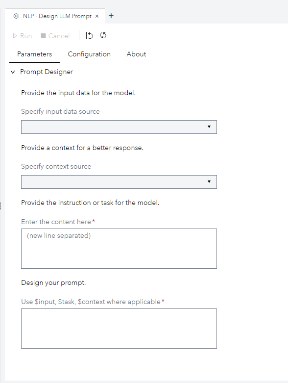
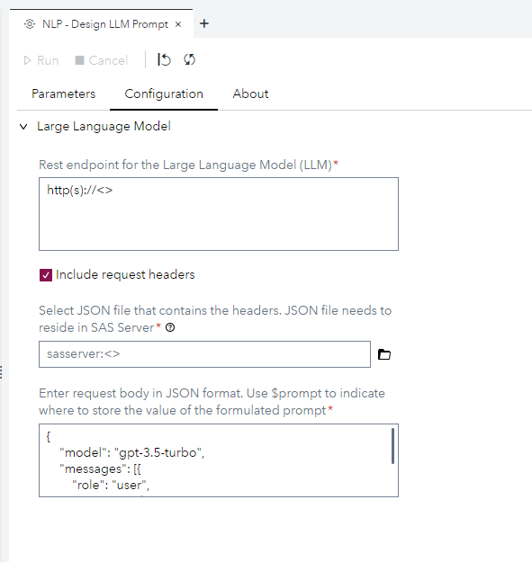
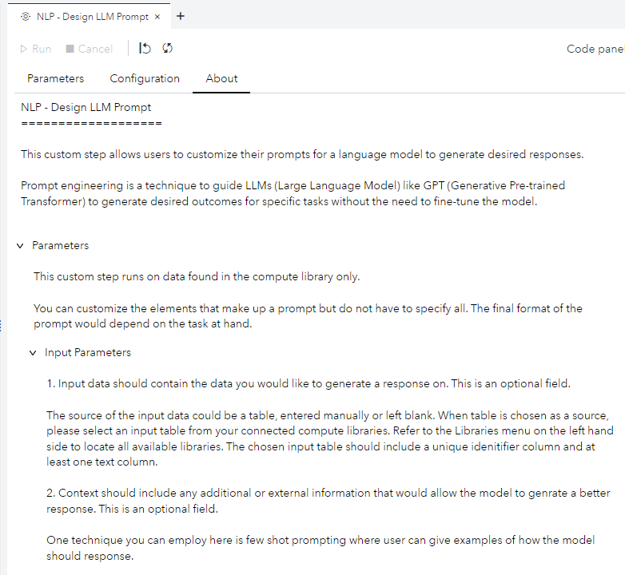

# Natural Language Processing (NLP) - Design LLM Prompt

This custom step enables you to customize your prompts for a Large Language Model of choice to generate desired output. Prompt engineering is a practice of designing and optimizing prompts to elicit specifc response from generative models such as Large Language Models. 

You can use this custom step for prompt engineering on foundation models with your own data to enhance the relevance of Large Language Model for your specific task.

## User Interface

### Parameters tab

### Configuration tab

### About tab

## SAS Viya version support

Tested in Viya 4 Stable 2023.12

## Requirements

- [ ] A SAS Viya 4 environment (monthly release 2023.12 or later) with SAS Studio Flows.
- [ ] A python environment (Python 3.8 or later), with the required packages installed, configured for use in SAS Studio.  

### Python packages
- pandas
- aiohttp
- asyncio
- json
- re

### Supported data source
This custom step runs on tables found in the SAS compute library.

## Getting Started - Make this custom step available in SAS Studio

Follow the instructions on [Using a Custom Step from this GitHub repository in SAS Studio](https://github.com/sassoftware/sas-studio-custom-steps/blob/main/docs/IMPORT_CUSTOM_STEP.md) to download custom steps from this repository and make them available for use in your SAS Studio environment.

## Additional Resources
- [Configuring the Python environment](https://go.documentation.sas.com/doc/en/sasadmincdc/v_048/calsrvpgm/p1iu2rzpk1j1b4n1shfqxpqzyso4.htm)
- [Making the Python environment available in SAS Programming Runtime](https://go.documentation.sas.com/doc/en/sasadmincdc/v_048/calsrvpgm/n1a7ados7ybdn1n15f0td8twwca9.htm)

## License
This project is licensed under the [Apache 2.0 License](https://github.com/sassoftware/sas-studio-custom-steps/blob/main/LICENSE).

## Change Log
Version: 1.2 (02FEB2023)
