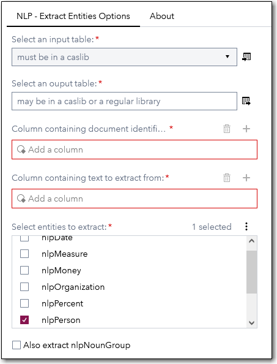
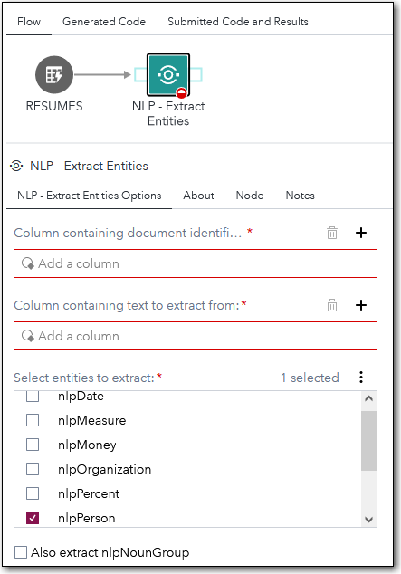
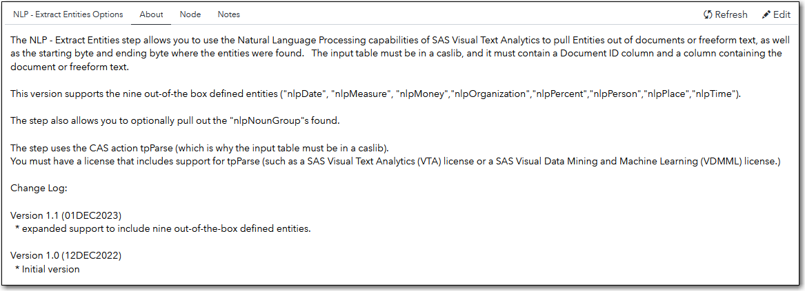

# Natural Language Processing (NLP) - Extract Entities

## Description

The "**NLP - Extract Entities**" Custom Step allows you to use the Natural Language Processing capabilities of SAS Visual Text Analytics to pull entities out of documents or freeform text.  You also get the starting byte and the ending byte where the entities were found. 

This version supports the nine out-of-the box defined entities ("nlpDate", "nlpMeasure", "nlpMoney", "nlpOrganization", "nlpPercent", "nlpPerson", "nlpPlace", "nlpTime"). 
 
The step also allows you to optionally pull out the "nlpNounGroup"s found.

## User Interface


**NLP - Extract Entities Options** tab 


   | Standalone mode | Flow mode |
   | --- | --- |                  
   |  |  |
   


   

**About** tab

   

## Requirements
* SAS Viya version 2022.12+
* A license that supports the tpParse CAS action (such as a SAS Visual Text Analytics (VTA) license or a SAS Visual Data Mining and Machine Learning (VDMML) license.)
* **At runtime: an active connection to CAS:** This custom step requires Cloud Analytics Services. Ensure you have an active CAS connection available prior to running the step.
* input table must be in a caslib
* input table must contain a column containing a Document ID
* input table must contain a column containing the document(s) or freeform text
* a minimum of one entity must be specified for extraction (default is "nlpPerson")

## Usage


## Download Sample Data File

The **extras** folder contains a file with sample data of resumes from which you can extract entities like nlpPerson and nlpDate.  You just need to load this txt file into a caslib (like CASUSER).

[resumes.txt](./extras/resumes.txt)

## Change Log

* Version 1.1 (01DEC2023)
  * expanded support to include the nine out-of-the-box defined entities.

* Version 1.0 (12DEC2022)  
  * Initial version   

```