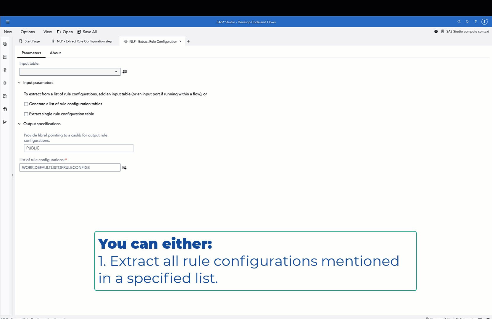
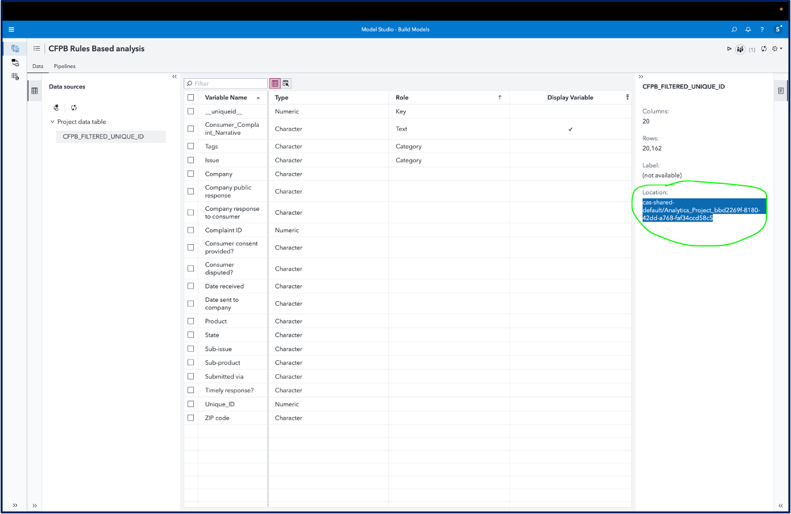

# Natural Language Processing (NLP) - Extract Rule Configuration

This custom step extracts the rule configuration within rules-based Visual Text Analytics Concepts or Categories model definitions for use in downstream applications.

**Artificial Intelligence demands greater transparency and easier access to underlying metadata.  Rule configurations help explain model logic to business stakeholders, promote better model governance, assist in customising models and enable visualisation.**

This custom step identifies and extracts such rule configuration tables (located inside system tables) associated with a project, to a user-specified SAS Cloud Analytics Services (CAS) library (a caslib) so that it's easily accessible.  It also makes the rule configuration output more consumable through deriving additional columns.  This custom step requires a SAS Visual Text Analytics (VTA) license.
 
 
## A general idea

## SAS Viya Version Support
Tested in Viya 4, Stable 2023.04

## Requirements

1. A SAS Viya 4 environment (monthly release 2023.04 or later) with SAS Studio Flows.

2. **At runtime: an active connection to CAS:** This custom step requires SAS Cloud Analytics Services (CAS). Ensure you have an active CAS connection available prior to running the same.

3. A SAS Visual Text Analytics (VTA) license. 

4. At least one Visual Text Analytics Model Studio project with a completed Categories or Concepts node.  Successfully running a categories or concepts node leads to the creation of system-generated rule configurations within a project caslib.

## User Interface

This custom step runs on data loaded to a SAS Cloud Analytics Services (CAS) library (known as a caslib). Ensure you are connected to CAS before running this step.

Prior to running this step, carry out the following task.  Note the system-generated caslib name for your required Model Studio (VTA) project.  To do this, open the project and go to the Data tab.  Copy the entire text appearing on the Properties pane on the right hand side, under the section "Location" (of the form cas-shared-default/Analytics_project_xxx).  Paste the entire selection in this field.  The custom step contains methods to parse the caslib portion of this text.

Follow this screenshot for reference.

### Parameters:

There are **three tasks** you can carry out with this custom step, as offered in the input parameters.

#### Input parameters:

1. **Extract tables from a specified list of rule configurations ([reference screenshot here](./img/extract_rule_configuration.png)):** for this purpose, attach a table containing a list of desired rule configurations to the input data port (an optional port) of this step. At a minimum, the table should contain

   1. **Name :** name of the rule configuration table.
   2. **Project_Caslib :** name of the system caslib attached to the Model Studio project.
   3. **Type :** either CATEGORY or CONCEPT based on the project
   4. **Astore_Name :** name of the astore created after compiling this rule configuration.  Note this is an optional field carried through for informational purposes.

2. **Extract a single rule configuration table ([reference screenshot here](./img/extract_single_rule_configuration.png)) :**  this operates on the same principle, with the difference that instead of a list, you can provide a single table name and caslib through the UI. Provide the following:

   1. **Project caslib (text field) :** system-generated project caslib  for a Model Studio project.
   2. **Name of rule configuration table (text field) :** system-generated rule configuration table name

3. **Generate a list of rule configurations ([reference screenshot here](./img/generate_list_of_rule_configurations.png)) :** in case you don't yet know the names of the tables you wish to extract,  choose this option to generate a list of all rule configuration tables  located within the system caslib.  Provide the following.

   - **System caslib name** for the Model Studio project (text field) : following same instruction as mentioned [above](#user-interface). 

#### Output specifications:

1. **Output list of rule configurations (table, output port, optional):** connect a SAS dataset which will list all rule configuration tables obtained from a project. This is needed only when you are generating a list of rule configurations.  

**Note:** please DON'T add a CAS table to this output port as this will lead to the step erroring out.  In any event, a CAS table isn't necessary for this output, which typically does not contain more than 4-5 observations. 

2. **Output caslib for extracted rule configuration tables (text field):** fill this in if you are performing extraction tasks.  For example, provide *Public* to indicate that you want all rule configurations to be saved to the shared Public caslib. 

The rule configuration tables listed in the output are named as per a pattern : <astore_name>_<project_type>_RULESCONFIG.sashdat.  The <astore_name> is usually a long alphanumeric string which is also the same name as the model binary generated.  The <project_type> could refer to either CATEGORY or CONCEPT based on the model in question.

## Documentation:

- The table.caslibInfo CAS action : https://go.documentation.sas.com/doc/en/pgmsascdc/default/caspg/cas-table-caslibinfo.htm is used for purposes of listing out the tables within a SAS Model Studio's project caslib.  Typical users may find it difficult to access information in the project caslib through the interface, therefore raising need for this custom step.

## Installation & Usage
- Refer to the [steps listed here](https://github.com/sassoftware/sas-studio-custom-steps#getting-started---making-a-custom-step-from-this-repository-available-in-sas-studio).

## Created / contact : 

- Sundaresh Sankaran (sundaresh.sankaran@sas.com)

## Change Log

Version 1.0 (02MAY2023) 
* Initial Step Creation

Version 1.1 (12JUN2023) 
* Additional documentation, code cleanup; latest version