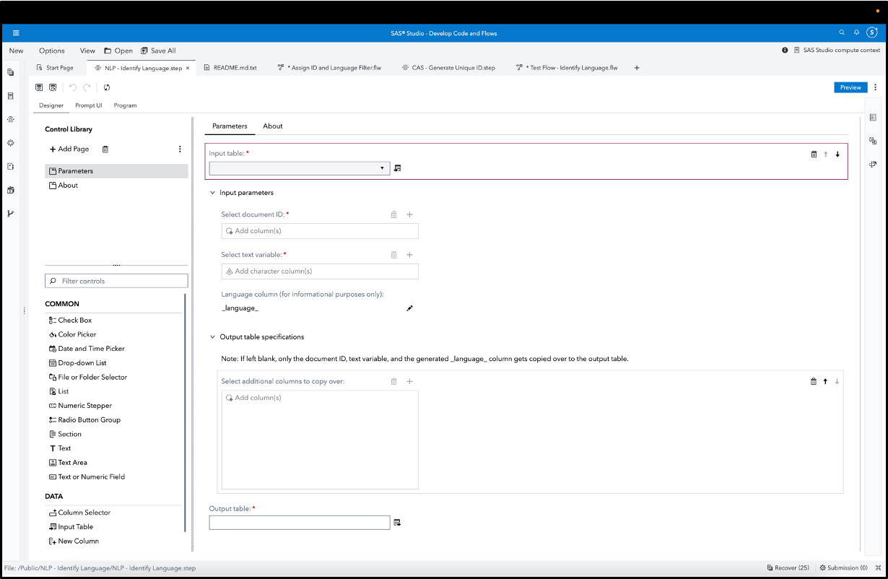

# Natural Language Processing (NLP) - Identify Language

This custom step identifies the language for text data in an input table and creates a new column containing the language's ISO 639-1 code.

Some business applications such as social media data, customer reviews and government / law enforcement deal with data in multiple languages. This custom step aids identification and downstream segmentation of observations as per language, so that they can then be analysed using the relevant language pack.

**Here's a general idea of how this custom step works (the below is an animated GIF)**

## SAS Viya Version Support
Tested in Viya 4, Stable 2022.12

## Requirements

1. A SAS Viya 4 environment (monthly release 2022.12 or later) with SAS Studio Flows.

2. **At runtime: an active connection to CAS:** This custom step requires Cloud Analytics Services. Ensure you have an active CAS connection available prior to running the same.

## User Interface

### Parameters:

Note that this custom step runs on data loaded in Cloud Analytics Services (CAS). Ensure you are connected to CAS before running this step.

#### Input parameters:

1. Input port: connect an input CAS table.

2. Document ID: select a column which serves as an ID for each observation.

3. Text variable: select a character column which contains the text to be analyzed.

#### Output table specifications:

1. Output columns: select columns which you would like copied over to the output table.

2. Output port: connect an output CAS table.

The custom step results in a new column, **\_language\_**, which contains the ISO 639-1 language code.

## Documentation:

1. textmanagement.identifyLanguage CAS action : https://go.documentation.sas.com/doc/en/pgmsascdc/default/casanpg/n0qdvvymlj69d7n18dfvh6ipjn2k.htm#p0sk06te8li0uyn14l3kt8i4gvdw

## Installation & Usage
1. Refer to the [steps listed here](https://github.com/sassoftware/sas-studio-custom-steps#getting-started---making-a-custom-step-from-this-repository-available-in-sas-studio).

## Created / contact : 

- Sundaresh Sankaran (sundaresh.sankaran@sas.com)

## Change Log

Version : 1.0.   (15FEB2023)