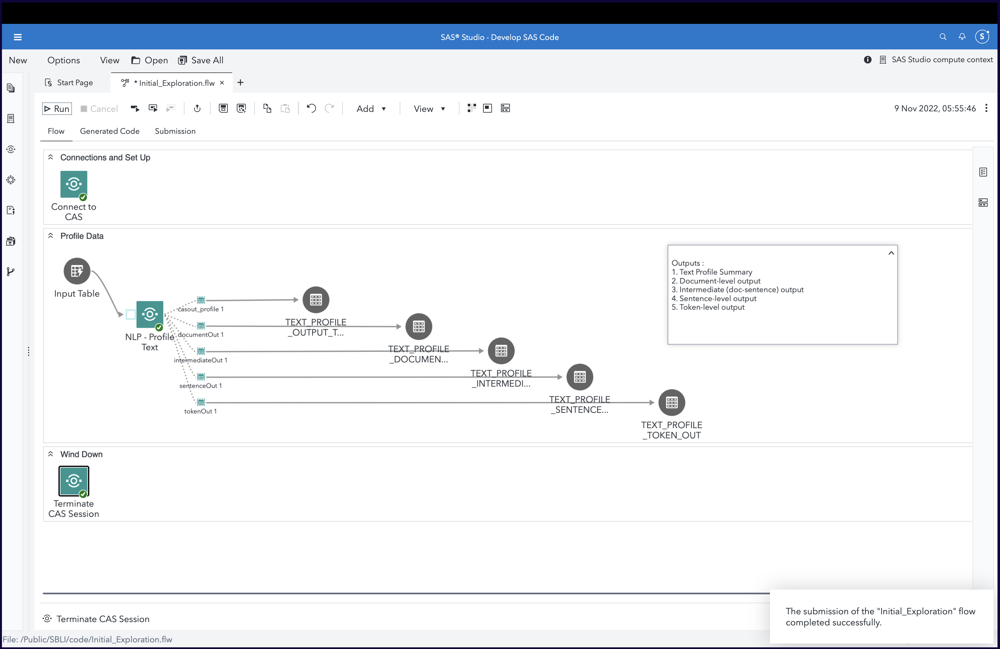

# Profile Text

## Description
Natural Language Processing (NLP) requires a thorough understanding of the underlying document corpus in order to be effective and aid downstream analysis.  This folder contains a SAS Studio Custom Step which helps you profile text within a document corpus and understand its linguistic structure.  This helps you identify outliers, determine data pre-processing and makes you more productive in your analysis.  

**Here's a general idea:**



## SAS Viya Version Support
Tested in Viya 4, Stable 2022.10

## User Interface

The following **input arguments** are required:
1. **Input port**: assign an input **CAS table** to the input port of this node. This table should contain a text column (varchar or char) for analysis.

**Need a starter input table?  Consider the [NEWS dataset](https://support.sas.com/documentation/prod-p/visual-text-analytics/news-nov2019.zip) from the SAS Support Page.**

2. **Document ID column**: Select a column which indicates the unique ID for each text observation in this table
3. **Text column**: Select a column which contains the text to be profiled
4. **Language**: Select a language (English is the default)

The following **output tables** are created. Provide desired target table names (and location) for the output ports. Note that target table names are already suggested for these input tables.  If you choose to continue with the same, an advantage is that you would be able to easily visualize the results in a Visual Analytics report which can seamlessly updates based on these table names. Use of the Visual Analytics report is optional.

1. **Text Profile Output table**: (Suggested: PUBLIC.TEXT_PROFILE_OUTPUT_TABLE) The main output containing a single observation with several profile statistics
2. **Document Output**: (Suggested: PUBLIC.TEXT_PROFILE_DOCUMENT_OUT) Statistics provided for each observation as represented by the Document ID
3. **Intermediate-level Output**: (Suggested: PUBLIC.TEXT_PROFILE_INTERMEDIATE_OUT) Statistics provided for each sentence within the document corpus
4. **Sentence-level Output**: (Suggested: PUBLIC.TEXT_PROFILE_SENTENCE_OUT) A distribution of the number of sentences based on token length
5. **Token-level Output**: (Suggested: PUBLIC.TEXT_PROFILE_TOKEN_OUT) A frequency matrix for all tokens based on their type (whether stop words, numeric tokens etc.)

Refer the "About" tab on the step for further details.

### Visual Analytics Report 

We acknowledge that analysis of multiple output tables is a cumbersome task.  As a convenience, this custom step also promotes the 5 output tables so that they can easily be visualized.  A transfer package containing a SAS Visual Analytics Report is also provided to serve as an example [in this subfolder](./reports/). Refer to this folder's [README](./reports/README.md) for more details.  Here's a screenshot of the report.


## Requirements

1. A SAS Viya 4 environment (monthly release 2022.07 or later) with SAS Studio Flows.

## Installation & Usage

1. Refer to the [steps listed here](https://github.com/sassoftware/sas-studio-custom-steps#getting-started---making-a-custom-step-from-this-repository-available-in-sas-studio).

2. For installing the VA report (optional), refer to the steps listed [here](./reports/README.md)

3. In case you wish to try this Custom Step using an example dataset, consider using the [NEWS dataset](https://support.sas.com/documentation/prod-p/visual-text-analytics/news-nov2019.zip) from the SAS Support Page. Following are some instructions on using this dataset.

### Instructions for using the example NEWS dataset

  1. Download and extract the [News dataset](https://support.sas.com/documentation/prod-p/visual-text-analytics/news-nov2019.zip) to your workstation. The data extracted will be a SAS dataset of format sas7bdat.
  2. In SAS Studio - Explorer pane, expand “SAS Server / Home” and identify a directory where you have write access.
  3. Select this directory and right-mouse-click and from the popup menu choose “Upload Files” to upload the .sas7bdat which you extracted earlier.
  4. If there is no libname defined (yet) for this directory, then select the directory again, right-mouse-click, and from the popup menu choose “Create Library”. Provide a name for your library.
  5. Check the Libraries pane in SAS Studio to see if your library exists.  Open the library and verify that the table shows.
  6. Make this table available in a permanent Cloud Analytics Services (CAS) library. Here’s some SAS code that you can run in a SAS Program tab. Commonly available CAS libraries (caslibs) include PUBLIC, and CASUSER (referring to each user's personal (home) caslib).  The following sample code assumes the table was made available in a library called DEMODATA on Compute and then loads the table to CASUSER. Modify the same as necessary.
  ```sas
    cas;
    caslib _all_ assign;
    
    data CASUSER.news_u8(promote=yes);
    set DEMODATA.news_u8;
    run;
  ```


## Change Log

Version 1.0 (19OCT2022)

