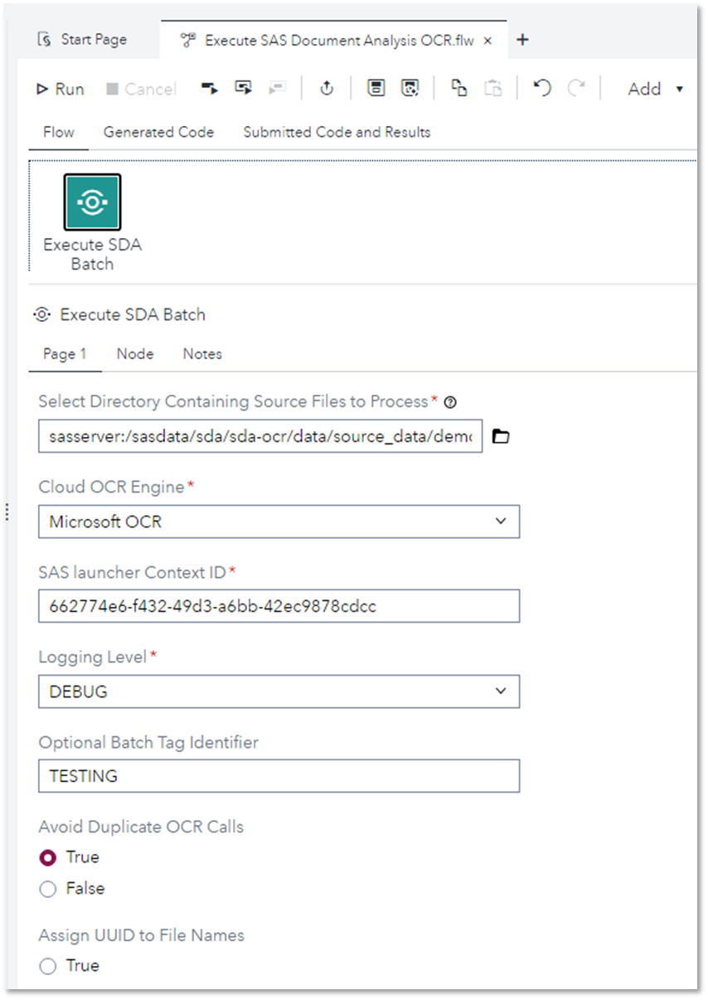
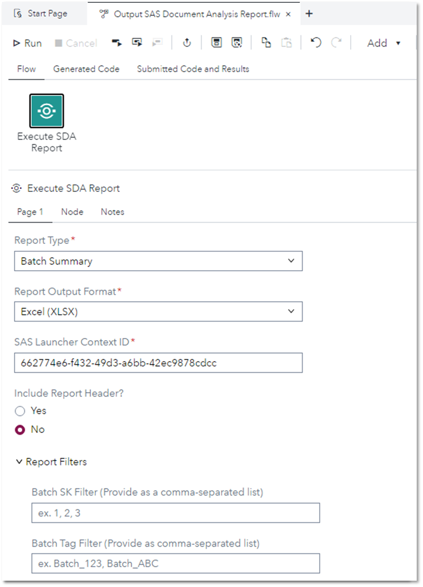

# OCR - Document Analysis - SAS Custom Steps

These custom steps are provided to enable point-and-click usage of the functionality available as part of the [SAS Document Analysis](https://www.sas.com/en_us/solutions/ai/models.html) offering from within the SAS Studio interface.

# Disclaimer

These custom steps are provided on an as-is basis. No guarantee of support is offered or implied. Reference the official documentation for additional details.

## ✨ Features
- ✅ Multiple OCR engines supported (MS & AWS)
- ✅ Parallelized batch-based end-to-end execution
- ✅ Automated file conversion (between image and PDF formats) 
- ✅ Process tracking and entity mapping
- ✅ Viya-ready outputs produced
- ✅ Usage reporting metrics

## 📖 Contents
- [💻 User Interface](#user-interface)
- [👩‍💻 Usage](#usage)
- [📋 Requirements](#requirements)
- [⚙️ Settings](#settings)
- [📚 Documentation](#documentation)
- [📝 Change Log](#change-log)

<a name="user-interface"/>

## 💻 User Interface
* ### OCR - Document Analysis - Execute Batch OCR Process ###

* ### OCR - Document Analysis - Produce Usage Report Output ###

<a name="usage"/>

## 👩‍💻 Usage

### 📺 Tutorial

<a name="requirements"/>

## 📋 Requirements

Tested on SAS Viya Stable 2024.09

<a name="settings"/>

## ⚙️ Settings

### 🧙‍♂️ Advanced

 Additional parameters can be supplied as per the "Supported Parameters" section of the official documentation.

<a name="documentation"/>

## 📚 Documentation
- [SAS Document Analysis Official Documentation](https://helpcenter.unx.sas.com/test/doc/en/aaimdacdc/v_001/aaimdawlcm/home.htm)
  
<a name="change-log"/>

## 📝 Change Log

**Version 1.0 (07OCT2024)** 
* Initial Version

