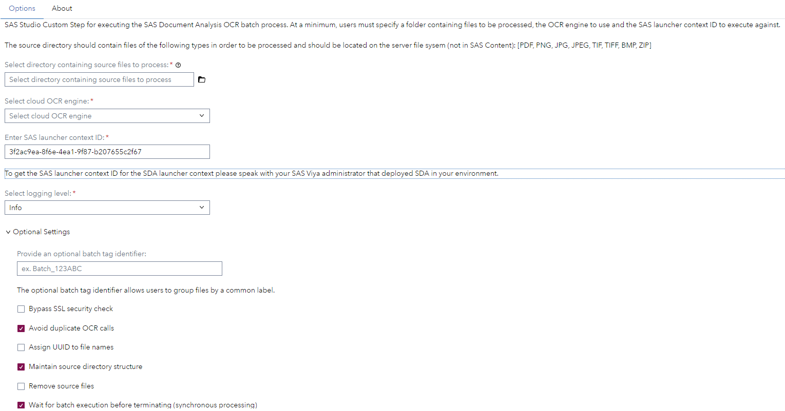

# OCR - Document Analysis - SAS Custom Steps

## Description

These custom steps are provided to enable point-and-click usage of the functionality available as part of the [SAS Document Analysis](https://www.sas.com/en_us/solutions/ai/models.html) offering from within the SAS Studio interface.

First use the OCR - Document Analysis - Execute Batch OCR Process step in order to turn analysis documents of the following file types: PDF, PNG, JPG, JPEG, TIF, TIFF, BMP & ZIP. After the document analysis has finished you can run the second step OCR - Document Analysis - Produce Usage Report Output to generate a report about the performed analysis.

### Features
- Multiple OCR engines supported (MS & AWS)
- Parallelized batch-based end-to-end execution
- Automated file conversion (between image and PDF formats) 
- Process tracking and entity mapping
- Viya-ready outputs produced
- Usage reporting metrics

## User Interface
* ### OCR - Document Analysis - Execute Batch OCR Process - Options Page ###

* ### OCR - Document Analysis - Produce Usage Report Output - Options Page ###

## Requirements

-   SAS Viya 2024.08 or later (OCR - Document Analysis - Produce Usage Report Output)
-   SAS Viya 2025.10 or later (OCR - Document Analysis - Execute Batch OCR Process) 
-   A license for SAS Document Analysis is required

## Settings

For more information about the different settings please refer to the SAS documentation linked below.

## Documentation
- [SAS Document Analysis documentation](https://go.documentation.sas.com/doc/en/aaimdacdc/default/aaimdawlcm/home.htm)
- [Custom step documentation](https://github.com/sassoftware/sas-studio-custom-steps/tree/main/OCR%20-%20Document%20Analysis)

## Change Log

### OCR - Document Analysis - Execute Batch OCR Process

* Version 1.4 (04NOV2025)
  * Add PaddleOCR to OCR engine options
  * Add MS OCR model name - available when "Microsoft" is selected as the OCR engine
  * Add Custom Document Intelligence model name - available when "Custom" is selected as the MS OCR model
  * Remove optional setting to maintain directory structure

* Version 1.3 (25FEB2025)
  * Use launcher context name instead ID

* Version 1.2 (21NOV2024)
  * Added option to enable syncronous processing
  * Added option to suppress SSL check

* Version 1.1 (09OCT2024)
  * Implemented feedback

* Version 1.0 (07OCT2024)
  * Initial version

### OCR - Document Analysis - Produce Usage Report Output

* Version 1.2 (21NOV2024)
  * Added option to enable syncronous processing
  * Added option to suppress SSL check

* Version 1.1 (29OCT2024)
  * Implemented feedback

*Version 1.0 (07OCT2024)
  * Initial version
