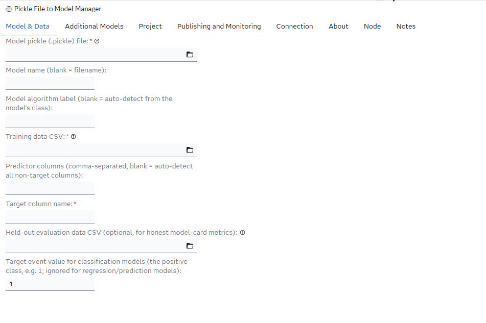
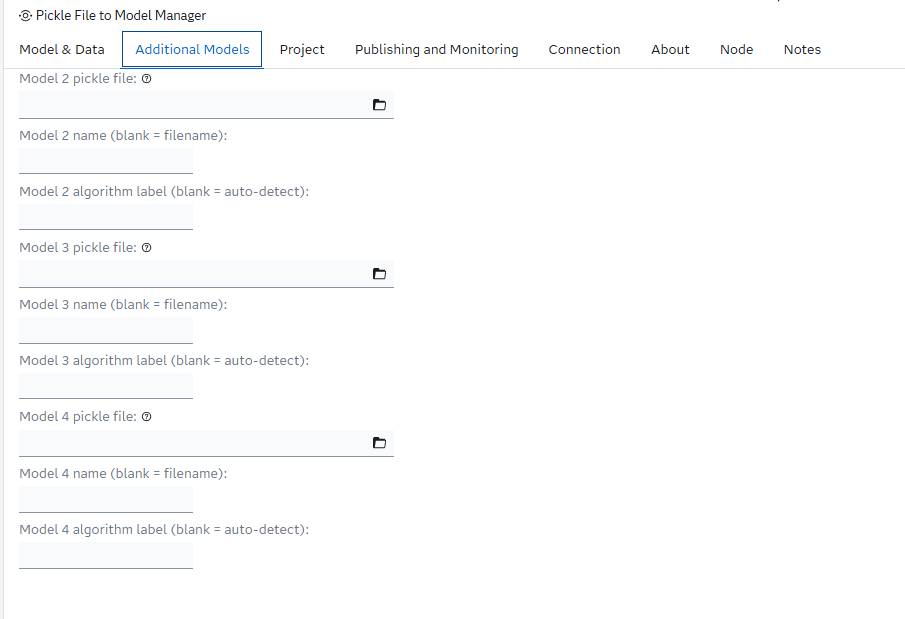
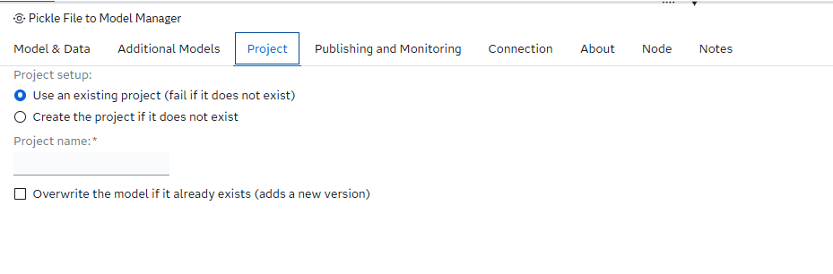
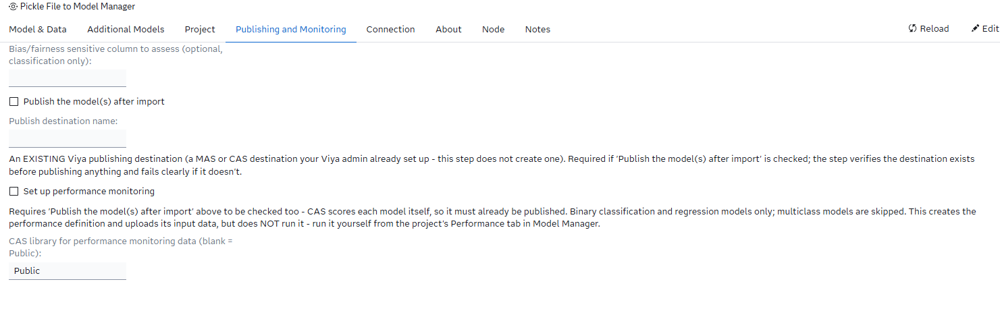
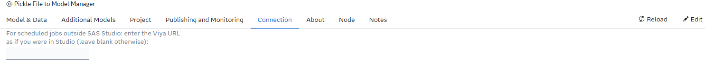
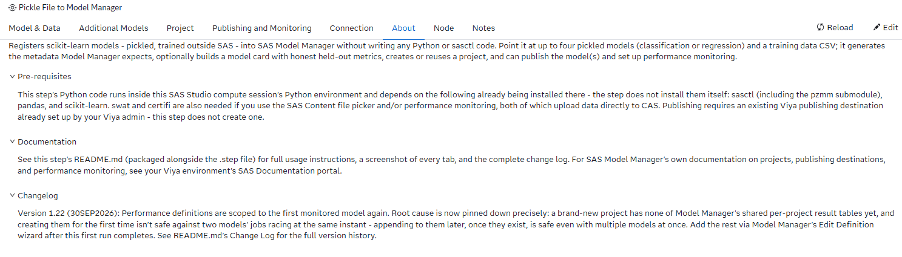

# Pickle File to Model Manager

## Description

The **Pickle File to Model Manager** custom step enables SAS Studio users to register scikit-learn models — trained entirely outside SAS, in plain Python — into SAS Model Manager, without writing any Python or sasctl code themselves.

Point the step at up to four pickled scikit-learn models (classification or regression) and a training data CSV, and it will:

* Auto-detect predictor columns from each model's own trained feature list (or let you specify them explicitly), and auto-detect whether each model is classification or regression/prediction directly from the pickle itself
* Handle binary **and** multiclass classification, as well as regression/prediction models, in the same batch
* Generate the input/output variable metadata, model properties, and governance/lineage metadata (who registered it, when, the framework, the model's hyperparameters) that SAS Model Manager expects
* Optionally generate a full model card, including honest held-out metrics if an evaluation dataset is supplied, and an optional bias/fairness assessment against a sensitive column
* Create the target Model Manager project if it doesn't already exist, or register into an existing one
* Optionally publish the imported model(s) to an existing Viya publishing destination, verifying the destination exists before doing any work, and confirming the publish job actually completed rather than just submitting it
* Optionally set up performance monitoring for the imported model(s), once published

Up to four models share one training table, one target column, and one project — so a single run of the step can recreate a typical "compare several algorithms on the same problem" workflow (e.g. a decision tree, a random forest, and a gradient boosting model, all predicting the same target) entirely from the UI.

Models are picked up either from a SAS Content location or directly from the compute server's filesystem — the step stages SAS Content files into WORK automatically before reading them.

## User Interface

* ### Model & Data ###

   The core inputs: the first model's pickle file, an optional name and algorithm label (auto-detected from the model's class if left blank), the training data CSV, optional explicit predictor columns (auto-detected from the model if left blank), the target column (optional, auto-detected from the training table if left blank), an optional held-out evaluation dataset for honest model-card metrics, and — for classification models only — which class value is the target "event" (whether each model is classification or regression/prediction is detected automatically from the pickle; there's no field for it).

   

* ### Additional Models ###

   Optionally, up to three more models (pickle file, name, algorithm label each), sharing the same training table, target, and project as the first model.

   

* ### Project ###

   Whether to require an existing project or create one if it's missing, the project name, and whether re-running should overwrite an existing model version.

   

* ### Publishing and Monitoring ###

   A model card is always generated; optionally give a sensitive column for a bias/fairness assessment (classification only).

   Whether to publish the imported model(s), and the name of the (already-existing) Viya publishing destination to publish to. The destination is verified up front — the step fails immediately with a clear message (and the list of destinations that *do* exist) if it can't find the one you named, rather than partway through the run.

   Also whether to set up performance monitoring for the imported model(s) — binary classification and regression/prediction models only, multiclass models are skipped — and which CAS library to upload the monitoring input table to (default `Public`). This requires **Publish** to be checked too: SAS Model Manager scores each model itself to compute performance, so the model has to already be published for that to work. This option configures the project's Model Evaluation properties, uploads a monitoring input table, and creates the performance definition, including drift-alert thresholds set automatically to SAS's recommended defaults — it deliberately does **not** run the performance job itself (see Requirements below for why). Once the step finishes, open the project's **Performance** tab in Model Manager and click **Run** on the definition it created.

   

* ### Connection ###

   An optional explicit Viya host, only needed if the step can't derive one automatically from the SAS Studio session it's running in.

   


* ### About ###

   General description of the step, plus collapsible **Pre-requisites** and **Documentation** sections and an expanded **Changelog** section showing the current version — kept in sync with the Requirements and Change Log sections of this README.

   

## Requirements

Tested on Viya version Stable 2026.06.

This step's Python code runs inside the SAS Studio compute session's `proc python` block and depends on the following packages already being available in that session's Python environment — the step does not install them itself:

* `sasctl` (including the `pzmm` submodule)
* `pandas`
* `scikit-learn`
* `swat` and `certifi` (needed if you use the SAS Content file picker, and/or performance monitoring — both upload data directly to CAS and this pre-configures SWAT's SSL certificate path so that doesn't fail on servers with the same known broken default; not needed otherwise for `sasserver:`-style paths)

If you plan to use the **Publish** option, the named destination must already exist in your Viya environment — creating a publishing destination is an admin-only operation and out of scope for this step.

If you plan to use **performance monitoring**, the step only creates the performance definition — it does not execute it. Running a performance job promotes result tables into Model Manager's own results library, which is shared across projects rather than scoped to the one you're working in; if that library is carrying any stale state (from an interrupted earlier job, anywhere on the server), the run fails with a "target table ... already exists" error that has nothing to do with your model or this step, and isn't something the step can detect or clean up on your behalf. Running it yourself from the Performance tab keeps that failure mode a normal, retryable Model Manager job instead of a failure buried in this step's log.

## Usage

The step expects a plain CSV training table and one or more pickled scikit-learn models trained on it. A quick way to produce both from data already available in your Viya environment:

1. Export `SASHELP.CARS` to CSV (or use any tabular dataset with a mix of numeric predictors and a target column).
2. In a local Python environment (not SAS Studio), train a simple scikit-learn model against it and pickle the result, e.g.:

   ```python
   import pickle
   from sklearn.ensemble import RandomForestClassifier
   from sklearn.model_selection import train_test_split

   # X, y loaded from your exported CSV, target is a binary column
   X_train, X_test, y_train, y_test = train_test_split(X, y, test_size=0.3, random_state=42)
   model = RandomForestClassifier(random_state=42).fit(X_train, y_train)

   with open("model.pickle", "wb") as f:
       pickle.dump(model, f)
   ```

3. Upload `model.pickle` and the training CSV somewhere SAS Studio's file picker can reach them (a SAS Content folder, or a path on the compute server).
4. Add the **Pickle File to Model Manager** step to a flow, point **Model & Data** at the pickle and the CSV, name your target column, and run it.
5. Check SAS Model Manager — the project (created if it didn't exist) should now contain the registered model, with a model card if you left that option checked.

The log ends with a run summary listing every phase (model card, import, publish) as OK or ERR per model, so a problem with one model in a multi-model batch is easy to spot without blocking the rest.

### Running it without the step's UI

`extras/Pickle File to Model Manager.sas` contains the exact same logic as the custom step, with the UI fields exposed as `%let` statements at the top instead. Fill those in and submit the file directly in a SAS Studio Program tab (or any batch/scheduled SAS session) to run it without importing the custom step — useful for repeated or scripted runs.

## Change Log

* Version 1.23 (30SEP2026)
    * Target column name is now optional. Leave it blank and it auto-detects from the training table — the same technique `2_pzmm_import.ipynb` already used: whichever non-predictor column matches the first model's own `classes_` (classification) or has more than 2 distinct values (regression). Verified against all 5 demo models, each resolving unambiguously. Still raises a clear error if the training table makes it ambiguous, asking for the column name explicitly rather than guessing wrong.
* Version 1.22 (30SEP2026)
    * Performance definitions are scoped to the first monitored model again (having briefly gone back to all models in 1.21). The root cause is now pinned down precisely from a real job log: a brand-new project has none of Model Manager's shared per-project result tables yet (`mm_std_kpi`, `mm_kpi_categories`, and similar) — the first time one gets created, two models' jobs scored at the same instant can both see "doesn't exist" and race to create it, and one loses with a "table ... already exists" error. Once those tables exist, later runs safely *append* instead, even with multiple models scored together — confirmed by a real log showing the identical tables handled via "Updated by key"/"Successfully appended" on a subsequent run. Add the rest of the models to the definition via Model Manager's Edit Definition wizard once this first run has completed cleanly — safe from then on.
* Version 1.21 (29SEP2026)
    * Performance definitions are back to including every monitored model again, instead of just the first one. The Model Manager job-collision risk that motivated scoping to one model (Version 1.13) was confirmed transient rather than a reliable blocker, by a real multi-model test run that completed successfully.
* Version 1.20 (29SEP2026)
    * Removed the drift-alert UI boxes entirely (the Warning/Critical count fields added in 1.17, and the two Advanced expression overrides), along with their explanatory notes. Drift alerts still get set automatically with SAS's recommended defaults (`char_p1>2` warning, `char_p1>5 or char_p25>0` critical) - there's simply nothing left to configure or explain on the tab, in the interest of keeping the step's UI simple.
* Version 1.19 (29SEP2026)
    * Reworded the Connection tab's "Viya host" field label to say plainly what to type in it: "For scheduled jobs outside SAS Studio: enter the Viya URL as if you were in Studio (leave blank otherwise)". Confirmed `sasctl`'s `Session()` accepts either a full URL or a bare hostname (it parses out the hostname via `urlsplit()` either way), so telling users to just paste the same address they use to open SAS Studio is accurate, not just simpler.
* Version 1.18 (29SEP2026)
    * Model cards are now generated automatically - the "Generate a model card" checkbox is gone, since it was an easy-to-miss opt-in for something that should just happen. Renamed the "Optional Steps" tab to "Publishing and Monitoring" to describe what's actually on it now that model cards aren't part of it. Viya host/token auto-detection also now checks a `baseurl` macro variable (documented for SAS Job Execution Service/scheduled jobs, alongside the existing `_baseurl` for interactive SAS Studio sessions) and a `SAS_VIYA_TOKEN` environment variable that the previous token search missed - widening auto-connect coverage for batch/scheduled execution. The Connection tab's manual host override remains as the fallback for whatever this still can't detect on its own.
* Version 1.17 (29SEP2026)
    * Drift-alert thresholds are now set with plain numbers instead of raw SAS syntax: "Warning: alert if more than this many input variables drift noticeably" and the same for Critical, each defaulting to 2 and 5 if left blank. The step translates the count into SAS Model Manager's `char_p1`/`char_p25` characteristic-alert expression itself. Critical always also fires on any single severely-drifted variable regardless of the chosen count. The previous raw-expression fields are still there as an "Advanced" override for a fully custom rule, and take precedence over the counts when filled in.
* Version 1.16 (29SEP2026)
    * Performance monitoring now sets drift-alert thresholds by default, instead of leaving governance alerting off unless a user hand-writes SAS Model Manager's own `characteristicWarn`/`characteristicAlert` expression syntax. Defaults follow SAS's own documented drift guidance: Warning when more than 2 input variables show at least mild drift (`char_p1>2`), Critical when more than 5 show mild drift or any variable drifts significantly (`char_p1>5 or char_p25>0`). The "Warning alert expression"/"Critical alert expression" fields are now optional advanced overrides (relabeled "Custom warning rule"/"Custom critical rule") rather than the only way to get alerting at all.
* Version 1.15 (29SEP2026)
    * Clarified the Connection tab's "Viya host" field label to make its actual, narrow scope clear: it's an override needed only when running the generated code as a batch/scheduled SAS job outside an interactive SAS Studio session (where `_baseurl` may not auto-resolve). It does not connect the step to a different Viya environment — authentication always comes from the current session's own reused token regardless of what host is entered here.
* Version 1.14 (29SEP2026)
    * Removed the static reference probability column (`P_<target>`) that was baked into the performance monitoring input table, computed once from only the first monitored model. Real evidence from a live project (a raw `MM_STD_KPI` results table) showed two structurally different models — a decision tree and a gradient-boosted ensemble — producing identical KPI values down to 10 significant digits and the same execution timestamp. That's consistent with Model Manager's KPI computation reading the pre-existing static column directly rather than each model's own freshly executed score code, despite `scoring_required=True`. The uploaded table now contains only predictors and the real target column, nothing pre-computed.
* Version 1.13 (25SEP2026)
    * Performance definitions are now scoped to the first monitored model only, instead of every model in the batch. Model Manager can launch multiple models' scoring jobs from one definition at the same instant, which has been observed to collide on shared per-model result tables (`mm_fitstat`/`mm_ks`/`mm_lift`/`mm_roc`/`mm_var` and similar) and fail intermittently. Add the remaining models to the definition via Model Manager's Edit Definition wizard and run them one at a time to avoid the collision.
* Version 1.12 (24SEP2026)
    * Fixed performance monitoring for regression/prediction models. `sasctl`'s generated score code for a plain single-output `predict()` model does `x = prediction[0][0]`, assuming 2D output — but a regressor's `.predict()` on one row returns a flat 1D array, so `prediction[0]` is already the value, and the extra `[0]` crashed scoring with `TypeError: 'float' object is not subscriptable`. The step now patches the generated score code for these models (replacing the errant `[0][0]` with `[0]`) immediately after generation, before it's zipped and uploaded — classification models are untouched, since `predict_proba()` genuinely returns 2D output and was never affected.
* Version 1.11 (15SEP2026)
    * Fixed the likely root cause of persistent near-50% misclassification with no Lift/ROC/Gini/KS charts on performance results, seen consistently regardless of model or data: the project's `targetEventValue` and `classTargetValues` properties were never being set by this step's performance-monitoring setup, even though `targetVariable`/`targetLevel`/`eventProbabilityVariable` were. Without `targetEventValue`, Model Manager has no way to know which class counts as "the event" when computing misclassification/ROC/Gini/KS/Lift — producing exactly the degenerate coin-flip-looking result seen. `2_pzmm_import.ipynb`'s own `ensure_project()` always set both; this step now does too.
* Version 1.10 (15SEP2026)
    * Fixed a recurring "table ... could not be located" error during performance monitoring. The previous fix (Version 1.5, below) dropped the old `<prefix>_train_data` CAS table before generating a fresh model card — but that's a drop-then-hope race: if anything failed between the drop and the re-upload (including the model card generation itself), the table stayed deleted while the project's Training table property kept pointing at it. Each run's training-data table now gets a unique, timestamped name instead of a fixed one that's reused and dropped, so there's never anything to delete or overwrite in the first place. The project's Training table property is also now read back from the exact path PZMM itself recorded for the model, rather than re-derived by hand a second time — keeping the two from ever drifting apart.
* Version 1.9 (14SEP2026)
    * Removed the "Model function" radio button. Whether each model is classification or regression/prediction is now auto-detected directly from the pickle via `sklearn.base.is_classifier()` — one less thing to fill in, and one less way to accidentally mismatch the UI selection against what the model actually is. Since a Model Manager project can only be one function or the other, models in the same batch are checked for agreement up front, with a clear error naming which ones disagree if they don't.
    * The target event value field is now always visible (previously it only appeared once classification was selected) — labelled as classification-only and ignored for regression/prediction models, since the step can no longer know which type you're about to give it until the pickle is actually loaded.
* Version 1.8 (10SEP2026)
    * Added optional warning/critical alert threshold expressions for the performance definition (`characteristicWarn`/`characteristicAlert`, in SAS Model Manager's own characteristic-alert syntax). Not exposed by sasctl's `create_performance_definition()`, so this is set with a follow-up call directly against the Model Manager REST API's `performanceTasks` resource.
    * Checked the rest of SAS Model Manager's performance-monitoring setup checklist against what sasctl and the Model Manager REST API actually expose: recurring data ingestion, job scheduling, and full KPI alert-rule (severity/notification) configuration all remain out of scope for a single-run custom step — scheduling in particular isn't present anywhere in the `sasctl` SDK. These need a recurring job/flow outside the step, not a code change to it.
* Version 1.7 (03SEP2026)
    * Renamed the step to **Pickle File to Model Manager**.
    * Reworked the tab layout to follow the SAS Studio custom step UI guidelines: tab labels now use title case; **Model Type** was merged into **Model & Data**; **Publish & performance monitoring** was merged into **Optional Steps**; field labels now end with a colon (checkboxes excepted); two long, paragraph-length control labels (the publish destination and performance monitoring checkboxes) were split into a short label plus separate explanatory text.
    * Added an **About** tab (general description, collapsible Pre-requisites and Documentation sections, and an expanded Changelog section) — none of this existed before.
* Version 1.6 (26AUG2026)
    * Performance monitoring now refuses to upload a monitoring table that's missing usable values in the actual outcome column (or, for classification, the score/probability column), instead of silently uploading it. Model Manager doesn't error on this itself — it just quietly skips the accuracy or stability measures — so this stops the step from producing a performance definition that looks fine but isn't.
* Version 1.5 (25AUG2026)
    * Restored performance monitoring, redesigned around `scoring_required=True` (SAS Model Manager scores each model itself against one shared uploaded input table) rather than pre-computed scores — the earlier removed version's numbers didn't reliably match each model's independently-verified accuracy; this one mirrors a proven-working, hand-verified pattern instead.
    * The step creates the performance definition but deliberately does not execute it — run it yourself from the project's Performance tab in Model Manager. See Requirements above for why.
    * Fixed a stale-training-data-table bug: re-running the step with the same model prefix (normal during repeated testing) now drops any previously-uploaded `<prefix>_train_data` CAS table before regenerating the model card, instead of leaving the project's Training table property pointing at whatever was uploaded last time.
* Version 1.4 (20AUG2026)
    * Removed in-step performance monitoring. It relied on CAS scoring the model directly and produced results that didn't reliably match a model's independently-verified accuracy; set up performance monitoring yourself in Model Manager once your model(s) are published and look right, rather than relying on this step for it.
    * Publish now uses a monitored publish call that waits for the job to finish and raises a clear error on failure, instead of a fire-and-forget submission that could leave a model looking published when it wasn't.
* Version 1.3 (20AUG2026)
    * Missing-value imputation is now baked into the generated score code (computed from the training data at import time), so a live scoring request with real gaps in it doesn't crash models that can't handle `NaN` natively (e.g. `GradientBoostingClassifier`).
    * Predictor auto-detection now explicitly excludes the target and event-probability columns, so a training table that's previously been used as a monitoring/reference table (and so already contains a scored probability column) doesn't get that column mistaken for a real predictor.
    * A duplicated predictor column name (typed twice, or produced by a particular model/data combination) now fails fast with a clear message instead of a cryptic internal error several steps later.
    * **Training data CSV** and **Target column name** are now marked as required fields in the UI, matching what the step already enforced in code.
* Version 1.2 (19AUG2026)
    * Added multiclass classification support (verified against sasctl's own score-code dispatch logic), alongside the existing binary classification and regression support.
    * Added optional model publishing, with the publish destination verified before any model work begins.
* Version 1.1 (11AUG2026)
    * Reworked to support up to four models sharing one training table, target, and project, each picked via its own file picker, instead of a single model per run.
    * Added governance/lineage metadata (registered by, registered when, ML framework, scikit-learn version, hyperparameters) written into each model's properties.
    * Added optional model card generation with honest held-out metrics (via an optional evaluation dataset) and an optional bias/fairness assessment.
* Version 1.0 (04AUG2026)
    * Initial version — single scikit-learn classification model, pickle + training CSV in, registered into a SAS Model Manager project.
