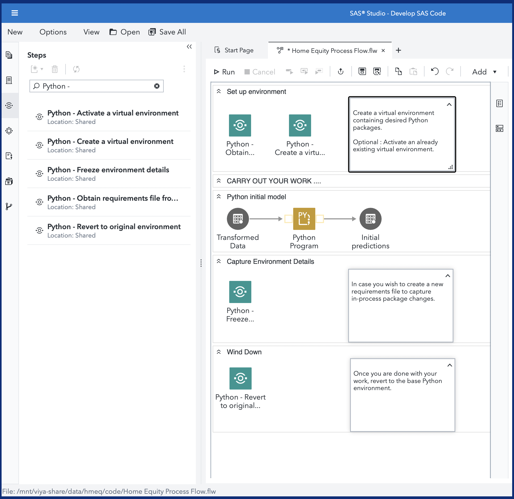
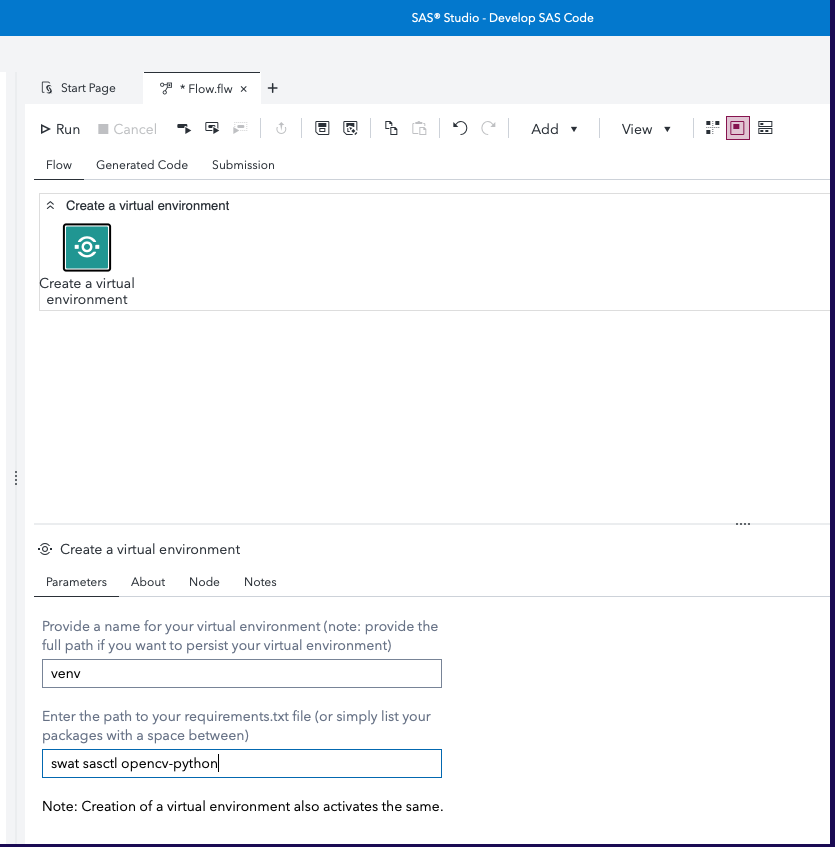
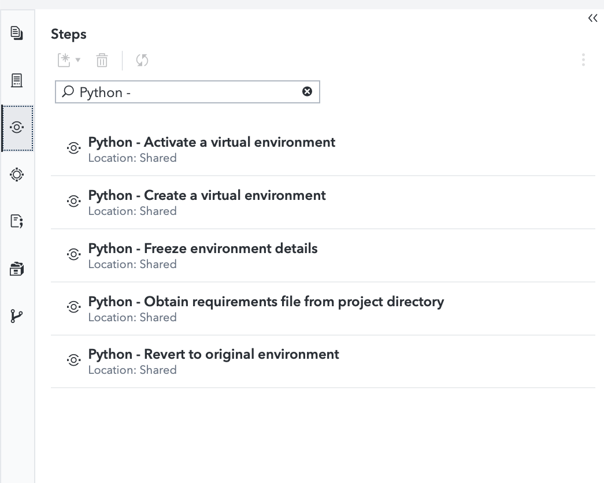

# Python - Create a Virtual Environment

## Description
Package your Python-based analytics solutions in a portable, repeatable, and reusable manner.  This SAS Studio custom step helps you create a virtual Python environments for use within SAS Viya. This enables ephemeral and isolated sessions.  

A general idea of how to use steps related to virtual environments:

A quick video: Watch this YouTube video [here](https://www.youtube.com/watch?v=RaiPOU0M278).

*Link: https://www.youtube.com/watch?v=RaiPOU0M278*

## User Interface

Refer the "About" tab on the step for more details.

### Parameters
This step helps you create a virtual environment. Input arguments required :
1. Path to your virtual environment (optional) : specify a full path to a persistent location on the filesystem, for future reuse
2. Requirements (optional) : either specify a path to a requirements.txt or enter them in space-delimited format.
3. Install system-site packages (checkbox): Keep this checked to ensure system-site packages from the base environment are also made available in the virtual environment. 

## Requirements

1. A SAS Viya 4 environment (last update on a monthly release 2026.05) with SAS Studio Flows
2. Python configured with the above environment (preferably using the [SAS Configurator for Open Source](https://go.documentation.sas.com/doc/en/itopscdc/v_016/itopswn/p19hj5ipftk86un1axa51rzr5mxv.htm))

## Installation & Usage

Refer to the [steps](../README.md#getting-started---making-a-custom-step-from-this-repository-available-in-sas-studio) listed in the main README.md

When successfully uploaded, the following structure will be present in the Shared Section of your SAS Studio application - Custom Steps tab.

## The WHY :  Background information

Refer this [blog](https://blogs.sas.com/content/subconsciousmusings/2022/05/16/python-a-la-carte) for background.  The ability to create and use virtual Python environments for use within SAS Viya helps data scientists create portable solutions,  maintain solution integrity, and exploit the integration between SAS and Python to the fullest extent.

Watch this example! 

[SAS & Open Source (Python) Integration : Better Together](https://www.youtube.com/watch?v=YVaX-A-ZsQ0&list=PLpe69msCs2C8IcarG0aEs_iKy4gyRSFPN&index=3)

[Creating virtual Python environments within SAS Studio.](https://youtu.be/UIYZf2bKcWw)

This repository contains 5 custom steps which are offered as examples of how you could create, activate, switch between, and package virtual Python environments from within SAS Viya applications and tools, such as SAS Studio.  It makes use of [Custom Steps](https://go.documentation.sas.com/doc/en/webeditorcdc/v_006/webeditorug/n0b7ljqhka8lh5n12judc27x5gph.htm), a component within SAS Studio which help users package repeatable steps in an user-friendly manner.

## Change Log

* Version 2.2.0 (02JUL2026)
  - Additional documentation and refinement
* Version 2.1.0 (01SEP2025)
  - Converted ORIGINAL_PYPATH to global macro variable to avoid breaking downstream steps
* Version 2.0.0 (26AUG2025)
  - **Refactored code to leverage venv (*Goodbye, virtualenv!*)**
  - Separate folder in repository
  - Additional parameters
  - Accepts folder selector as input
  - Handles errors in requirements and folder input
  
* Version 1.1 (12JUL2022)
  - Added new Custom Step - "Python - Obtain requirements from project directory"
  
* Version 1.0 (20MAY2022)
  - Renamed to "Python - " as per Wilbram's advice; shuffled order of About tab on "Freeze"

