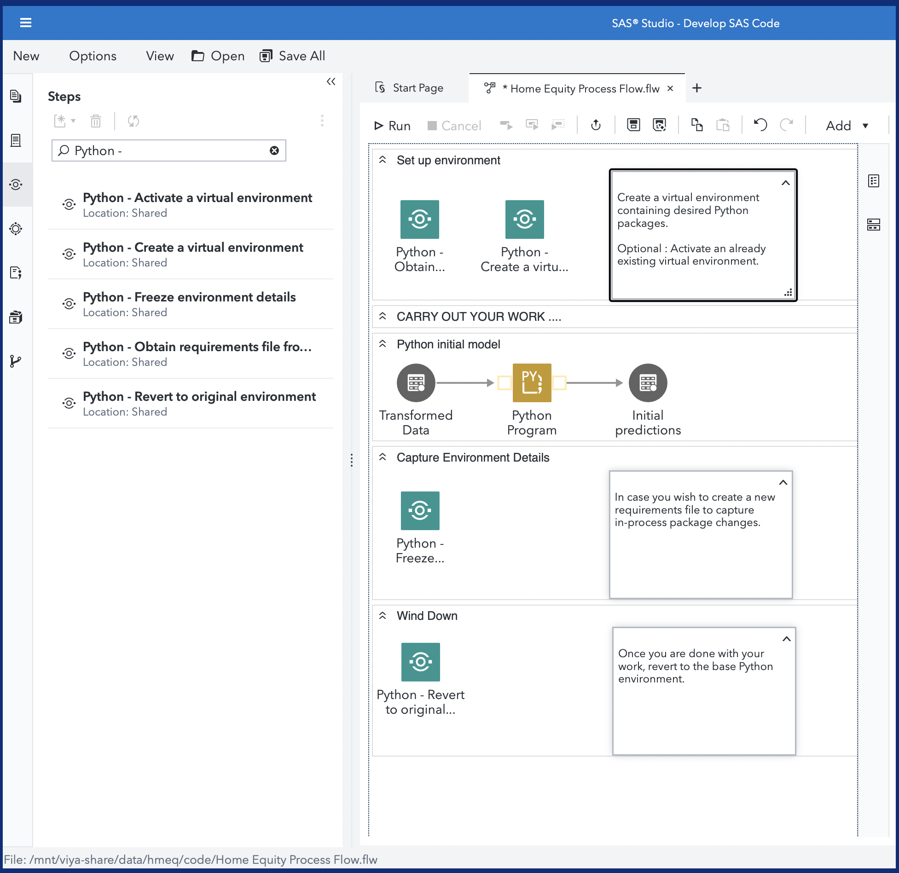
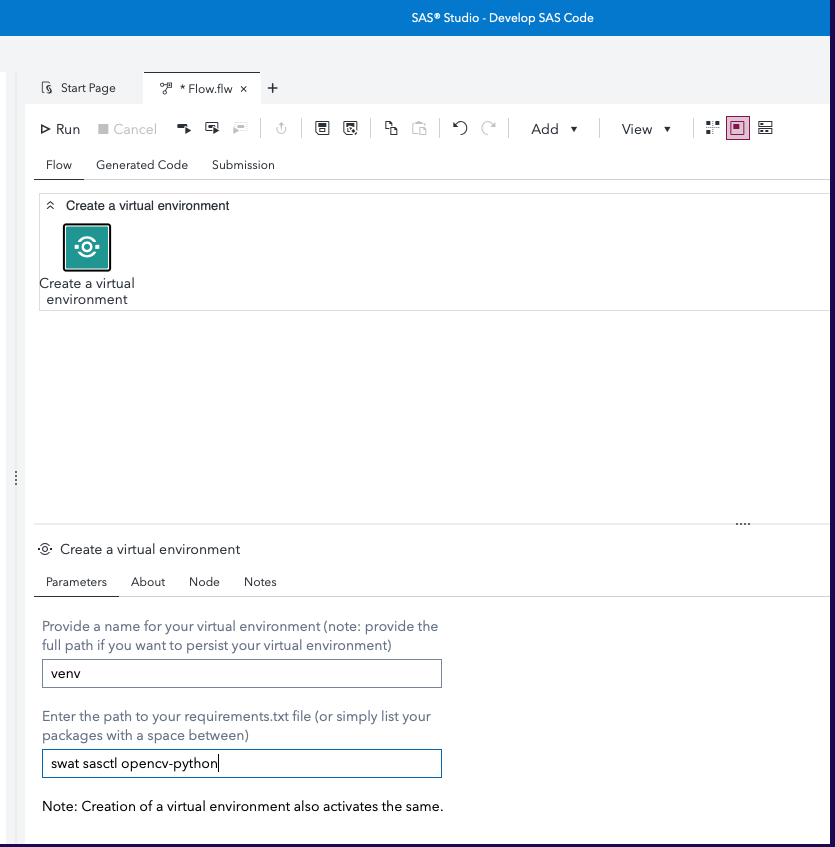
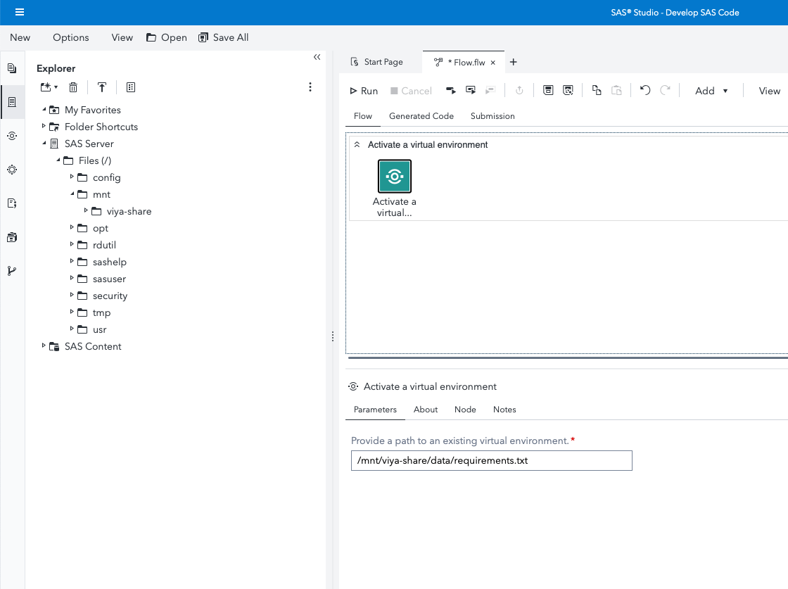
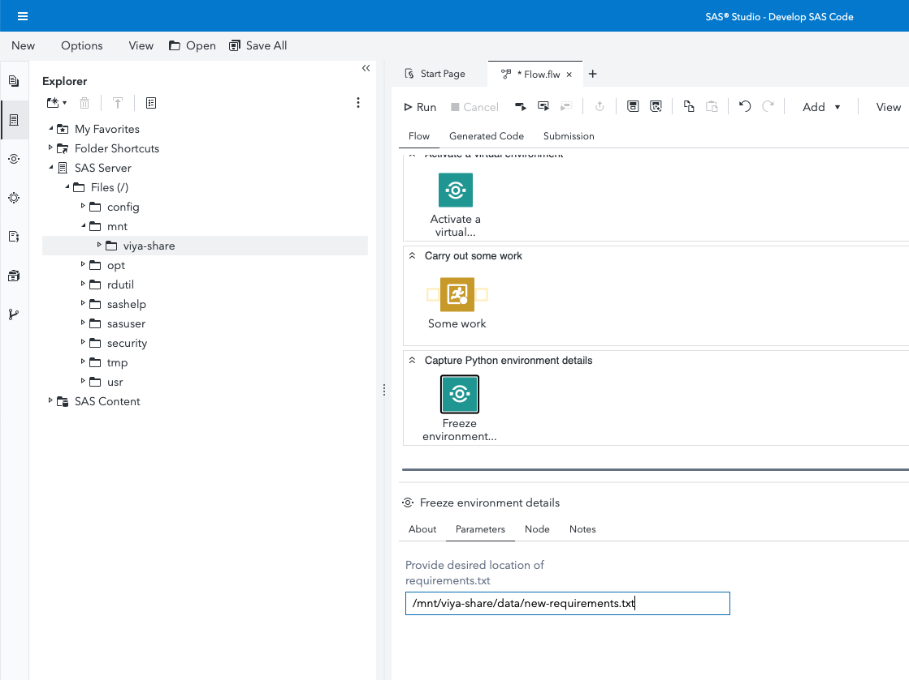
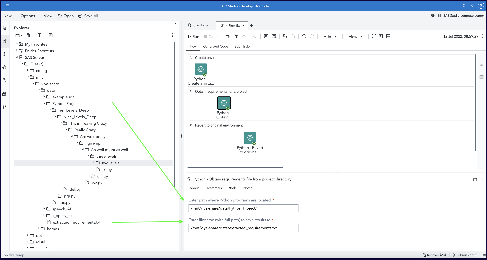

# SAS Studio Custom Steps for virtual Python environments

>[!NOTE]
>Over time the steps in this subfolder will be deprecated and replaced with a new version that will be stored in a step-specific subfolder

> 27AUG2025: Custom step **Python - Create a Virtual Environment** has a new version that now lives in a dedicated subfolder, see [subfolder Python - Create a Virtual Environment](../Python%20-%20Create%20a%20Virtual%20Environment).

## Description
Package your Python-based analytics solutions in a portable, repeatable, and reusable manner.  This repo contains **five** SAS Studio custom steps which help you create, activate, and switch between virtual Python environments for use within SAS Viya.  

A general idea :

## User Interface

Refer the "About" tab on each of the individual steps for more details on what they are used for.

### Create a virtual environment
> 27AUG2025: Custom step **Python - Create a Virtual Environment** has a new version that now lives in a dedicated subfolder, see [subfolder Python - Create a Virtual Environment](../Python%20-%20Create%20a%20Virtual%20Environment).

This step helps you create a virtual environment. Input arguments required :
1. A name provided for your virtual environment (which can optionally be expressed as a full path to a persistent location, for future retrieval)
2. Additional packages you would like installed inside this virtual environment. As instructions note, you can provide a space-delimited string, or a path to a requirements.txt file.

### Activate a virtual environment
This step helps you activate an existing virtual environment. It requires a single argument to a folder path pointing to your virtual environment.

### Freeze environment details
This step helps you save details of all the packages currently installed in your environment, to a requirements.txt.  You can reuse this requirements.txt file for other environments or create a new virtual environment based on this definition. You provide a single argument pointing to the path where you want your requirements.txt to be saved.

### Revert to original environment 
This step switches a SAS Studio session, currently under a virtual Python environment, to the Python environment that was in operation earlier. This step does not require any arguments.

### Obtain requirements file from Project Directory
This step helps users generate a relevant, more compact requirements.txt for a project containing one or more Python programs.  The resulting requirements.txt can be used for specifying configuration for a virtual environment meant for running the said project.

## Requirements

1. A SAS Viya 4 environment (monthly release 2021.2.1 or later) with SAS Studio Flows
2. Python configured with the above environment (preferably using the [SAS Configurator for Open Source](https://go.documentation.sas.com/doc/en/itopscdc/v_016/itopswn/p19hj5ipftk86un1axa51rzr5mxv.htm))
3. Python [virtualenv](https://virtualenv.pypa.io/en/latest/installation.html) package installed in above Python environment (the base environment)

## Installation & Usage

Refer to the [steps](../README.md#getting-started---making-a-custom-step-from-this-repository-available-in-sas-studio) listed in the main README.md

When successfully uploaded, the following structure will be present in the Shared Section of your SAS Studio application - Custom Steps tab.

## Change Log
Version 1.1 (12JUL2022)
- Added new Custom Step - "Python - Obtain requirements from project directory"  

Version 1.0 (20MAY2022)
- Renamed to "Python - " as per Wilbram's advice; shuffled order of About tab on "Freeze" 

## The WHY :  Background information

Refer this [blog](https://blogs.sas.com/content/subconsciousmusings/2022/05/16/python-a-la-carte) for background.  The ability to create and use virtual Python environments for use within SAS Viya helps data scientists create portable solutions,  maintain solution integrity, and exploit the integration between SAS and Python to the fullest extent.

Watch this example! 

[SAS & Open Source (Python) Integration : Better Together](https://www.youtube.com/watch?v=YVaX-A-ZsQ0&list=PLpe69msCs2C8IcarG0aEs_iKy4gyRSFPN&index=3)

[Creating virtual Python environments within SAS Studio.](https://youtu.be/UIYZf2bKcWw)

This repository contains 5 custom steps which are offered as examples of how you could create, activate, switch between, and package virtual Python environments from within SAS Viya applications and tools, such as SAS Studio.  It makes use of [Custom Steps](https://go.documentation.sas.com/doc/en/webeditorcdc/v_006/webeditorug/n0b7ljqhka8lh5n12judc27x5gph.htm), a component within SAS Studio which help users package repeatable steps in an user-friendly manner.

