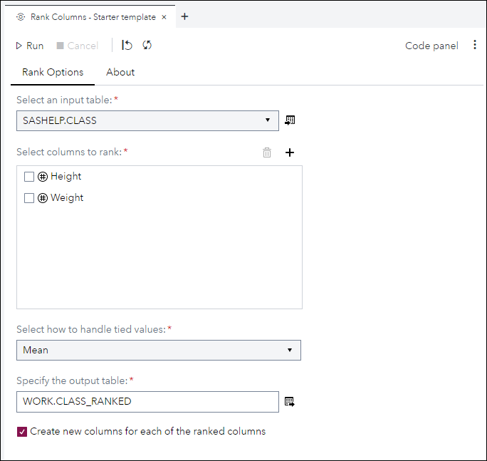
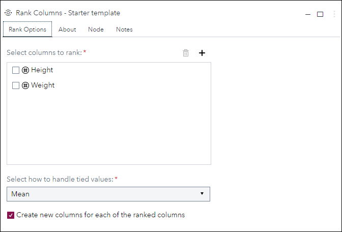
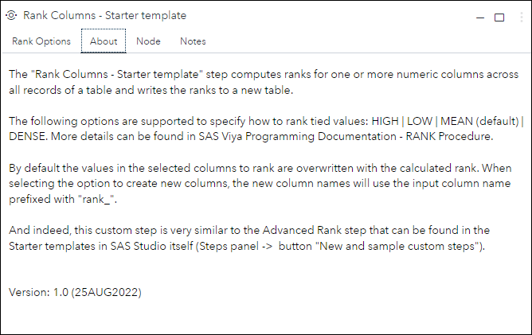
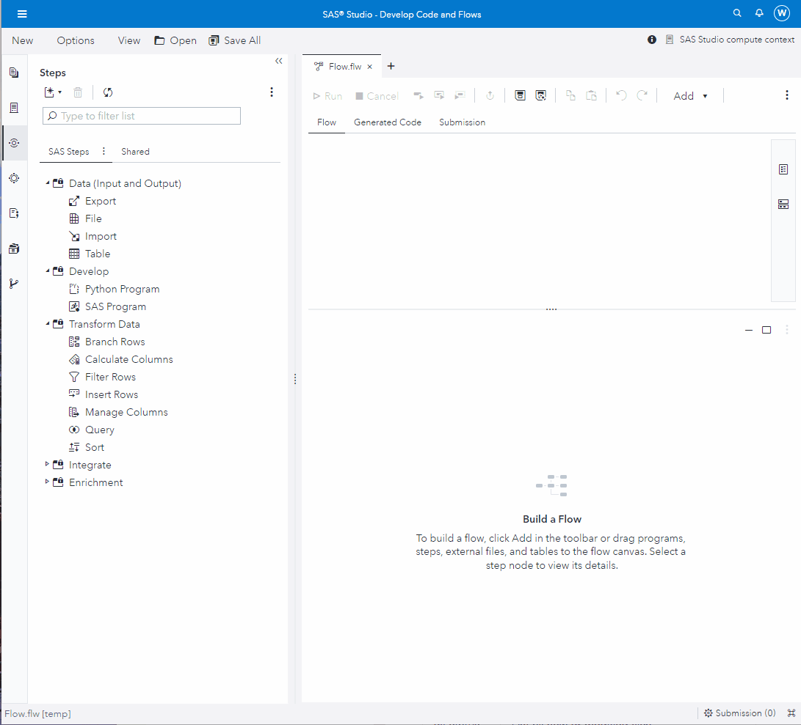

# Rank Columns - Starter template

## Description

The **Rank Columns - Starter template** custom step computes ranks for one or more numeric columns across all records of a table and writes the ranks to a new table.

The following options are supported to specify how to rank tied values: HIGH | LOW | MEAN (default) | DENSE.
More details can be found in [SAS Viya Programming Documentation - RANK Procedure](https://documentation.sas.com/?cdcId=pgmsascdc&cdcVersion=default&docsetId=proc&docsetTarget=p16s2o8e4bnqrin1phywxdaxqba7.htm)

By default, the values in the selected columns to rank are overwritten with the calculated rank. When selecting the option to create new columns, the new column names will use the following naming convention: input column name prefixed with **rank_**. 

And indeed, this custom step is very similar to the **Advanced Rank** custom step that can be found in the Starter templates in SAS Studio itself (Steps panel ->  button "New and sample custom steps").

Version: 1.0 (25AUG2022)

## User Interface

* ### Rank Options tab ###

   | Standalone mode | Flow mode |
   | --- | --- |                  
   |  |  |

* ### About tab ###

   |

## Requirements

No special requirements. 
  * The custom step uses UI controls that have been available for quite a while
  * The custom step code generator uses proc rank, which should be available in all SAS Viya deployments

## Usage

## Change Log

* Version 1 (25AUG2022)
    * Initial version
