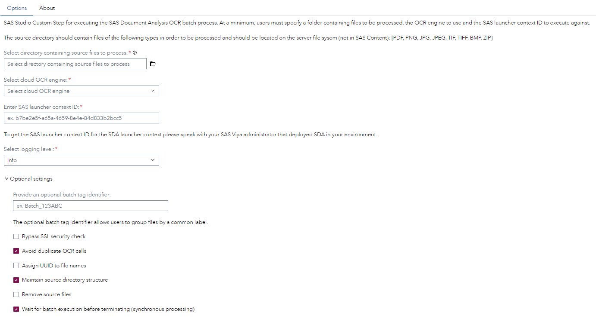

# SAAM - Document Analysis - Execute Batch OCR Process

## Description

This custom step is provided to enable point-and-click usage of the functionality available as part of the [SAS Document Analysis](https://www.sas.com/en_us/solutions/ai/models.html) offering from within the SAS Studio interface.

Use the SAAM - Document Analysis - Execute Batch OCR Process step in order to turn analysis documents of the following file types: PDF, PNG, JPG, JPEG, TIF, TIFF, BMP & ZIP. After the document analysis has finished you can run the companion step [SAAM - Document Analysis - Produce Usage Report](../SAAM%20-%20Document%20Analysis%20-%20Produce%20Usage%20Report) to generate a report about the performed analysis.

### Features
- Multiple OCR engines supported (MS & AWS)
- Parallelized batch-based end-to-end execution
- Automated file conversion (between image and PDF formats)
- Process tracking and entity mapping
- Viya-ready outputs produced

## User Interface
* ### SAAM - Document Analysis - Execute Batch OCR Process - Options Page ###

## Requirements

-   SAS Viya 2025.10 or later
-   A license for SAS Document Analysis is required

## Settings

For more information about the different settings please refer to the SAS documentation linked below.

## Documentation
- [SAS Document Analysis documentation](https://go.documentation.sas.com/doc/en/aaimdacdc/default/aaimdawlcm/home.htm)
- [Custom step documentation](https://github.com/sassoftware/sas-studio-custom-steps/tree/main/SAAM%20-%20Document%20Analysis%20-%20Execute%20Batch%20OCR%20Process)

## Change Log

### SAAM - Document Analysis - Execute Batch OCR Process

* Version 1.9 (28MAY2026)
  * Renamed step from "OCR - Document Analysis - Execute Batch OCR Process" to "SAAM - Document Analysis - Execute Batch OCR Process" to conform to the SAAM naming standard

* Version 1.8 (22APR2026)
  * Add the following options and associated defaults:
    * Retain line breaks (True)
    * Generate images from PDFs (False)
    * Output mapping file format (XSLX)

* Version 1.7 (22APR2026)
  * Remove "bypass SSL" option. Default to False

* Version 1.6 (16APR2026)
  * Communicate exit codes for failed SDA batch processes

* Version 1.5 (19FEB2026)
  * Use absolute path for python command

* Version 1.4 (04NOV2025)
  * Add PaddleOCR to OCR engine options
  * Add MS OCR model name - available when "Microsoft" is selected as the OCR engine
  * Add Custom Document Intelligence model name - available when "Custom" is selected as the MS OCR model
  * Remove optional setting to maintain directory structure

* Version 1.3 (25FEB2025)
  * Use launcher context name instead ID

* Version 1.2 (21NOV2024)
  * Added option to enable syncronous processing
  * Added option to suppress SSL check

* Version 1.1 (09OCT2024)
  * Implemented feedback

* Version 1.0 (07OCT2024)
  * Initial version
