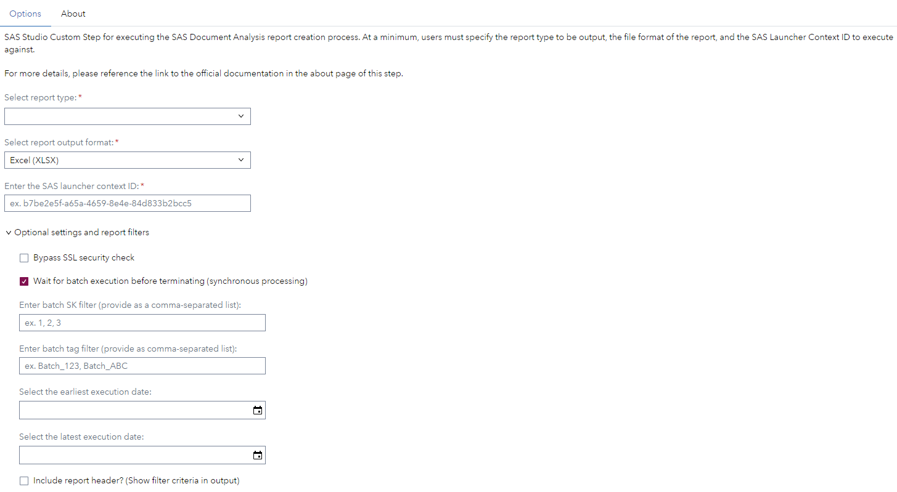

# SAAM - Document Analysis - Produce Usage Report

## Description

This custom step is provided to enable point-and-click usage of the functionality available as part of the [SAS Document Analysis](https://www.sas.com/en_us/solutions/ai/models.html) offering from within the SAS Studio interface.

Run the SAAM - Document Analysis - Produce Usage Report step after a batch OCR process has finished (for example, by using the companion step [SAAM - Document Analysis - Execute Batch OCR Process](../SAAM%20-%20Document%20Analysis%20-%20Execute%20Batch%20OCR%20Process)) to generate a usage report about the performed analysis.

### Features
- Usage reporting metrics for previous SDA batch processes

## User Interface
* ### SAAM - Document Analysis - Produce Usage Report - Options Page ###

## Requirements

-   SAS Viya 2024.08 or later
-   A license for SAS Document Analysis is required

## Settings

For more information about the different settings please refer to the SAS documentation linked below.

## Documentation
- [SAS Document Analysis documentation](https://go.documentation.sas.com/doc/en/aaimdacdc/default/aaimdawlcm/home.htm)
- [Custom step documentation](https://github.com/sassoftware/sas-studio-custom-steps/tree/main/SAAM%20-%20Document%20Analysis%20-%20Produce%20Usage%20Report)

## Change Log

### SAAM - Document Analysis - Produce Usage Report

* Version 1.6 (28MAY2026)
  * Renamed step from "OCR - Document Analysis - Produce Usage Report Output" to "SAAM - Document Analysis - Produce Usage Report" to conform to the SAAM naming standard

* Version 1.5 (22APR2026)
  * Remove "bypass SSL" option. Default to False

* Version 1.4 (16APR2026)
  * Communicate exit codes for failed SDA batch processes

* Version 1.3 (19FEB2026)
  * Use absolute path for python command

* Version 1.2 (21NOV2024)
  * Added option to enable syncronous processing
  * Added option to suppress SSL check

* Version 1.1 (29OCT2024)
  * Implemented feedback

* Version 1.0 (07OCT2024)
  * Initial version
