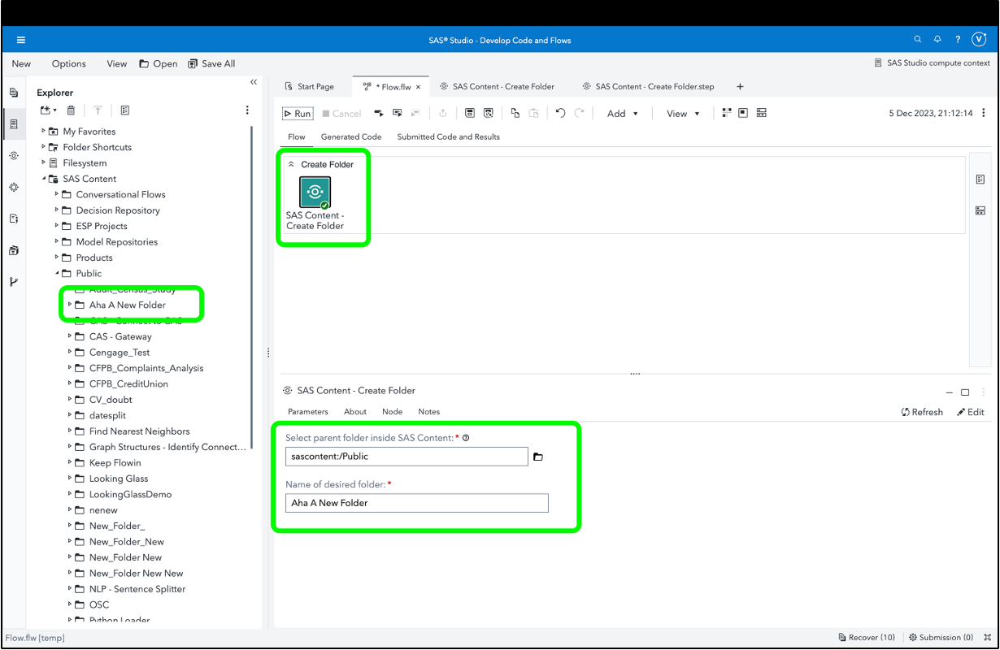

# SAS Content - Create Folder

This is a utility custom step which creates a desired SAS Content folder.

Some SAS programs require operations to be performed on folders located inside the SAS Infrastructure Data Server (also known as SAS Content). This custom step facilitates such operations. 

## General Idea


## Parameters

This custom step wraps proc http calls to a SAS Viya endpoint in order to check for as well as create a folder.  While it's likely that your environment's administrator has already ensured the same, please verify that north-south communication among pods is enabled / whitelisted in your environment.  Proc http won't work for Viya endpoints (though they may for other endpoints) in such a case.  Viya may consider the SAS Studio session pod IP (which is making the call) as not recognizable and therefore timeout the request.  A quick check for this would be to run a simple proc http call (e.g. a get request) to your SAS Viya endpoint and note if you are able to get a response code of 200 (OK).


### Input Parameters
1. A parent folder within SAS Content (folder selector, required): provide the full path of a desired folder under which you wish to create the new folder.

2. Desired name for new folder (folder selector, required): provide a name for the new folder.  Adhere to the naming conventions for SAS Content folders.

### Output Specifications

TThe custom step provides a note informing that the folder has been created. 

1. targetFolderURI (global macro variable): this macro variable is created to hold the URI of the new folder for any downstream activity.

2. folderCreated (global macro variable): this macro variable is created with a value of 1 if the folder is created, or a value of 0 in case it isn't, for downstream code to consume.

## Optional: Run-time Control

Edit / keep this section only if you want to have a run-time control

Note: Run-time control is optional.  You may choose whether to execute the main code of this step or not, based on upstream conditions set by earlier SAS programs.  This includes nodes run prior to this custom step earlier in a SAS Studio Flow, or a previous program in the same session.

Refer this blog (https://communities.sas.com/t5/SAS-Communities-Library/Switch-on-switch-off-run-time-control-of-SAS-Studio-Custom-Steps/ta-p/885526) for more details on the concept.

The following macro variable,

```sas
_cf_run_trigger
```

will initialize with a value of 1 by default, indicating an "enabled" status and allowing the custom step to run.

If you wish to control execution of this custom step, include code in an upstream SAS program to set this variable to 0.  This "disables" execution of the custom step.

To "disable" this step, run the following code upstream:

```sas
%global _cf_run_trigger;
%let _cf_run_trigger =0;
```

To "enable" this step again, run the following (it's assumed that this has already been set as a global variable):

```sas
%let _cf_run_trigger =1;
```

**IMPORTANT**: Be aware that disabling this step means that none of its main execution code will run, and any  downstream code which was dependent on this code may fail.  Change this setting only if it aligns with the objective of your SAS Studio program.


## Documentation

1. [SAS Viya REST API reference](https://developer.sas.com/apis/rest/CoreServices/#create-a-new-folder)

2. Note this [section](https://go.documentation.sas.com/doc/en/pgmsascdc/default/lestmtsglobal/p0qapul7pyz9hmn0zfoefj0c278a.htm#p0nscb67k9xhr5n1fqx4pvnoed4f) within the documentation on the filesrvc filename reference method.  Note that the filesrvc filename reference results in an automatically generated macro variable containing the URI, which is in fact used within this custom step.  However, the direct use of the filesrvc reference on a non-existent folder results in an error, which is handled by this custom step.

3. Some "SAS Content-related" operations inspired by similar code by David Weik for the purpose of transferring custom steps.  His full code is located [here](https://github.com/Criptic/sas_snippets/blob/master/Upload-and-Register-all-Custom-Steps.sas).  

4. [Details on the optional run-time trigger control](https://communities.sas.com/t5/SAS-Communities-Library/Switch-on-switch-off-run-time-control-of-SAS-Studio-Custom-Steps/ta-p/885526)


## SAS Program

Refer [here](./extras/SAS%20Content%20-%20Create%20Folder.sas) for the SAS program used by the step.  You'd find this useful for situations where you wish to execute this step through non-SAS Studio Custom Step interfaces such as the [SAS Extension for Visual Studio Code](https://github.com/sassoftware/vscode-sas-extension), with minor modifications. 

## Installation & Usage

- Refer to the [steps listed here](https://github.com/sassoftware/sas-studio-custom-steps#getting-started---making-a-custom-step-from-this-repository-available-in-sas-studio).


## Created/contact: 

- Sundaresh Sankaran (sundaresh.sankaran@sas.com)

## Change Log

* Version: 1.0  (05DEC2023)
  * Initial version
