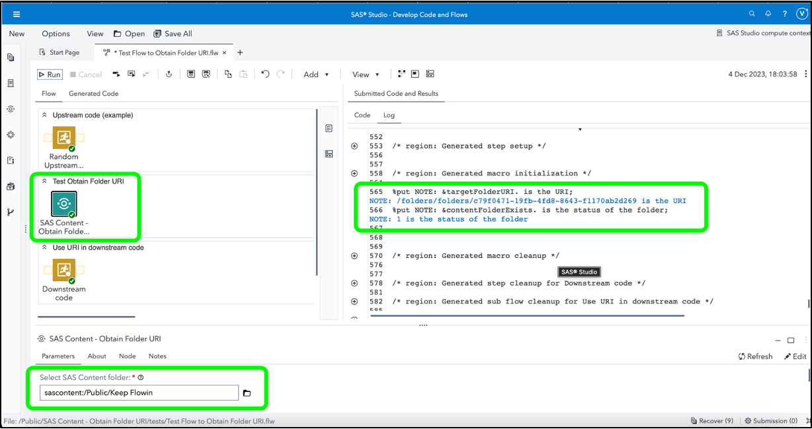

# SAS Content - Obtain Folder URI

This is a utility custom step which obtains the URI of a selected SAS Content folder and saves it in a global macro variable if the folder exists.  It also populates another global macro variable with a flag of 1 or 0 to indicate if the folder exists or not, which may be used in downstream code.

Some SAS programs require operations to be performed on folders located inside the SAS Infrastructure Data Server (also known as SAS Content), and such operations typically require the folder URI. 

## General Idea


## Parameters

This custom step wraps proc http calls to a SAS Viya endpoint in order to check for a folder.  While it's likely that your environment's administrator has already ensured the same, please verify that north-south communication among pods is enabled / whitelisted in your environment.  A quick check for this would be to run a simple proc http call (e.g. a get request) to your SAS Viya endpoint and note if you are able to get a response code of 200 (OK).

### Input Parameters
* SAS Content Folder (folder selector, required): provide the full path of a SAS Content folder you wish to obtain the URI for.

### Output Specifications

The simple output provided by this initial version of this custom step is in the form of 2 global macro variables.

 1. targetFolderURI: this contains the URI of the folder in case it exists, and a direction to the HTTP status code error variable in case of other reasons.  Other reasons could include the specified folder  not existing on the target environment, or an inability to make an HTTP request (as mentioned above).
 
 2. contentFolderExists: this is populated with the following values. 
    1. In case the folder exists, this is populated with a value of 1.  
    2. In case the folder does not exist, the value is set to 0.
    3. In case the request was unsuccessful (resulting in a status code other than 200 or 404), then the value is set to 99.

The value of SYS_PROCHTTP_STATUS_CODE, a system variable, is also surfaced within the log for better debugging.

## Optional: Run-time Control

Edit / keep this section only if you want to have a run-time control

Note: Run-time control is optional.  You may choose whether to execute the main code of this step or not, based on upstream conditions set by earlier SAS programs.  This includes nodes run prior to this custom step earlier in a SAS Studio Flow, or a previous program in the same session.

Refer this blog (https://communities.sas.com/t5/SAS-Communities-Library/Switch-on-switch-off-run-time-control-of-SAS-Studio-Custom-Steps/ta-p/885526) for more details on the concept.

The following macro variable,

```sas
_ofu_run_trigger
```

will initialize with a value of 1 by default, indicating an "enabled" status and allowing the custom step to run.

If you wish to control execution of this custom step, include code in an upstream SAS program to set this variable to 0.  This "disables" execution of the custom step.

To "disable" this step, run the following code upstream:

```sas
%global _ofu_run_trigger;
%let _ofu_run_trigger =0;
```

To "enable" this step again, run the following (it's assumed that this has already been set as a global variable):

```sas
%let _ofu_run_trigger =1;
```

**IMPORTANT**: Be aware that disabling this step means that none of its main execution code will run, and any  downstream code which was dependent on this code may fail.  Change this setting only if it aligns with the objective of your SAS Studio program.


## Documentation

1. Note this section within the [documentation on the filesrvc filename reference method](https://go.documentation.sas.com/doc/en/pgmsascdc/default/lestmtsglobal/p0qapul7pyz9hmn0zfoefj0c278a.htm#p0nscb67k9xhr5n1fqx4pvnoed4f).  Note that the filesrvc filename reference results in an automatically generated macro variable containing the URI, which is in fact used within this custom step.  However, the direct use of the filesrvc reference on a non-existent folder results in an error, which is handled by this custom step.

2. This specific operation was inspired by similar code provided by David Weik for the purpose of transferring custom steps.  His full code is located [here](https://github.com/Criptic/sas_snippets/blob/master/Upload-and-Register-all-Custom-Steps.sas)

3. [Details on the optional run-time trigger control](https://communities.sas.com/t5/SAS-Communities-Library/Switch-on-switch-off-run-time-control-of-SAS-Studio-Custom-Steps/ta-p/885526)


## SAS Program

Refer [here](./extras/SAS%20Content%20-%20Obtain%20Folder%20URI.sas) for the SAS program used by the step.  You'd find this useful for situations where you wish to execute this step through non-SAS Studio Custom Step interfaces such as the [SAS Extension for Visual Studio Code](https://github.com/sassoftware/vscode-sas-extension), with minor modifications. 

## Installation & Usage

- Refer to the [steps listed here](https://github.com/sassoftware/sas-studio-custom-steps#getting-started---making-a-custom-step-from-this-repository-available-in-sas-studio).


## Created/contact: 

- Sundaresh Sankaran (sundaresh.sankaran@sas.com)

## Change Log

* Version: 1.0  (18DEC2023)
  * Initial version
