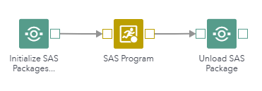
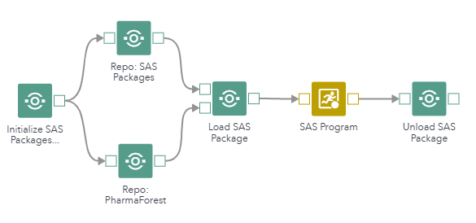
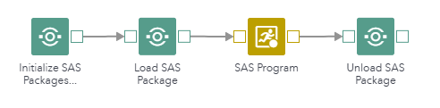
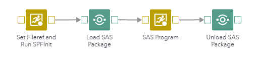
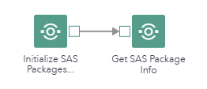
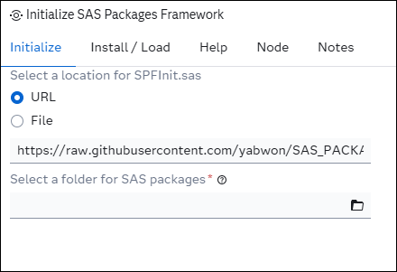
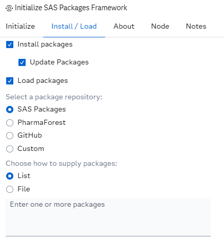
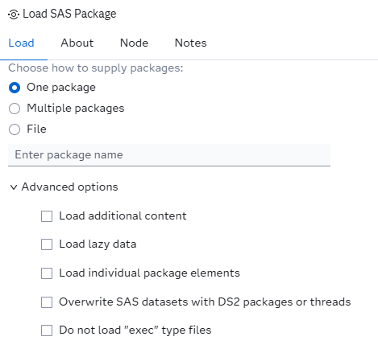
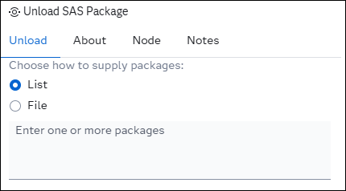
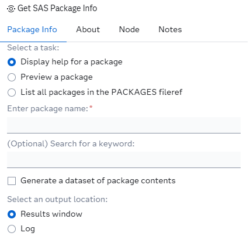

# SAS Packages Framework Steps

## Description
The [SAS Packages Framework](https://github.com/yabwon/SAS_PACKAGES), created by [Bart Jablonski](https://github.com/yabwon), allows users to develop and use SAS packages:

> A SAS package is an automatically generated, single, stand alone zip file containing organised and ordered code structures, created by the developer and extended > with additional automatically generated "driving" files (i.e. description, metadata, load, unload, and help files).
>
> The purpose of a package is to be a simple, and easy to access, code sharing medium, which will allow: on the one hand, to separate the code complex dependencies created by the developer from the user experience with the final product and, on the other hand, reduce developer's and user's unnecessary frustration related to a remote deployment process.

These custom steps add an interface around the SAS Packages Framework, enabling SAS Packages to be easily embedded into a SAS Studio flow.

## Features
* Initialize, install, load, and update SAS packages in one step using the latest version from GitHub (default), your own URL, or a local `SPFInit.sas` file
* Choose from the rich ecosystem of SAS packages: [SASPAC](https://github.com/SASPAC), [PharmaForest](https://github.com/PharmaForest/), GitHub, or your own  custom repository
* Install, load, and unload SAS packages as individual steps for granular flow control
* Choose advanced options to load individual packages
* Get HTML results for package help, package previews, or a list of packages
* Get an inventory of packages on your system
* Viya File Service support<sup>*</sup>
* Comprehensive documentation within each step
* Connect together multiple steps within a single flow
* Specify packages as a list or from a file in one of five intuitive formats:
###### packages.txt
```
package
package(version)
package[version]
package{version}
package==version
```

> [!WARNING]  
> Not all SPF features used by these steps are supported with the Viya File Service.
> 
> A physical disk or mounted network drive is **highly recommended** for package storage to ensure optimal performance and compatibility.

## Quick Start Guide
1. Upload _Initialize SAS Packages Framework_ to SAS Viya
2. Add _Initialize SAS Packages Framework_ to a flow
3. Select a folder to store SAS Packages (a physical disk or mounted network drive is highly recommended)
4. In the _Install / Load_ tab, check the _Install packages_ and _Load packages_ options
5. Add a list of packages you wish to install and load from a repository; for example, [sqlInDs](https://github.com/SASPAC/sqlinds) from the SAS Packages repository
6. Run the step
7. Create a new SAS program and test your package code:

```sas
data hello_cars;
    set %sql(select * from sashelp.cars);
run;
```

## Example workflows

#### Initialize, install, and load packages, run code, then unload packages


#### Initialize and install packages from two different sources, run code, then unload packages


#### Initialize and load packages, run code, then unload packages


#### Initialize using SAS code, load packages, run code, then unload packages


#### Get help or other information about packages


## User Interface
#### Initialize:




#### Install:


#### Load:


#### Unload:


#### Get Package Info:


## SAS Viya Version Support

Tested on Viya 4, Stable 2025.12

## Requirements

- [SAS Packages Framework](https://github.com/yabwon/SAS_PACKAGES/tree/main) [(SPFInit.sas)](https://github.com/yabwon/SAS_PACKAGES/blob/main/SPF/SPFinit.sas) 20251231 or higher

## Documentation:
- SAS Packages Framework: https://github.com/yabwon/SAS_PACKAGES

All documentation is provided within the **About** section of each step. A general description of all available steps is provided below.

#### Initialize SAS Packages Framework
Initializes the SAS Packages Framework, and optionally installs and loads packages in a single step.

#### Install SAS Package
An independent step to install SAS packages.

#### Load SAS Package
An independent step to load SAS packages.

#### Unload SAS Package
Unload SAS packages from the current session.

#### Get SAS Package Info
- Prints developer-provided package help and optionally generates a dataset of package content
- Prints a package preview
- Prints all SAS packages in the PACKAGES fileref and optionally generates a dataset with all packages to create an inventory

Results are printed to either HTML or the log.

## Created / contact:

- Custom Steps: Stu Sztukowski (stu.sztukowski@sas.com; https://github.com/stu-code)
- SAS Packages Framework: Bart Jablonski (https://github.com/yabwon)

## Change Log
- Version 1.0.0 (17FEB2026)
    - Initial version
