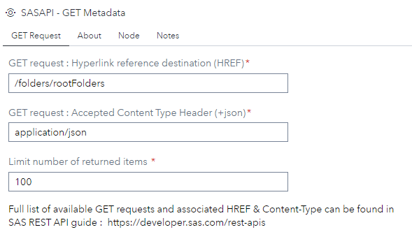
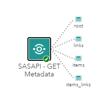

# SASAPI - GET Metadata

## Description

This custom step allow the user to call any SAS VIYA API GET requests and returns metadata response into 4 output datasets : root, links, items, items_links

## User Interface

### GET Request ###

  * Define Hyperlink reference for the GET Request. 
      * All Hyperlink refernces available for SAS VIYA API are listed in the SAS REST API guide :  https://developer.sas.com/rest-apis.
	  
  * Define Accepted Content-Type associated to the GET Request. 
      * This option is set to application/json by default. Most request will accept this tyoe. 
	  * For more specific Content-Type, refer to the documentation of the GET request. 
      * The Content-Type must include json.   
	  
  * Define the limit number of items included in the response. The default value is 100. 

  <kbd></kbd>

## Requirements

* Tested on Viya version Stable 2024.12

* Uses : SAS REST API (https://developer.sas.com/rest-apis

## Usage

   * To be used only in Flow mode. 
   
   <kbd></kbd>
	
   * 4 datasets are created as output : 
   	   * root : root items returned by the request
	   * links : root links returned by the request
	   * items (if any) : collection items returned by the request + items self HREF and TYPE
	   * items_links (if any) : collection items links returned by the request
	   
   * If the request generated is not valid, an error is printed to the log and the output is not generated. 
   
## Change Log

* Version 1.0 (30DEC2024) 
    * Initial version
