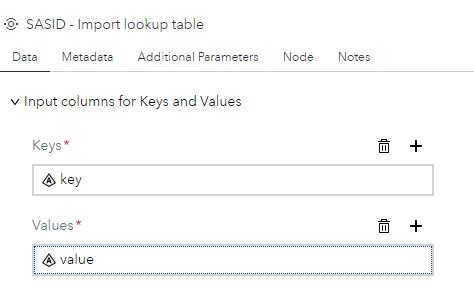
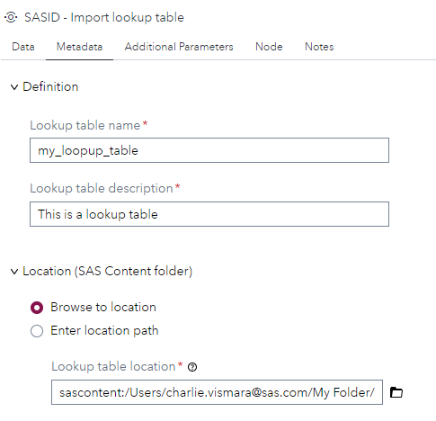
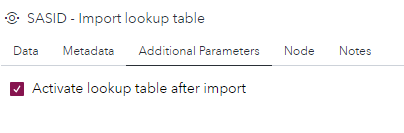
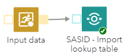

# SASID - Import lookup table

## Description

The **SASID - Import lookup table** custom step enables SAS Studio users to import and activate a lookup table for SAS Intelligent Decisioning from input data. 

## User Interface

### Data tab ###

   * From input table, select a column for the lookup table keys (required).
   * From input table, select a column for the lookup table values (required).
   
   <kbd></kbd>

### Metadata tab ###

   * Define a name for your lookup table (required).
   * Define a description for your lookup table (required).
   * Define a location on the _sas content_ for your lookup table (required).
		--> the location path can be browsed or defined by a string or a macro variable. 
		
   <kbd></kbd>

### Additional Parameters tab ###

   * Activate or not the lookup table. By default, this option is checked. 
   
   <kbd></kbd>

## Requirements

* Tested on Viya version Stable 2024.12.
* Requires : SAS® Intelligent Decisioning 5.4 or higher.
* Uses : DCM_IMPORT_LOOKUP macro (https://go.documentation.sas.com/doc/en/edmcdc/5.4/edmmacro/n0ni2e3h31k5x3n1v1w4e46z7rnh.htm)
* Uses : <viyahost>/folders/paths REST API (https://developer.sas.com/rest-apis/folders/findByPath)

## Usage

   * To be used only in Flow mode. 
   
   <kbd></kbd>
	
   * Require an input data set with valid columns for keys and values. 

## Change Log

* Version 1.0 (30DEC2024) 
    * Initial version 
