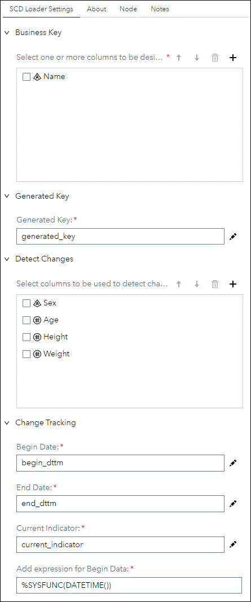
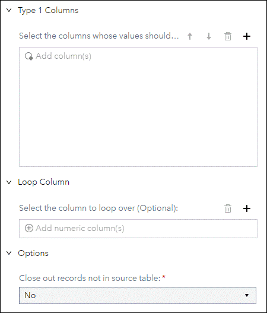
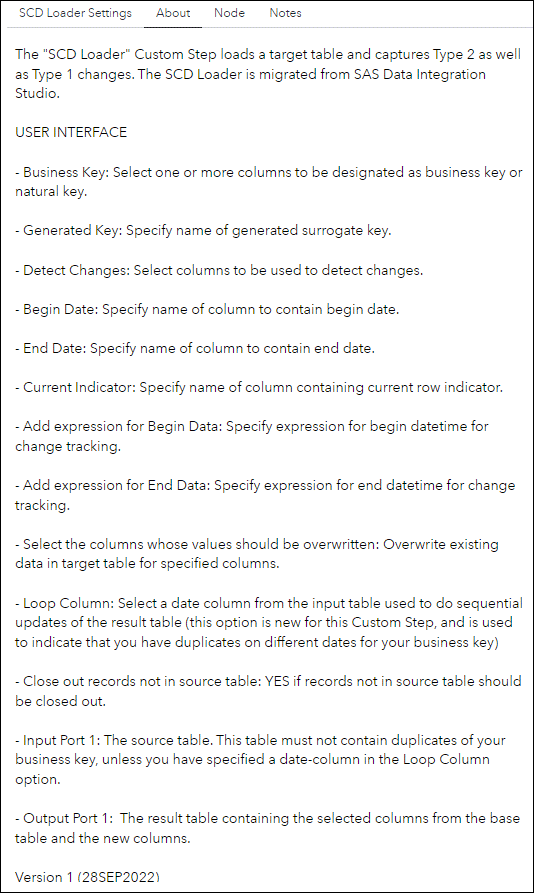

# SCD Loader

## Description

The "**SCD Loader**" Custom Step loads a target table and captures Type 2 as well as Type 1 changes. The SCD Loader is migrated from SAS Data Integration Studio.

Version 1.0 (28SEP2022)

## User Interface

* ### SCD Loader Settings tab ###
   
   

* ### About tab ###
   

## Usage

### SCD Loader Settings tab

- **Business Key:**
Select one or more columns to be designated as business key or natural key.
- **Generated Key:**
Specify name of generated surrogate key.
- **Detect Changes:**
Select columns to be used to detect changes.
- **Begin Date:**
Specify name of column to contain begin date.
- **End Date:**
Specify name of column to contain end date.
- **Current Indicator:**
Specify name of column containing current row indicator.
- **Add expression for Begin Data:**
Specify expression for begin datetime for change tracking.
- **Add expression for End Data:**
Specify expression for end datetime for change tracking. 
- **Select the columns whose values should be overwritten:**
Overwrite existing data in target table for specified columns.
- **Loop Column:**
Select a date column from the input table used to do sequential updates of the result table (this option is new for this Custom Step, and is used to indicate that you have duplicates on different dates for your business key)
- **Close out records not in source table:**
YES if records not in source table should be closed out.

### Input Port
- The source table. This table must **not** contain duplicates of your business key, unless you have specified a date-column in the **Loop Column** option.

### Output Port
- The Target table

## Change Log

* Version 1.0 (28SEP2022)
    * Inital version
