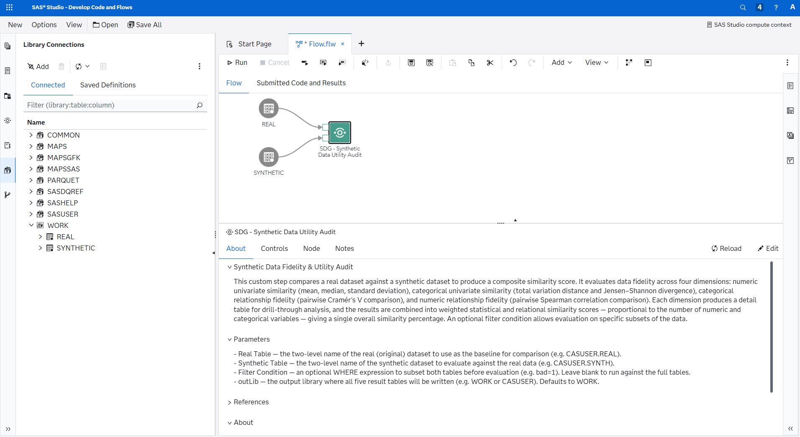
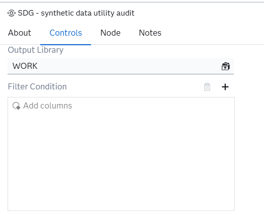
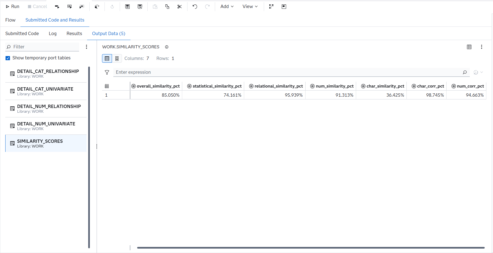

# Synthetic Data Utility AUdit

## Description

The **Synthetic Data Utility Audit** custom step enables SAS Studio users to evaluate the fidelity of a synthetic dataset against its real (original) counterpart. It computes similarity metrics across four dimensions — numeric univariate, categorical univariate, categorical relationship, and numeric relationship — and produces a composite similarity score along with per-variable detail tables for drill-through analysis.

### Metrics used

- **Mean, Median, Standard Deviation** — core summary statistics compared per numeric variable to assess whether the synthetic data preserves central tendency and spread.
- **Total Variation Distance (TVD)** — measures the largest absolute difference between real and synthetic category probability distributions. A value of 0 means identical distributions.
- **Jensen–Shannon Divergence (JSD)** — a symmetric, bounded measure of how much two probability distributions differ. Unlike KL divergence, it is always finite and well-defined, making it ideal for comparing category frequencies.
- **Cramér's V** — a chi-square-based measure of association between two categorical variables, scaled between 0 (no association) and 1 (perfect association). Computed pairwise for all character variables in both datasets, then compared to assess whether categorical relationships survive synthesis.
- **Spearman Rank Correlation** — a non-parametric measure of monotonic relationship between two numeric variables, ranging from −1 to +1. Computed pairwise for all numeric variables in both datasets, then compared to assess whether numeric dependencies are preserved.

## User Interface

* ### About tab ###

   

* ### Controls tab ###

   

## Requirements

Tested on Viya version Stable 2026.04.

### Required products

- Base SAS (PROC MEANS, PROC FREQ, PROC CORR, PROC TRANSPOSE, PROC SQL, PROC SORT, PROC DATASETS)

### Parameters

| Parameter | Required | Default | Description |
|-----------|----------|---------|-------------|
| `realTable` | Yes | — | Two-level name of the real (original) dataset |
| `synthTable` | Yes | — | Two-level name of the synthetic dataset |
| `filterCondition` | No | *(blank)* | Optional WHERE expression to subset both tables before evaluation (e.g. `bad=1`) |
| `outLib` | No | `WORK` | Output library where all result tables will be written |

### Output tables

All tables are written to the specified output library.

| Table | Contents |
|-------|----------|
| `detail_num_univariate` | Per-statistic (mean, median, std) similarity for each numeric variable |
| `detail_cat_univariate` | TVD and JSD per character variable |
| `detail_cat_relationship` | Cramér's V comparison (real vs synthetic) per character variable pair |
| `detail_num_relationship` | Spearman correlation comparison (real vs synthetic) per numeric variable pair |
| `similarity_scores` | Overall, statistical, relational, and four component scores in a single row |

   

#### detail_num_univariate

Compares the mean, median, and standard deviation of every numeric variable between the real and synthetic datasets. Each row is one statistic for one variable, with a 0–100% similarity score. Use this to identify which numeric variables have drifted most during synthesis — for example, if the synthetic data has compressed the spread of an income variable, the `Std` rows for that variable will show a lower similarity score.

#### detail_num_relationship

Compares the Spearman rank correlation between every pair of numeric variables in the real and synthetic datasets. Each row is one variable pair, showing the real correlation, the synthetic correlation, and the absolute difference. Use this to check whether monotonic dependencies between numeric variables have survived synthesis — for example, whether the positive correlation between income and loan amount is still present and at a similar strength.

#### detail_cat_univariate

Reports two distributional divergence metrics — Total Variation Distance (TVD) and Jensen–Shannon Divergence (JSD) — for every character variable. Each row is one variable. Both metrics range from 0 (identical distributions) to 1 (completely different). Use this to spot character variables where category proportions have shifted — for example, if a gender variable that was 60/40 in the real data has become 50/50 in the synthetic data.

#### detail_cat_relationship

Compares the Cramér's V association between every pair of character variables in the real and synthetic datasets. Each row is one variable pair, showing the real Cramér's V, the synthetic Cramér's V, and the absolute difference. Use this to check whether categorical associations have been preserved — for example, whether the relationship between employment type and loan purpose still holds.

#### similarity_scores

The primary summary table — a single row containing the overall score, two composite scores, and four component scores.

| Column | What it measures | How it is calculated |
|--------|-----------------|----------------------|
| `num_similarity_pct` | Do numeric columns individually look right? | Average of per-statistic similarity scores (mean, median, std) across all numeric variables, rescaled to 0–1 |
| `char_similarity_pct` | Do categorical columns individually look right? | Combines mean and max of TVD and JSD across all character variables into a single 0–1 score, penalising both average drift and worst-case divergence |
| `num_corr_pct` | Are numeric relationships preserved? | `1 − mean(Abs_Delta)` across all pairwise Spearman correlation differences |
| `char_corr_pct` | Are categorical relationships preserved? | `1 − mean(Abs_Delta)` across all pairwise Cramér's V differences |
| `statistical_similarity_pct` | Overall marginal fidelity | Weighted average of `num_similarity_pct` and `char_similarity_pct`, where the weights are the number of numeric and character variables respectively |
| `relational_similarity_pct` | Overall relationship fidelity | Weighted average of `num_corr_pct` and `char_corr_pct`, using the same variable-count weighting |
| `overall_similarity_pct` | Single headline score | Mean of `statistical_similarity_pct` and `relational_similarity_pct` — giving equal weight to "do columns look right individually?" and "do relationships between columns look right?" |

All scores range from 0 to 1 (formatted as percentages). A score of 100% means perfect fidelity; lower values indicate divergence. If a dimension cannot be computed (e.g. no character variables, or fewer than 2 numeric variables for correlation), it is excluded automatically and the composites adjust to use only the available components.

## Usage

The following example uses `SASHELP.CARS` split randomly into two halves to simulate a real vs synthetic comparison.

### Create sample data

```sas
/* split SASHELP.CARS into two random halves */
data work.cars_split;
    set sashelp.cars;
    u = rand("uniform");
run;

proc sort data=cars_split;
    by u;
run;

data work.real work.synth;
    if 0 then set cars_split nobs=n;
    set cars_split;
    if _n_ <= n/2 then output real;
    else output synth;
run;
```

### Run as a standalone macro call

```sas
%syntheticDataComparison(
    realTable       = WORK.REAL,
    synthTable      = WORK.SYNTH,
    outLib          = WORK
);
```

### Run in a flow

1. Run the sample data code above
2. Create a new flow
3. Drag and drop the **Synthetic Data Utility Audit** step onto the canvas
4. Connect the real and synthetic tables to the input ports
5. Run the flow
6. The output will appear in the **Submitted Code and Results** tab

## Change Log
- Version 1.0 (11JUN2026)
-- Initial version
