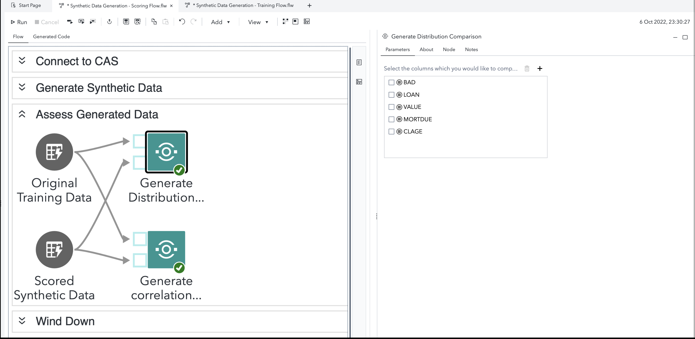
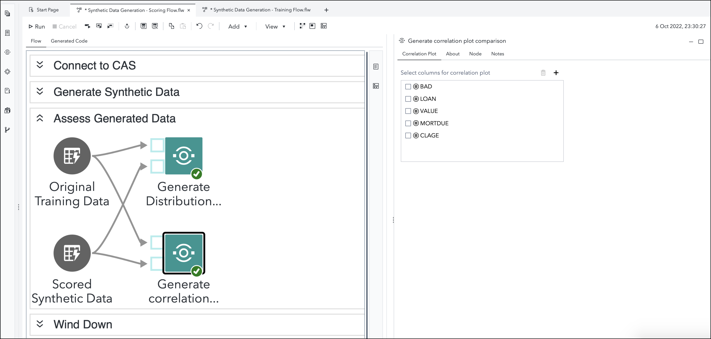

# Train a Synthetic Data Generator through Generative Adversarial Networks (GANs)

## Description
Make better data-informed decisions, even in situations where you have imbalanced, scant, poor quality, unobservable, or restricted data!  

This folder contains SAS Studio custom steps which help you train, score and assess Synthetic Data models.  

<mark> From prior versions, you will also find two additional custom steps for assessing synthetic data.  These will soon make their way to a separate section. </mark>

## Main custom step - Train a Synthetic Data Generator through GANs

This custom step helps you train a model through Generative Adversarial Networks (GANs) using underlying distributions and correlations learnt from an existing dataset.  This step results in a model binary, known as an astore, which can be used in a scoring process.


## A general idea :

### Training a Synthetic Data Model


Read this [blog](https://communities.sas.com/t5/SAS-Communities-Library/SAS-for-Synthetic-Data-Generation-in-Martech/ta-p/837716) for a general overview of applying these steps (taking Marketing Intelligence as an example).


## SAS Viya Version Support

Latest test in Viya 4, Stable 2024.10

## Requirements

1. A SAS Viya 4 environment (monthly release 2022.09 or later) with SAS Studio Flows.
2. An active connection to SAS Cloud Analytics Services.
3. In case you wish to use GPUs for training, check with your administrator on whether GPUs are available in your environment for SAS Cloud Analytics Services (CAS) to access.

## User Interface

### Parameters

#### Input Parameters

1. An input dataset referring to an in-memory CAS table, which serves as the training data - connect this to the input port of this step.

2. Provide both interval (min=1) and nominal variables to be used for training the model. 


#### Configuration tab

1. Number of epochs for autoencoder optimizer (numeric field, default 1): change as required.

2. Number of epochs for the GAN optimizer (numeric field, default 1): change as required

3. Minibatch size (default 60): change as required

4. Enable GPU (check box, deselected by default): check this option if you wish to use GPUs to train.

5. GPU device ID (text field, dependent on GPU enabled): enter a value only if you want to specify a device ID different from the default.  Note that the tabularGanTrain action is set to use a max of 1 GPU.

#### Output specification

1. Provide number of sample observations to generate.

2. Attach a table to the output port for Desired Model Binary, which will hold the astore table. (Note: the astore is a binary table. Do not attempt to open it within SAS Studio as it won't be readable.)

3. Attach a table (optional) to the output port for Output Data, which contains sample generated observations for review.


#### Run-time control

**Note that this is optional.**  

*For large training data, Synthetic Data Generation does tend to take up time and computational resources.  Therefore, you may find it useful to employ the following control in some situations, as dictated by logic.*

In some scenarios, you may wish to dynamically control whether this custom step runs or simply "passes through" without doing anything, in a SAS Studio session. The following macro variable is set to initialize with a value of 1 by default, indicating an "enabled" status and allowing the custom step to run.

Refer this [blog](https://communities.sas.com/t5/SAS-Communities-Library/Switch-on-switch-off-run-time-control-of-SAS-Studio-Custom-Steps/ta-p/885526) for more details on the concept.

```sas
/* To demonstrate the default value of the trigger macro variable */;

&_tsdg_run_trigger.=1;
```

If you wish to control execution of this custom step programmatically (within a session, including execution of a SAS Studio Flow), make sure that an upstream SAS program sets the macro variable to 0.  Setting the value to 0 "disables" the execution of this custom step.

For example, to "disable" this step, run the following code upstream:

```sas
%global _tsdg_run_trigger;
%let _tsdg_run_trigger=0;
```

To "enable" this step again, run the following (it's assumed that this has already been set as a global variable):

```sas
%let _tsdg_run_trigger=1;
```

**Important:** Be aware that disabling this step means that none of its main execution code will run, and any  downstream code which was dependent on this code may fail.  Change this setting only if it aligns with the objective of your SAS Studio program.

## Additional Custom Steps (for assessment)

### Generate Distribution Comparison
This step helps you assess the distributions of your generated data with original data. Parameters required:
1. Select columns you wish to assess
2. Input Ports - attach the training (original) and the synthetic data tables




### Generate Correlation Comparison
This step helps you assess the correlation among variables in your generated and original data. Parameters required:
1. Select columns you wish to assess
2. Input Ports - attach the training (original) and the synthetic data tables



## SAS Program

Refer [here](./extras/Train a Synthetic Data Generator through GANs.sas) for the SAS program used by the step. You'd find this useful for situations where you wish to execute this step through non-SAS Studio Custom Step interfaces such as the SAS Extension for Visual Studio Code, with minor modifications.

## Documentation

1. The proc tabularGAN procedure is documented [here](https://go.documentation.sas.com/doc/en/vwbcasml/v_001/vwbcasml_tabulargan_toc.htm)

2. The generativeAdversarialNet.tabularGanTrain action (a CASL-oriented interface for the algorithm) is documented [here](https://documentation.sas.com/?cdcId=pgmsascdc&cdcVersion=default&docsetId=casactml&docsetTarget=cas-generativeadversarialnet-tabulargantrain.htm)

3. The proc gmm procedure is documented [here](https://go.documentation.sas.com/doc/en/sasstudiocdc/v_056/pgmsascdc/casml/casml_gmm_toc.htm)

4. The nonparametricBayes.gmm action (a CASL-oriented interface for the algorithm) is documented [here](https://go.documentation.sas.com/doc/en/pgmsascdc/default/casactml/casactml_nonparametricbayes_details01.htm)

5. This [SAS Communities article](https://communities.sas.com/t5/SAS-Communities-Library/Switch-on-switch-off-run-time-control-of-SAS-Studio-Custom-Steps/ta-p/885526) referred to earlier suggests an approach through which execution of this custom step is controlled during run time.


## Installation & Usage

Refer to the [steps listed here](https://github.com/sassoftware/sas-studio-custom-steps#getting-started---making-a-custom-step-from-this-repository-available-in-sas-studio).

If you want to use the Home Equity sample data (HMEQ) used in the screenshots above to get started with these custom steps, then you can make them available in your SAS Studio session. This sample data set is part of the SAS sample data library (sampsio) which should be available in a standard SAS Viya deployment. But the library is not visible by default in the Libraries panel in SAS Studio. Here is how to make this library available:

* Open SAS Program using New -> SAS Program from the main menu
* Run the following SAS code to get a listing of all the SAS datasets in the sampsio sample library that should be part of a default SAS deployment
```sas
proc datasets library=sampsio; run;
```
* This will display a list of tables in the Results window and will make the library sampsio available in the Libraries panel for your current SAS Studio session
* TIP: Watch this [SAS Sample Data for Forecasting](https://www.youtube.com/watch?v=wX6mdBgYmXo&t=271s) recording on Youtube for more pointers to interesting sample data available from SAS

## Change Log

- Version 2.0 (05NOV2024)

  - The Train a Synthetic Data Generator step is now "Train a Synthetic Data Generator through GANs" within dedicated folder (partial)
  - Step refactored to use procedure instead of action.

- Version 1.1 (16AUG2023):

    **Train a Synthetic Data Generator**

   	1. UI: variable selectors added
    2. UI: nominal input variables added
    3. UI: minibatch size option added
    4. UI: GPU option added
    5. Refactored Program 
    6. Runtime control added
    7. Refactored About tab


    **Generate Synthetic Data**

    1. Refactored Program
    2. Runtime control added
    3. Refactored About tab


- Version 1.0 (06OCT2022):

    - Step published.


## Created/contact: 

- Sundaresh Sankaran (sundaresh.sankaran@sas.com)
- Brett Wujek (brett.wujek@sas.com)
- Lorne Rothman (lorne.rothman@sas.com)
- Reza Nazari (reza.nazari@sas.com) 
- Ruiwen Zhang (ruiwen.zhang@sas.com) 
