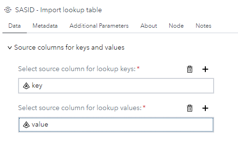
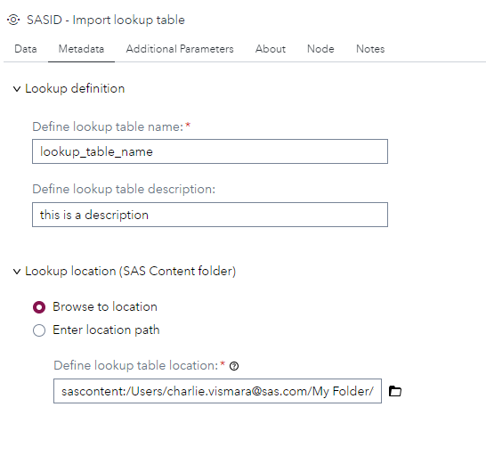
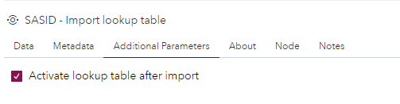

# SID - Import Lookup Table

## Description

The custom step enables SAS Studio users to import and activate a lookup table for SAS Intelligent Decisioning (SID) from input data, using DCM_IMPORT_LOOKUP macro. 
The macro DCM_IMPORT_LOOKUP (part of SID) uses the lookup table name and folder path name to determine whether a lookup table already exists. If the lookup table already exists, then it is updated. If either the path name or lookup table name does not exist, it is created.

## User Interface

### Data tab ###

   * From input table, select a column for the lookup table keys (required).
   * From input table, select a column for the lookup table values (required).
   
   <kbd></kbd>

### Metadata tab ###

   * Define a name for your lookup table (required).
   * Define a description for your lookup table (optional).
   * Define a location on the _sas content_ for your lookup table (required).
		--> the location path can be browsed or defined by a string or a macro variable. 
		
   <kbd></kbd>

### Additional Parameters tab ###

   * Activate or not the lookup table. By default, this option is checked. 
   
   <kbd></kbd>

## Requirements

* Tested on Viya version Stable 2024.12.
* Requires : SAS® Intelligent Decisioning 5.4 or higher.
* Uses : DCM_IMPORT_LOOKUP macro (https://go.documentation.sas.com/doc/en/edmcdc/default/edmmacro/n0ni2e3h31k5x3n1v1w4e46z7rnh.htm)
* Uses : <viyahost>/folders/paths REST API (https://developer.sas.com/rest-apis/folders/findByPath)

## Usage

   * Can be used in a flow or in stand alone.
   
   <kbd></kbd>
	
   * Require an input data set with valid columns for keys and values. 

## Change Log

* Version 1.0 (07FEB2025) 
    * Initial version 
