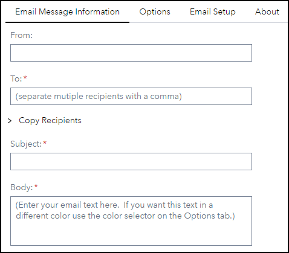
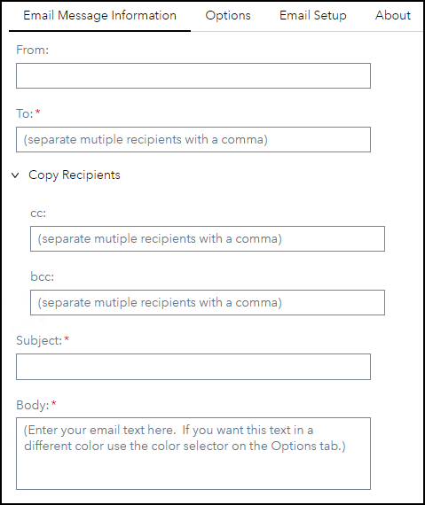
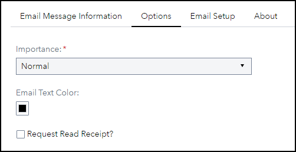
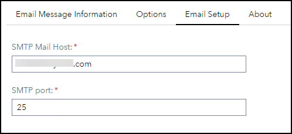
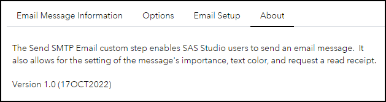
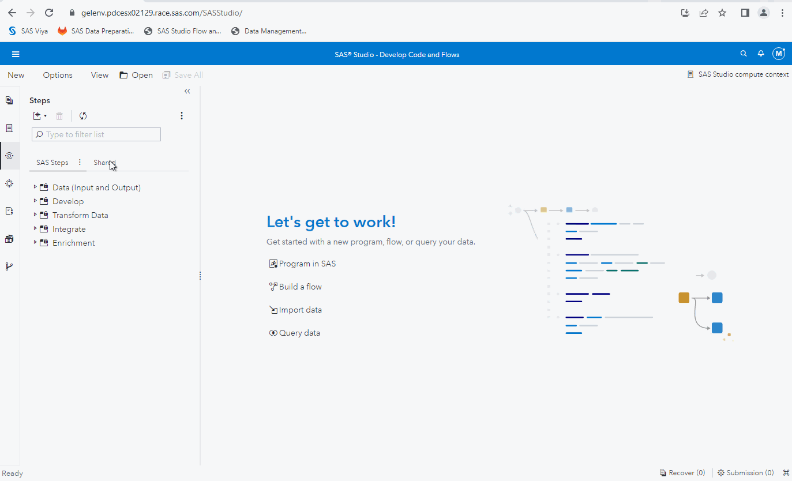

# Send SMTP Email

## Description

The "**Send SMTP Email**" Custom Step enables SAS Studio users to send an email message.  It also allows for the setting of the message's importance, text color, and request a read receipt.

For more information, please refer to [this article](https://communities.sas.com/t5/SAS-Communities-Library/SAS-Viya-Send-Email-Custom-Step-Featuring-the-Color-Picker/ta-p/839499).

## User Interface

### Email Message Information tab
(Copy Recipients section collapsed)

   

(Copy Recipients section expanded)

   

 

### Options tab

   

### Email Setup tab

   

 

### About tab

   

## Requirements

* Viya 2022.1.4 or later
* SMTP Host and Port information
* To email address
* Email subject
* Email body
* Email importance - default is *Normal*

Refer to the SAS Viya documentation for more details about configuring an SMTP Email server: https://go.documentation.sas.com/doc/en/pgmsascdc/default/lepg/n1w4ntt16ty6gvn17e68ggvhspwm.htm

 

## Usage

 

## Change Log

* Version 1.0 (17OCT2022)
    * Initial version